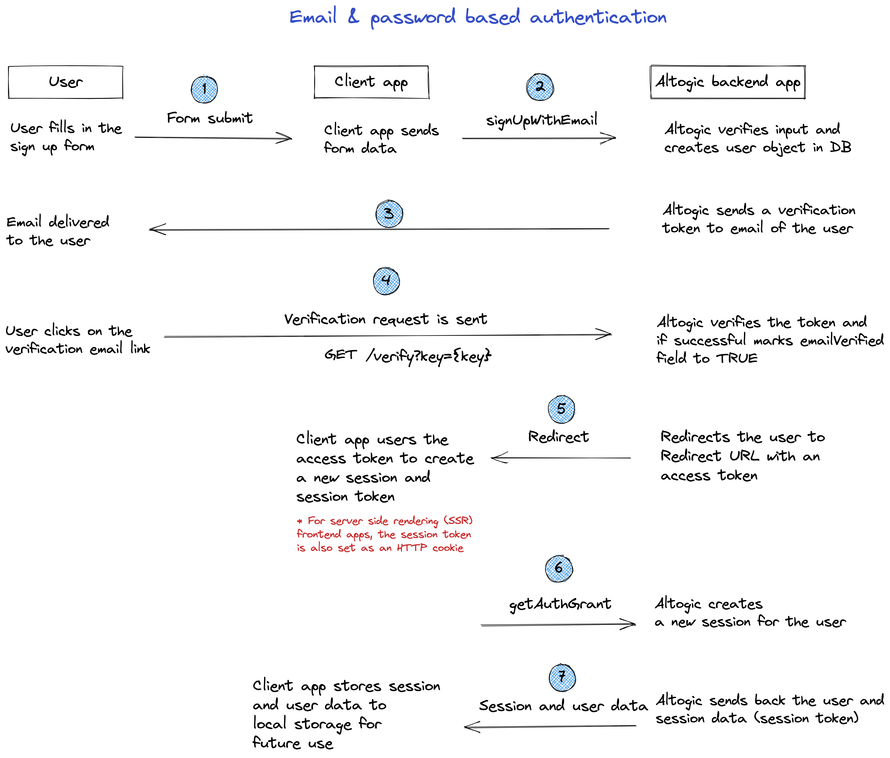

# How to Authenticate Email and Password Using Flutter & Altogic

## What is Altogic in Short

It is a BaaS platform that you can develop backend applications in minutes. Database, authentication, endpoints,
storages and more.. You can easily manage them all and use them easily with highly functional client libraries.
After creating an application, you can start using all these services on the front-end. In most cases, you can create
endpoints without coding and use them easily with the cleint library.

## Intro

In this tutorial, we will implement email/password authentication with Flutter and take a look how as a Flutter
developer we build applications and integrate with Altogic Authentication.

After completion of this tutorial, you will learn:

- How to create sample screens to display forms like login and signup.
- How to create a home screen and authorize only logged in users.
- How to create an authentication flow by conditionally rendering between these pages whether a user is logged-in or
  not.
- How to authenticate users using magic link
- How to update user profile info and upload a profile picture
- How to manage active sessions of a user
- And we will integrate Altogic authentication with the email/password method.

If you are new to Flutter, this tutorial is definitely for you to understand the basics and even advanced concepts.

## Prerequisites

To complete this tutorial, make sure you have installed following tools and utilities on your local development
environment.

- [Flutter SDK](https://docs.flutter.dev/get-started/install)
- [Flutter Project](https://codelabs.developers.google.com/codelabs/first-flutter-app-pt)
- You also need an [Altogic Account](https://designer.altogic.com/). If you have not one yet, you can create an account
  by signin up to Altogic.

## How email based sign-up works in Altogic

Here are Login and Signup components to collect information from the user.



Once the user created successfully a verification email will be sent to the user’s email address. When the user clicks
the link in the mail, the user will navigate to the redirect page to grant authentication rights. After successfully
creating a session on the Redirect page, users will be redirected to the Home page.

# Get Started

## Creating an Altogic App

We will use Altogic as a backend service platform, so let’s visit [Altogic Designer](https://designer.altogic.com/).

After creating an account, you will see the workspace where you can access your apps.


Click + New app and follow the instructions;

1. In the App name field, enter a name for the app.
2. Enter your subdomain.
3. Choose the deployment location.
4. And select your free execution environment pricing plan.


Then click Next and select Basic Authentication template. This template is creates a default user model for your app
which is required by [Altogic Client Library](https://github.com/altogic/altogic-js) to store user data and manage
authentication.

Then click Next and select Basic Authentication template. This template is based on session authentication and highly
recommended to secure your apps.


Then click Next to confirm and create an app.

Awesome! We have created our application; now click/tap on the <strong>newly created app to launch the
Designer.</strong>

> This is the only configuration we need to do in Altogic Designer. In order to access the app and use the Altogic
> client library, we should get envUrl and clientKey of this app.

Click the <strong>Home</strong> icon at the left sidebar to copy the envUrl and clientKey.


## Integrating with Altogic

Our backend is now ready and running on the server. ✨

Now, we can install the Altogic client library to our Flutter project to connect our frontend with the backend.

```sh
flutter create altogic_auth

cd altogic auth

flutter pub add altogic_flutter
```

Let’s create a altogic.dart file inside of the lib/ directory.

Open altogic.dart and paste below code block to create global `AltogicClient` instance.

/lib/altogic.dart

```dart
import 'package:altogic_flutter/altogic_flutter.dart';

// This `envUrl` and `clientKey` is sample you need to create your own.
const String envUrl = 'https://c4-na.altogic.com/e:.......2900095';
const String clientKey = '5b05db.....85c262e8';

AltogicClient altogic = createClient(envUrl, clientKey);
```

> Replace envUrl and clientKey which is shown in the <strong>Home</strong> view
> of [Altogic Designer](https://designer.altogic.com/).

### Storing Session

`altogic_flutter` package provider a session storage implementation that uses `shared_preferences`.

If you want to use own local storage methods yo have to create your own `ClientStorage` implementation. You can specify
client storage with the third parameter of `createClient`, `ClientOptions` options'.

If the session is held in the local (the user is logged in before), you need to restore the auth session from the local
to check this:

```dart
Future<void> main() async {
  WidgetsFlutterBinding.ensureInitialized();

  await altogic.restoreLocalAuthSession();

  runApp(const AltogicAuthExampleApp());
}

```

### Create an Application

We should use a stateful widget and `AltogicState` when creating the application to take advantage of the various
conveniences Altogic provides.

`AltogicState` listens deep links and provides deep linking actions with methods that can be overriden.

```dart

class AltogicAuthExampleApp extends StatefulWidget {
  const AltogicAuthExampleApp({Key? key}) : super(key: key);

  @override
  State<AltogicAuthExampleApp> createState() => _AltogicAuthExampleAppState();
}

class _AltogicAuthExampleAppState extends AltogicState<AltogicAuthExampleApp> {


  @override
  Widget build(BuildContext context) {
    // or WidgetsApp, CupertinoApp etc.
    return MaterialApp(

    );
  }
}

```

### Creating Splash Screen

When the application is opened, we can direct our user knowing whether there is an auth session.

`````dart

class SplashScreen extends StatefulWidget {
  const SplashScreen({Key? key}) : super(key: key);

  @override
  State<SplashScreen> createState() => _SplashScreenState();
}

class _SplashScreenState extends State<SplashScreen> {
  Future<void> init() async {
    // Check if there is an auth session.
  }

  @override
  void initState() {
    init();
    super.initState();
  }


  @override
  Widget build(BuildContext context) {
    return const Scaffold(
      body: Center(
        child: CircularProgressIndicator(),
      ),
    );
  }
}

`````

We can get the current auth session with `altogic.auth.currentState`.

`````dart
Future<void> init() async {
  await Future.delayed(const Duration(milliseconds: 500));

  final session = altogic.auth.currentState.session;

  if (session != null) {
    // Navigate to Home page.
    if (mounted) Navigator.pushNamed(context, '/home');
  } else {
    // Navigate to Login page.
    if (mounted) Navigator.pushNamed(context, '/sign-up');
  }
}
`````

### Add routes to the application

We can add routes to the application.

```dart
@override
Widget build(BuildContext context) {
  return MaterialApp(
    title: 'Altogic Auth Example',
    theme: ThemeData(
      primarySwatch: Colors.blue,
    ),
    initialRoute: '/',
    routes: {
      '/': (context) => const SplashScreen(),
      '/sign-up': (context) => const SignUpPage(),
      '/home': (context) => const HomePage(),
    },
  );
}
```

### Creating Sign-Up Page

```dart
class SignUpPage extends StatefulWidget {
  const SignUpPage({Key? key}) : super(key: key);

  @override
  State<SignUpPage> createState() => _SignUpPageState();
}

class _SignUpPageState extends State<SignUpPage> {

  final TextEditingController emailController = TextEditingController();
  final TextEditingController passwordController = TextEditingController();

  @override
  Widget build(BuildContext context) {
    return Scaffold(
        body: Column(
            crossAxisAlignment: CrossAxisAlignment.center,
            mainAxisAlignment: MainAxisAlignment.center,
            children: [
              AltogicInput(hint: 'Email Address', editingController: emailController),
              AltogicInput(hint: 'Password', editingController: passwordController),
              AltogicButton(body: 'Sign Up', onPressed: _signUp)
            ]
        ));
  }


  Future<void> _signUp() async {
    // TODO: Implement sign up with altogic
  }
}
```

#### Implement Sign-Up

```dart
Future<void> _signUp() async {
  var result = await altogic.signUp(emailController.text, passwordController.text);

  if (result.errors != null) {
    ScaffoldMessenger.of(context).showSnackBar(SnackBar(content: Text(result.errors.toJson().toString())));
  } else {
    // Now your user should have received an email. The email contains a verification link.
    // We can show a dialog to say the user have to verify their email address.

  }
}
```

> If "Confirm email addresses" is turned on in Altogic designer's
> Authentication settings, ``result.user``  will not be null,
> but ``result.session`` will be null. In other words, our user is not yet
> ready to perform operations that require an auth session.
> For this, the email verification process must be successful.

## Configure Deep Linking

### Define redirect URL

We need to define a redirect URL in Altogic Designer. This URL will be used to redirect the user after the email
verification link is opened.

For the deep link used to open the application with links on Android and iOS, your links should have a custom schema.

For example, if you want to use `altogic://` as your schema, you should define `altogic://host/path` as your redirect
URL in
Altogic Designer.


### iOS

Add your deep link configuration to `ìnfo.plist`

In the example below our custom url scheme is ``altogic`` and our host is `com.flutter-auth`
So URLs like ``altogic://com.flutter-auth/<path>`` opens with application.

````xml
<dict>
    <key>FlutterDeepLinkingEnabled</key>
    <true/>
    <key>CFBundleURLTypes</key>
    <array>
        <dict>
            <key>CFBundleTypeRole</key>
            <string>Editor</string>
            <key>CFBundleURLName</key>
            <string>com.flutter-auth</string>
            <key>CFBundleURLSchemes</key>
            <array>
                <string>altogic</string>
            </array>
        </dict>
    </array>
    …
</dict>
````

### Android

Add your deep link configuration to your AndroidManifest.xml in activity

````xml
<activity
        android:name=".MainActivity"
>

    <meta-data android:name="flutter_deeplinking_enabled" android:value="true"/>
    <intent-filter android:autoVerify="true">
        <action android:name="android.intent.action.VIEW"/>
        <category android:name="android.intent.category.DEFAULT"/>
        <category android:name="android.intent.category.BROWSABLE"/>
        <data
                android:scheme="altogic"
                android:host="flutter-auth.com"/>
    </intent-filter>
</activity>
````

## Handling DeepLink

If you use the ``AltogicState`` in root of the application, the state will be mounted if the application lifecyle is
resumed. So when application resumed or opened with deep link, we can handle the link.

When the application is opened with a deeplink, ``AltogicState`` cannot synchronously inform you with which link the
application was opened. Instead, you can override methods to be called when the application is opened with a deep link.

Available methods to override: `onEmailVerificationLink`, `onMagicLink`, `onOauthProviderLink`, `onEmailChangeLink`
, `onPasswordResetLink`.

`````dart
class _AltogicAuthExampleAppState extends AltogicState<AltogicAuthExampleApp> {

  @override
  void onEmailVerificationLink(BuildContext? context, EmailVerificationRedirect redirect) {
    // WHEN THE APPLICATION IS OPENED WITH EMAIL VERIFICATION LINK
  }

  @override
  Widget build(BuildContext context) {
    return MaterialApp(

      // Using for deep linking methods BuildContext parameter.
      // If you use e.g onEmailVerificationLink called with context,
      // otherwise BuildContext will be null on the method.
      navigatorObservers: [navigatorObserver],
      // ...
    );
  }
}
`````

### Email Verification

When the application is opened with an email verification link, the ``onEmailVerificationLink`` method is called.

````dart
@override
void onEmailVerificationLink(BuildContext? context, EmailVerificationRedirect redirect) {
  // When the application is opened with an email verification link,
  // We can navigate to the email verification page.
  if (context != null) {
    Navigator.push(
        context,
        MaterialPageRoute(
            builder: (c) =>
                EmailVerificationRedirectPage(redirect: redirect)));
  }
}
````

> In this example, the context will not be null because the navigatorObserver is used.

### EmailVerificationRedirectPage

Email verification redirect link contains `action`, `status`, `access_token` parameters. Also `error` if any.

If there is no error, the ``access_token`` parameter will not be null and an auth session and user information can be
obtained with it.

`````dart
Future<void> getAuthSession(BuildContext context) async {
  if (redirect.error == null) {
    // HANDLE ERROR CASE
  }
  var result = await altogic.getAuthSession(redirect.token);
}
`````

On our redirect page, we can get auth grant with ``redirect.token`` or handle errors.
There are 3 possible states on this page (excluding pending auth grant).

- Redirect link status is error: User deleted etc.
- Redirect Link Success, getting auth grant return error: Token expired etc.
- Everything success. User logged in.

````dart
class EmailVerificationRedirectPage extends StatefulWidget {
  const EmailVerificationRedirectPage({Key? key, required this.redirect})
      : super(key: key);

  final EmailVerificationRedirect redirect;

  @override
  State<EmailVerificationRedirectPage> createState() =>
      _EmailRedirectPageState();
}

class _EmailRedirectPageState extends State<EmailVerificationRedirectPage> {
  UserSessionResult? userState;

  @override
  void initState() {
    if (widget.redirect.error == null) {
      altogic.auth.getAuthGrant(widget.redirect.token).then((value) {
        setState(() {
          userState = value;
        });
      });
      if (value.user != null && value.session != null) {
        Timer(const Duration(seconds: 3), () {
          Navigator.pushNamed(context, '/home');
        });
      }
    }
    super.initState();
  }

  @override
  Widget build(BuildContext context) {
    Widget body;

    if (widget.redirect.error != null) {
      // Link status is error: User deleted etc.
      body = Text('ERROR: ${widget.redirect.error}');
    } else if (userState == null) {
      // redirect link success. Auth grant pending.
      body = const CircularProgressIndicator();
    } else if (userState!.errors != null) {
      // Auth grant error: Token expired etc.
      body = SingleChildScrollView(child: Text(userState!.errors!.toString()));
    } else if (userState!.user != null) {
      // Everything success. User logged in.
      body =
          Text("Routing home...\n\nYour Data:\n\n${userState!.user!.toJson()}");
    } else {
      // The case is not possible
      body = const Text("Unknown error");
    }

    return Scaffold(
      body: Center(
        child: body,
      ),
    );
  }
}
````

**Now we can open our email verification link.**

**User is now verified.**

We were automatically logged in during verification.
Then the user can sign-in with e-mail and password.

## Sign In

On our sign-in page, there is a text field for email and password and a button for sign-in.
Let's add a function to our button.

`````dart
Future<void> _signIn() async {
  var res = await altogic.auth
      .signInWithEmail(emailController.text, passwordController.text);
  if (res.errors != null) {
    if (mounted) {
      ScaffoldMessenger.of(context).showSnackBar(
          SnackBar(content: Text('An Error Occurred :\n${res.errors}')));
    }
  }
  if (res.user != null) {
    if (mounted) Navigator.pushReplacementNamed(context, '/home');
  }
}
`````

**Our user is ready.**

## Sign Out

We can sign out with ``altogic.auth.signOut()``.

`````dart
Future<void> _signOut() async {
  await altogic.auth.signOut();
  Navigator.pushReplacementNamed(context, '/login');
}
`````

## Conclusion
Congratulations!✨

>You had completed the most critical part of the Authentication flow, which includes sign-up, sign-in, and sign-out operations.
>If you have any questions about Altogic or want to share what you have built, please post a message in our Community Forum or Discord Channel.
