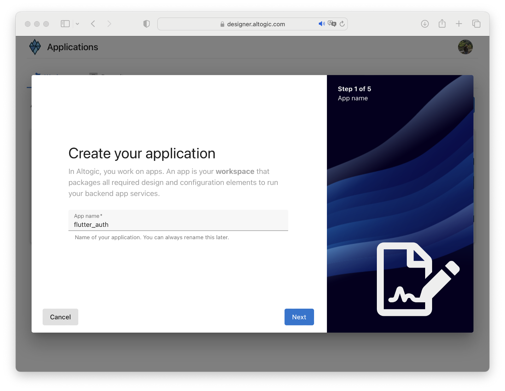
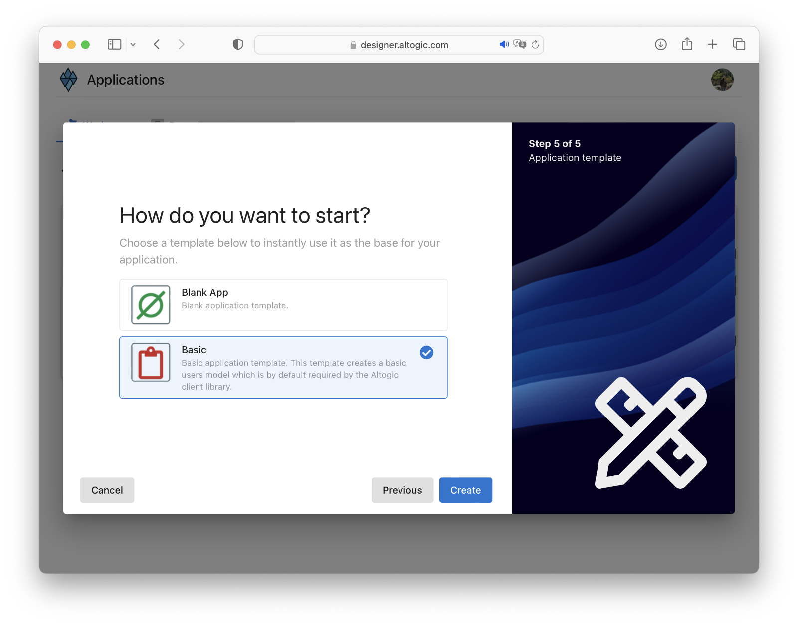
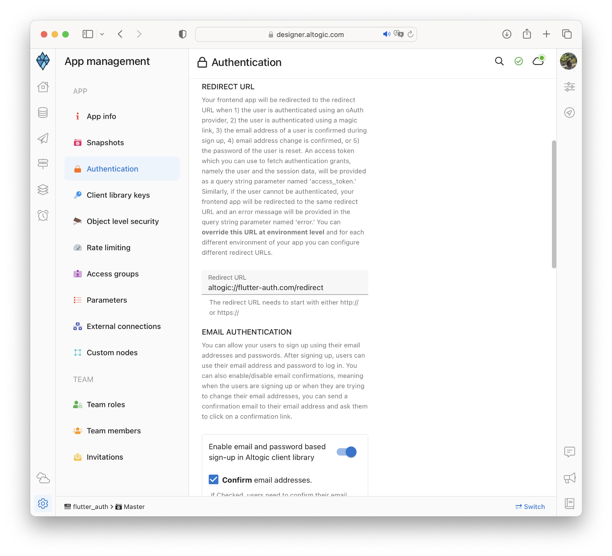

# How to Authenticate Email and Password Using Flutter & Altogic

## What is Altogic in Short

It is a BaaS platform that you can develop backend applications in minutes. Database, authentication, endpoints,
storages and more.. You can easily manage them all and use them easily with highly functional client libraries.
After creating an application, you can start using all these services on the front-end. In most cases, you can create
endpoints without coding and use them easily with the cleint library.

## Intro

In this tutorial, we will implement email/password authentication with Flutter and take a look how as a Flutter
developer we build applications and integrate with Altogic Authentication.

After completion of this tutorial, you will learn:

- How to create sample screens to display forms like login and signup.
- How to create a home screen and authorize only logged in users.
- How to create an authentication flow by conditionally rendering between these pages whether a user is logged-in or
  not.
- How to authenticate users using magic link
- How to update user profile info and upload a profile picture
- How to manage active sessions of a user
- And we will integrate Altogic authentication with the email/password method.

If you are new to Flutter, this tutorial is definitely for you to understand the basics and even advanced concepts.

## Prerequisites

To complete this tutorial, make sure you have installed following tools and utilities on your local development
environment.

- [Flutter SDK](https://docs.flutter.dev/get-started/install)
- [Flutter Project](https://codelabs.developers.google.com/codelabs/first-flutter-app-pt)
- You also need an [Altogic Account](https://designer.altogic.com/). If you have not one yet, you can create an account
  by signin up to Altogic.

## How email based sign-up works in Altogic

Here are Login and Signup components to collect information from the user.


Once the user created successfully a verification email will be sent to the user’s email address. When the user clicks
the link in the mail, the user will navigate to the redirect page to grant authentication rights. After successfully
creating a session on the Redirect page, users will be redirected to the Home page.

# Get Started

## Creating an Altogic App

We will use Altogic as a backend service platform, so let’s visit [Altogic Designer](https://designer.altogic.com/).

After creating an account, you will see the workspace where you can access your apps.


Click + New app and follow the instructions;

1. In the App name field, enter a name for the app.
2. Enter your subdomain.
3. Choose the deployment location.
4. And select your free execution environment pricing plan.



Then click Next and select Basic Authentication template. This template is creates a default user model for your app
which is required by [Altogic Client Library](https://github.com/altogic/altogic-js) to store user data and manage
authentication.

Then click Next and select Basic Authentication template. This template is based on session authentication and highly
recommended to secure your apps.



Then click Next to confirm and create an app.

Awesome! We have created our application; now click/tap on the <strong>newly created app to launch the
Designer.</strong>

> This is the only configuration we need to do in Altogic Designer. In order to access the app and use the Altogic
> client library, we should get envUrl and clientKey of this app.

Click the <strong>Home</strong> icon at the left sidebar to copy the envUrl and clientKey.


## Integrating with Altogic

Our backend is now ready and running on the server. ✨

Now, we can install the Altogic client library to our Flutter project to connect our frontend with the backend.

```sh
flutter create altogic_auth

cd altogic_auth

flutter pub add altogic
```

Let’s create a altogic.dart file inside of the lib/ directory.

Open altogic.dart and paste below code block to create global `AltogicClient` instance.

/lib/altogic.dart

```dart
import 'package:altogic_flutter/altogic_flutter.dart';

// This `envUrl` and `clientKey` is sample you need to create your own.
const String envUrl = 'https://c4-na.altogic.com/e:.......2900095';
const String clientKey = '5b05db.....85c262e8';

AltogicClient altogic = createClient(envUrl, clientKey);
```

> Replace envUrl and clientKey which is shown in the <strong>Home</strong> view
> of [Altogic Designer](https://designer.altogic.com/).

### Create an Application

We should use a stateful widget and `AltogicState` when creating the application to take advantage of the various
conveniences Altogic provides.

`AltogicState` listens deep links and provides deep linking actions with methods that can be override.

```dart

class AltogicAuthExampleApp extends StatefulWidget {
  const AltogicAuthExampleApp({Key? key}) : super(key: key);

  @override
  State<AltogicAuthExampleApp> createState() => _AltogicAuthExampleAppState();
}

class _AltogicAuthExampleAppState extends AltogicState<AltogicAuthExampleApp> {


  @override
  Widget build(BuildContext context) {
    // or WidgetsApp, CupertinoApp etc.
    return MaterialApp(

    );
  }
}

```

### Creating Splash Screen

When the application is opened, we can direct our user knowing whether there is an auth session.

`````dart

class SplashScreen extends StatefulWidget {
  const SplashScreen({Key? key}) : super(key: key);

  @override
  State<SplashScreen> createState() => _SplashScreenState();
}

class _SplashScreenState extends State<SplashScreen> {
  Future<void> init() async {
    // Check if there is an auth session.
  }

  @override
  void initState() {
    init();
    super.initState();
  }


  @override
  Widget build(BuildContext context) {
    return const Scaffold(
      body: Center(
        child: CircularProgressIndicator(),
      ),
    );
  }
}

`````

We can get the current auth session with `altogic.auth.currentState`.

`````dart
class _SplashScreenState extends State<SplashScreen> {


  Future<void> init() async {
    // If you want to show some beautiful things, show your splash screen for a while.
    await Future.delayed(const Duration(milliseconds: 500));

    if (altogic.auth.currentState.isLoggedIn) {
      // Navigate to Home page.
      if (mounted) Navigator.pushNamed(context, '/profile');
    } else {
      // Navigate to Login page.
      if (mounted) Navigator.pushNamed(context, '/sign-up');
    }
  }

  @override
  void initState() {
    init();
    super.initState();
  }
}
`````

> If you don't want to show splash screen when if your user is logged in, getting `context` throws an error in this
> case.
> Because the ``context`` not available before the first build. You can ensure that the context is available by using
> ``WidgetsBinding.instance.addPostFrameCallback((_) {})``.

### Creating Sign-Up Page

```dart
class SignUpPage extends StatefulWidget {
  const SignUpPage({Key? key}) : super(key: key);

  @override
  State<SignUpPage> createState() => _SignUpPageState();
}

class _SignUpPageState extends State<SignUpPage> {

  final TextEditingController emailController = TextEditingController();
  final TextEditingController passwordController = TextEditingController();
  final TextEditingController nameController = TextEditingController();

  @override
  Widget build(BuildContext context) {
    return Scaffold(
        body: Column(
            crossAxisAlignment: CrossAxisAlignment.center,
            mainAxisAlignment: MainAxisAlignment.center,
            children: [
              AltogicInput(hint: 'Email Address', editingController: emailController),
              AltogicInput(hint: 'Password', editingController: passwordController),
              AltogicInput(hint: 'Name', editingController: nameController),
              AltogicButton(body: 'Sign Up', onPressed: _signUp),
              TextButton(
                onPressed: () {
                  Navigator.pushNamed(context, '/sign-in');
                },
                child: const Text('Already have an account?'),
              )
            ]
        ));
  }


  Future<void> _signUp() async {
    // TODO: Implement sign up with altogic
  }
}
```

#### Implement Sign-Up

```dart
Future<void> _signUp() async {
  var result = await altogic
      .signUp(
      emailController.text,
      passwordController.text,
      nameController.text);

  if (result.errors != null) {
    ScaffoldMessenger.of(context)
        .showSnackBar(
        SnackBar(content: Text(result.errors.toJson().toString()))
    );
  } else {
    // Now your user should have received an email. The email contains a verification link.
    // We can show a dialog to say the user have to verify their email address.
    showDialog(
        context: context,
        builder: (context) =>
            AlertDialog(
              title: const Text('Verify your email address'),
              content: const Text('We have sent a verification email to your email address.'
                  ' Please verify your email address.'),
              actions: [
                TextButton(
                    onPressed: () {
                      Navigator.pop(context);
                    },
                    child: const Text('OK'))
              ],
            ));
  }
}
```

> If "Confirm email addresses" is turned on in Altogic designer's
> Authentication settings, ``result.user``  will not be null,
> but ``result.session`` will be null. In other words, our user is not yet
> ready to perform operations that require an auth session.
> For this, the email verification process must be successful.

### Add routes to the application

We can add routes to the application.

```dart
@override
Widget build(BuildContext context) {
  return MaterialApp(
    title: 'Altogic Auth Example',
    theme: ThemeData(
      primarySwatch: Colors.blue,
    ),
    initialRoute: '/',
    routes: {
      '/': (context) => const SplashScreen(),
      '/sign-up': (context) => const SignUpPage(),
    },
  );
}
```

**Now, we can run the application.**

### Running Application

If the session is held in the local (the user is logged in before), you need to restore the auth session from the local
to check this:

```dart
Future<void> main() async {
  WidgetsFlutterBinding.ensureInitialized();

  // Restores the session from the local storage.
  await altogic.restoreAuthSession();

  // Run application
  runApp(const AltogicAuthExampleApp());
}

```

Run the application:

```bash
flutter run
```

## Deep Linking

Altogic redirects the user to the **redirect url** in many authentication flow.

For example, when the user clicks the "Verify Email" in the mail, Altogic redirects the user to the **redirect url**.

We can handle the redirection in the application by using deep linking.

### Configure Deep Linking

#### Define redirect URL

We need to define a redirect URL in Altogic Designer. Altogic will redirect the user to the URL after the open email
verification link.

Your links should have a custom schema for the deep link used to open the application with Android and iOS.

For example, if you want to use `altogic://` as your schema, you should define `altogic://host/path` as your redirect
URL in Altogic Designer.



#### iOS

Add your deep link configuration to `ìnfo.plist`

In the example below, our custom URL scheme is ``altogic``, and our host is `com.flutter-auth`. So URLs
like ``altogic://com.flutter-auth/<path>`` opens the application.

````xml

<dict>
    <key>FlutterDeepLinkingEnabled</key>
    <true/>
    <key>CFBundleURLTypes</key>
    <array>
        <dict>
            <key>CFBundleTypeRole</key>
            <string>Editor</string>
            <key>CFBundleURLName</key>
            <string>com.flutter-auth</string>
            <key>CFBundleURLSchemes</key>
            <array>
                <string>altogic</string>
            </array>
        </dict>
    </array>
    …
</dict>
````

#### Android

Add your deep link configuration to your `<activity>` in AndroidManifest.xml

````xml

<activity
        android:name=".MainActivity"
>

    <meta-data android:name="flutter_deeplinking_enabled" android:value="true"/>
    <intent-filter android:autoVerify="true">
        <action android:name="android.intent.action.VIEW"/>
        <category android:name="android.intent.category.DEFAULT"/>
        <category android:name="android.intent.category.BROWSABLE"/>
        <data
                android:scheme="altogic"
                android:host="flutter-auth.com"/>
    </intent-filter>
</activity>
````

### Handling DeepLink

If you use the ``AltogicState`` in the root of the application, the `State` will be mounted while the application
lifecycle is resumed. So when the application is resumed or opened with the deep link, we can handle the link.

When the application opens by a deep link, ``AltogicState`` cannot synchronously inform you with which link the
application was opened. Instead, you can override methods to be called when a deep link opens the application.

Available methods to override: `onEmailVerificationLink`, `onMagicLink`, `onOauthProviderLink`, `onEmailChangeLink`
, `onPasswordResetLink`.

`````dart
class _AltogicAuthExampleAppState extends AltogicState<AltogicAuthExampleApp> {

  @override
  void onEmailVerificationLink(BuildContext? context, EmailVerificationRedirect redirect) {
    // WHEN THE APPLICATION IS OPENED WITH EMAIL VERIFICATION LINK
  }

  @override
  Widget build(BuildContext context) {
    return MaterialApp(

      // Using for deep linking methods BuildContext parameter.
      // If you use e.g onEmailVerificationLink called with context,
      // otherwise BuildContext will be null on the method.
      navigatorObservers: [navigatorObserver],
      // ...
    );
  }
}
`````

### Email Verification

When the application is opened by an email verification link, the ``onEmailVerificationLink`` method is called.

````dart
@override
void onEmailVerificationLink(BuildContext? context, EmailVerificationRedirect redirect) {
  // When the application is opened with an email verification link,
  // We can navigate to the email verification page.
  if (context != null) {
    navigateTo((c) => EmailVerificationRedirectPage(redirect: redirect));
    // or use your own navigation method
  }
}
````

> The context will not be null in this example below because we used the `navigatorObserver`.

#### EmailVerificationRedirectPage

The "email verification redirect URL" contains `action`, `status`, and `access_token` parameters. Also, `error` if any.

If there is no error, the ``access_token`` parameter will not be null, and an auth "session" and "user" can be gotten
with `getAuthGrant`.

`````dart
Future<void> getAuthSession() async {
  if (redirect.error == null) {
    // HANDLE ERROR CASE
  }
  var result = await altogic.getAuthSession(redirect.token);
}
`````

On our redirect page, we can get auth grant with ``redirect.token`` or handle errors. This page has three possible
states (excluding pending auth grant).

- Redirect link status is an error: User deleted etc.
- Redirect link valid, getting auth grant return error: Token expired, etc.
- Everything success. The user logged in.

````dart
class EmailVerificationRedirectPage extends StatefulWidget {
  const EmailVerificationRedirectPage({Key? key, required this.redirect})
      : super(key: key);

  final EmailVerificationRedirect redirect;

  @override
  State<EmailVerificationRedirectPage> createState() =>
      _EmailRedirectPageState();
}

class _EmailRedirectPageState extends State<EmailVerificationRedirectPage> {
  UserSessionResult? userState;

  @override
  void initState() {
    getAuthSession();
    super.initState();
  }


  Future<void> getAuthSession() async {
    if (widget.redirect.error == null) {
      // HANDLE ERROR CASE
    }
    var result = await altogic.getAuthSession(widget.redirect.token);
    setState(() {
      userState = result;
    });
    if (result.user != null && result.session != null) {
      Timer(const Duration(seconds: 3), () {
        Navigator.pushNamed(context, '/profile');
      });
    }
  }

  @override
  Widget build(BuildContext context) {
    Widget body;

    if (widget.redirect.error != null) {
      // Link status is error: User deleted etc.
      body = Text('ERROR: ${widget.redirect.error}');
    } else if (userState == null) {
      // redirect link success. Auth grant pending.
      body = const CircularProgressIndicator();
    } else if (userState!.errors != null) {
      // Auth grant error: Token expired etc.
      body = SingleChildScrollView(child: Text(userState!.errors!.toString()));
    } else if (userState!.user != null) {
      // Everything success. User logged in.
      body =
          Text("Routing home...\n\nYour Data:\n\n${userState!.user!.toJson()}");
    } else {
      // The case is not possible
      body = const Text("Unknown error");
    }

    return Scaffold(
      body: Center(
        child: body,
      ),
    );
  }
}
````

**Now we can open our email verification link.**

**The user is now verified.**

Altogic automatically signs in after verification. Then the user can log in with an email and password.

## Creating Sign-In Page

```dart
class SignInPage extends StatefulWidget {
  const SignInPage({Key? key}) : super(key: key);

  @override
  State<SignInPage> createState() => _SignInPageState();
}


class _SignInPageState extends State<SignInPage> {

  final TextEditingController emailController = TextEditingController();
  final TextEditingController passwordController = TextEditingController();

  @override
  Widget build(BuildContext context) {
    return Scaffold(
        body: Column(
            crossAxisAlignment: CrossAxisAlignment.center,
            mainAxisAlignment: MainAxisAlignment.center,
            children: [
              AltogicInput(hint: 'Email Address', editingController: emailController),
              AltogicInput(hint: 'Password', editingController: passwordController),
              AltogicButton(body: 'Sign In', onPressed: _signIn),
              TextButton(
                onPressed: () {
                  Navigator.pushNamed(context, '/sign-up');
                },
                child: const Text('Don\'t have an account?'),
              )
            ]
        ));
  }

  Future<void> _signIn() async {
    // TODO: Implement sign in with altogic
  }
}

```

#### Implement Sign-In

```dart
Future<void> _signIn() async {
  var result = await altogic.signIn(emailController.text, passwordController.text);

  if (result.errors != null) {
    ScaffoldMessenger.of(context)
        .showSnackBar(
        SnackBar(content: Text(result.errors.toJson().toString()))
    );
  } else {
    // Navigate to Home page.
    Navigator.pushNamed(context, '/profile');
  }
}
```

**Our user is ready.**

## Sign Out

We can sign out with ``altogic.auth.signOut()``.

`````dart
Future<void> _signOut() async {
  await altogic.auth.signOut();
  Navigator.pushReplacementNamed(context, '/sign-in');
}
`````

## Profile Page

Now let's make a profile page where our users' names and profile pictures appear.

`````dart

class ProfilePage extends StatefulWidget {
  const ProfilePage({Key? key}) : super(key: key);

  @override
  State<ProfilePage> createState() => _ProfilePageState();
}

class _ProfilePageState extends State<ProfilePage> {
  late TextEditingController nameController;

  @override
  void initState() {
    nameController = TextEditingController(
        text: altogic.auth.currentState.user?.name
    );
    super.initState();
  }

  Future<void> setUserName() async {
    // TODO: Implement set user name
  }

  User get user => altogic.auth.currentState.user!;

  Future<void> updateProfilePhoto() async {
    // TODO: Implement update profile photo
  }


  @override
  Widget build(BuildContext context) {
    return Scaffold(
      body: Center(
        child: SingleChildScrollView(
          child: !altogic.auth.currentState.isLoggedIn
              ? const Text("User Not Logged")
              : Column(
            crossAxisAlignment: CrossAxisAlignment.center,
            children: [
              CircleAvatar(
                radius: 80,
                backgroundImage: user.profilePicture != null
                    ? NetworkImage(
                  user.profilePicture!,
                )
                    : null,
              ),
              ValueListenableBuilder(
                  valueListenable: nameController,
                  builder: (context, value, child) {
                    return TextField(
                      controller: nameController,
                      decoration: InputDecoration(
                          border: const OutlineInputBorder(),
                          label: const Text('Name'),
                          suffixIcon: IconButton(
                            icon: const Icon(Icons.save),
                            onPressed: nameController.text !=
                                altogic.auth.currentState
                                    .user?.name
                                ? setUserName
                                : null,
                          )),
                    );
                  })
            ],
          ),
        ),
      ),
    );
  }
}
`````

#### Implement Set User Name

`````dart
  Future<void> setUserName() async {
  var response = await altogic.db
      .model('users')
      .object(altogic.auth.currentState.user?.id)
      .update({
    'name': nameController.text,
  });

  if (response.errors == null) {
    altogic.auth.setUser(User.fromJson(response.data!));
    setState(() {});
    if (mounted) {
      ScaffoldMessenger.of(context)
          .showSnackBar(const SnackBar(content: Text('User updated')));
    }
  } else {
    if (mounted) {
      ScaffoldMessenger.of(context)
          .showSnackBar(const SnackBar(content: Text('Error')));
    }
  }
}
`````

#### Implement Update Profile Photo

We must define a method for our users to select and upload images.

If an image is selected, we can upload the image later. Then if the operation is successful, we can update our
user's `profilePicture`.

`````dart
  Future<void> updateProfilePhoto() async {
  var pickedFile = await ImagePicker().pickImage(source: ImageSource.gallery);
  if (pickedFile == null) {
    return;
  }

  var imageBytes = await pickedFile.readAsBytes();

  var upload = await altogic.storage.bucket("profile_pictures").upload(
      '${user.id}.jpg',
      imageBytes,
      FileUploadOptions(
          contentType: pickedFile.mimeType ?? "image/jpeg",
          isPublic: true,
          onProgress: (uploaded, total, percent) {
            progress.value = percent;
          }));

  if (upload.errors != null) {
    if (mounted) {
      ScaffoldMessenger.of(context).showSnackBar(
          const SnackBar(content: Text('Error uploading image')));
    }
    return;
  }
  var res = await altogic.db
      .model('users')
      .object(altogic.auth.currentState.user?.id)
      .update({
    'profilePicture': upload.data!['publicPath'],
  });

  if (res.errors == null) {
    altogic.auth.setUser(User.fromJson(res.data!));
    setState(() {});
  }
}
`````

### Listen to Auth State Changes

We can listen to auth state changes with ``altogic.auth.onAuthStateChanged``.

`````dart
  @override
  void initState() {
    // ...
    altogic.auth.onAuthStateChanged.listen((event) {
      if (!event.isLoggedIn && mounted) {
        Navigator.pushReplacementNamed(context, '/sign-in');
      } else {
        if (mounted) {
          setState(() {});
        }
      }
    });
    super.initState();
  }
`````


## Conclusion

Congratulations!✨

> You have completed the most critical part of the Authentication flow, which includes sign-up, sign-in, and sign-out operations. If you have questions about Altogic or want to share what you have built, please post a message in our Community Forum or Discord Channel.

## Getting source code

You can get the all examples with
````shell
git clone https://github.com/altogic/altogic.git
````

Or you can get all dart examples with
````shell
git clone \
  --depth 1  \
  --filter=blob:none  \
  --sparse \
  https://github.com/altogic/altogic \
;
cd altogic
git sparse-checkout set dart_examples
cd dart_examples
````

Or you can get only this example

`````shell
git clone \
  --depth 2  \
  --filter=blob:none  \
  --sparse \
  https://github.com/altogic/altogic \
;
cd altogic
git sparse-checkout set dart_examples/flutter_auth_example
cd dart_examples
cd flutter_auth_example
`````