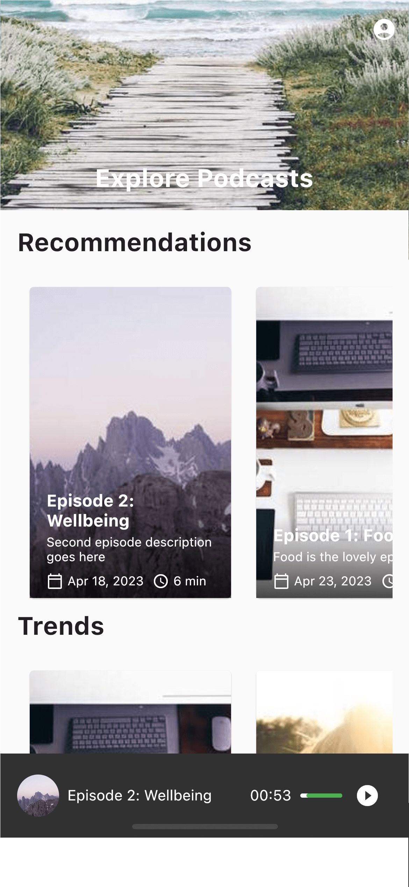
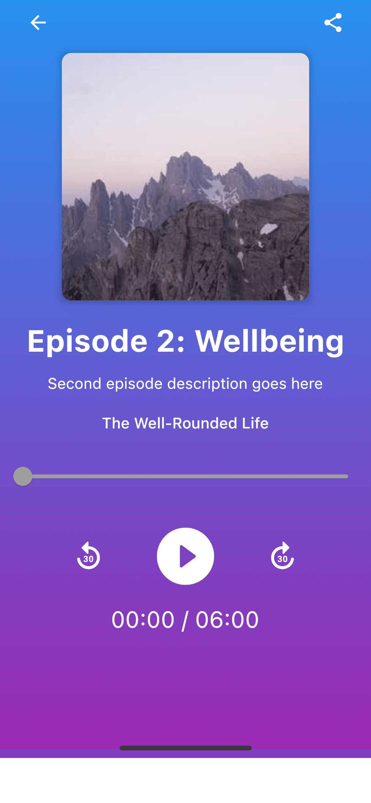

# Flutter & Altogic Podcast App

A new Flutter podcast app. This app is built using [Altogic](https://altogic.com) as backend.

## Screenshots

<p float="left">
  
  
  
  
  
  
</p>

## Installation

After cloning the project, run the following command in the project directory:

```bash
flutter pub get
```

## Preparing backend

This project uses Altogic as backend. You can clone the backend project from [Altogic Marketplace](https://designer.altogic.com) freely and follow the instructions to run it.

## Running the app

After preparing the backend, you need to set the environment url and client key in the `utils/altogic_service.dart` file.

```dart
import 'package:altogic/altogic.dart';

const String envUrl = 'https://c3-na.altogic.com/e:643d5f8dd21be6bdc5e77aef';
const String clientKey = 'a2e3e45a9620471aa1660eb54bcc72f4';

final altogic = createClient(envUrl, clientKey);
```

Then, you can run the app using the following command:

```bash

flutter run
```

## License

This project is licensed under the MIT License.
