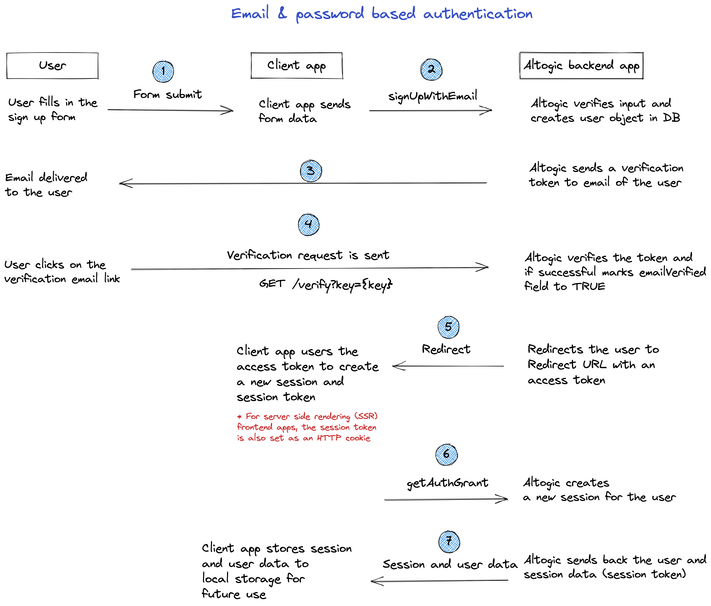
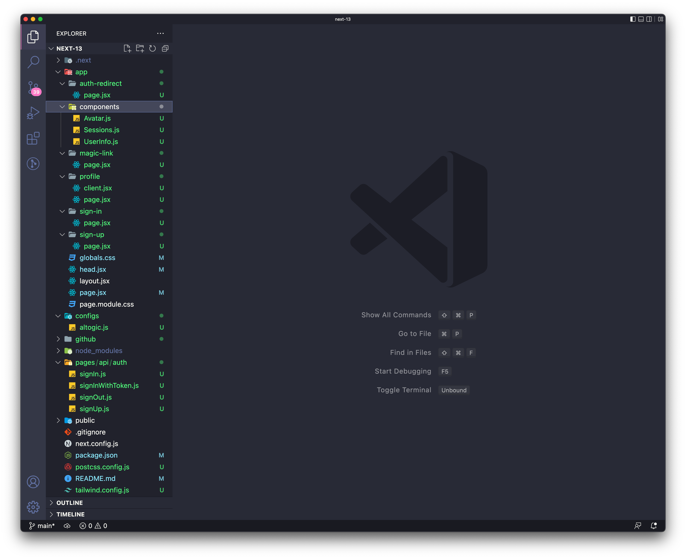

# Email & Password Based Authentication Using Next.js 13 & Altogic

## Introduction
**Altogic** is a Backend as a Service (BaaS) platform and provides a variety of services in modern web and mobile development. Most of the modern applications using Next.js or other libraries/frameworks require to know the identity of a user. And this necessity allows an app to securely save user data and session in the cloud and provide more personalized functionalities and views to users.

Altogic has an Authentication service that integrates and implements well in JAMstack apps. It has a ready-to-use Javascript client library, and it supports many authentication providers such as email/password, phone number, magic link, and OAuth providers like Google, Facebook, Twitter, Github, Apple, etc.,

In this tutorial, we will implement email/password authentication with Next.js and take a look how as a Next developer we build applications and integrate with Altogic Authentication.

After completion of this tutorial, you will learn:

* How to create sample screens to display forms like login and signup.
* How to create a home screen and authorize only logged-in users.
* How to create different routes using the next-navigation.
* How to create an authentication flow by conditionally rendering between these pages whether a user is logged-in or not.
* How to authenticate users using magic link
* How to update user profile info and upload a profile picture
* And we will integrate Altogic authentication with the email/password method.

If you are new to Next applications, this tutorial is definitely for you to understand the basics and even advanced concepts.

## How email-based sign-up works in Altogic
By default, when you create an app in Altogic, email-based authentication is enabled. In addition, during email-based authentication, the user's email address is also verified. Below you can find the flow of email and password-based sign-up process.



If email verification is disabled, then after step 2, Altogic immediately returns a new session to the user, meaning that steps after step #2 in the above flow are not executed. You can easily configure email-based authentication settings from the App Settings > Authentication in Altogic Designer. You need to specify one critical parameter, the Redirect URL; you can customize this parameter from App Settings > Authentication. Finally, you can customize the email message template from the App Settings > Authentication > Message Templates.

> For frontend apps that use server-side rendering, the session token needs to be stored in an HTTP cookie so that the client browser and the frontend server can exchange session information. Otherwise, the session information can be lost, and the Altogic Client library methods that require a session token can fail.

## Prerequisites
To complete this tutorial, ensure you have installed the following tools and utilities on your local development environment.

- [VsCode](https://code.visualstudio.com/download)
- [NodeJS](https://nodejs.org/en/download/)
- [Next.js 13](https://nextjs.org/docs/getting-started)
- You also need an Altogic Account. If you do not have one, you can create an account by [signin up for Altogic](https://designer.altogic.com/).

## Creating an Altogic App
After creating an account, you will see the workspace where you can access your apps.


Click + New app and follow the instructions;

1. In the App name field, enter a name for the app.
2. Enter your subdomain.
3. Choose the deployment location.
4. And select your free execution environment pricing plan.


Then click Next and select Basic template. **This template creates a default user data model for your app which is required by [Altogic Client Library](https://www.npmjs.com/package/altogic) to store user data and manage authentication.** You can add additional user fields to this data model (e.g., name, surname, gender, birthdate) and when calling the `signUpWithEmail` method of the client library you can pass these additional data.


> **Tip:** If you do not select the basic template, instead selected the blank app template the user data model will not be created for your app. In order to use the Altogic Client Library's authentication methods you need a user data model to store the user data. You can easily create a new data model manually and from the **App Settings > Authentication** mark this new data model as your user data model. 

Then click Next to confirm and create an app.

Awesome! We have created our application; now click/tap on the <strong>newly created app to launch the Designer.</strong> In order to access the app and use the Altogic client library, we should get `envUrl` and `clientKey` of this app. You can use any one of the API base URLs specified for your app environment as your envUrl.

Click the <strong>Home</strong> icon at the left sidebar to copy the `envUrl` and `clientKey`.


Once the user is created successfully, our Next.js app will route the user to the Verification page, and a verification email will be sent to the user's email address. When the user clicks the link in the mail, the user will navigate to the redirect page to grant authentication rights. After successfully creating a session on the Redirect page, users will be redirected to the Home page.

> If you want, you can deactivate or customize the mail verification from **App Settings -> Authentication** in Logic Designer.


We have changed the redirect URL to `http://localhost:3000/auth-redirect`

## Create a Next.js project
```bash
yarn create next-app
```


## Integrating with Altogic
Our backend and frontend is now ready and running on the server. ✨

Now, we can install the Altogic client library to our Next.js app to connect our frontend with the backend.

```bash
# using npm
npm install altogic
# OR is using yarn
yarn add altogic
```

Let’s create a configs/ folder inside of the src/ directory to add altogic.js file.

Open altogic.js and paste below code block to export the altogic client instance.

`/src/configs/altogic.js`

```javascript
// /configs/altogic.js
import { createClient } from "altogic";

// This `envUrl` and `clientKey` is sample you need to create your own.
let envUrl = "https://auth.c1-na.altogic.com";
let clientKey = "e574fee1fb2b443...a8598ca68b7d8";

const altogic = createClient(envUrl, clientKey, {
  signInRedirect: "/sign-in",
});

// We will use this function in server-side.
export const altogicWithToken = (token) => {
  altogic.auth.setSession({ token });
  return altogic;
};

export default altogic;
```

> Replace envUrl and clientKey which is shown in the <strong>Home</strong> view of [Altogic Designer](https://designer.altogic.com/).

> `signInRedirect` is the sign in page URL to redirect the user when user's session becomes invalid. Altogic client library observes the responses of the requests made to your app backend. If it detects a response with an error code of missing or invalid session token, it can redirect the users to this signin url.

## Create Routes

Next has built-in file system routing. We can create a page by creating a file in the **app/** directory.

Let's create some views in **app/** folder as below:
* sign-in
* sign-up
* auth-redirect
* magic-link
* profile



### Index Page
On this page, we will show the Login, Login With Magic Link, and Register buttons.

Replacing `app/page.jsx` with the following code:
```javascript
// app/page.jsx
import Link from "next/link";

function IndexView() {
  return (
    <div className="flex items-center justify-center gap-4 h-screen">
      <Link class="border px-4 py-2 font-medium text-xl" href="/magic-link">
        Login With Magic Link
      </Link>
      <Link class="border px-4 py-2 font-medium text-xl" href="/sign-in">
        Sign In
      </Link>
      <Link class="border px-4 py-2 font-medium text-xl" href="/sign-up">
        Sign Up
      </Link>
    </div>
  );
}
export default IndexView;
```

### Login Page
On this page, we will show a form to log in with your email and password. We will use fetch function to call our backend API. We will save session and user info to state and storage if the API returns success. Then the user will be redirected to the profile page.

Replacing `app/sign-in/page.jsx` with the following code:
```javascript
// app/sign-in/page.jsx
"use client";

import { useRouter } from "next/navigation";
import Link from "next/link";
import { useState } from "react";

function SignInView() {
  const router = useRouter();

  const [error, setError] = useState(null);
  const [loading, setLoading] = useState(false);

  const handleSignIn = async (e) => {
    e.preventDefault();
    const [email, password] = e.target;
    try {
      setLoading(true);
      const response = await fetch("/api/auth/signIn", {
        method: "POST",
        body: JSON.stringify({
          email: email.value,
          password: password.value,
        }),
      });
      if (!response.ok) {
        const { errors } = await response.json();
        throw errors;
      }
      router.push("/profile");
    } catch (err) {
      setLoading(false);
      setError(err.items);
    }
  };

  return (
    <section className="flex flex-col items-center justify-center h-96 gap-4">
      <form
        className="flex flex-col gap-2 w-full md:w-96"
        onSubmit={handleSignIn}
      >
        <h1 className="self-start text-3xl font-bold">Login to your account</h1>
        {error?.map(({ message }) => (
          <div key={message} className="bg-red-600 text-white text-[13px] p-2">
            <p>{message}</p>
          </div>
        ))}

        <input type="email" placeholder="Type your email" />
        <input
          autoComplete="new-password"
          type="password"
          placeholder="Type your password"
        />
        <div className="flex justify-between gap-4">
          <Link className="text-indigo-600" href="/sign-up">
            Don't have an account? Register now
          </Link>
          <button
            type="submit"
            className="border py-2 px-3 border-gray-500 hover:bg-gray-500 hover:text-white transition shrink-0"
            disabled={loading}
          >
            Login
          </button>
        </div>
      </form>
    </section>
  );
}

export default SignInView;
```

### Register Page
On this page, we will show a form to sign up with email and password. We will use fetch function to call our `sign-up API`.

We will save the session and user info to state and storage if the API returns session. The user will be redirected to the profile page.

If `signUpWithEmail` does not return the session, the user must confirm the email so we will show the success message.

Replacing `app/sign-up/page.jsx` with the following code:
```javascript
// /app/sign-up/page.jsx
"use client";
import { useState } from "react";
import Link from "next/link";
import { useRouter } from "next/router";

function SignUpView() {
  const router = useRouter();

  const [loading, setLoading] = useState(false);
  const [success, setSuccess] = useState("");
  const [error, setError] = useState(null);

  const handleSignUp = async (e) => {
    e.preventDefault();
    const [name, email, password] = e.target;
    try {
      setLoading(true);
      const response = await fetch("/api/auth/signUp", {
        method: "POST",
        body: JSON.stringify({
          name: name.value,
          email: email.value,
          password: password.value,
        }),
      });
      const { session, errors } = await response.json();

      if (!response.ok) {
        throw errors;
      }

      if (session) {
        router.replace("/profile");
      } else {
        setSuccess(`We sent a verification link to ${email.value}`);
        setError(null);
        setLoading(false);
        name.value = "";
        email.value = "";
        password.value = "";
      }
    } catch (err) {
      setSuccess(null);
      setError(err.items);
      setLoading(false);
    }
  };

  return (
    <section className="flex flex-col items-center justify-center h-96 gap-4">
      <form
        className="flex flex-col gap-2 w-full md:w-96"
        onSubmit={handleSignUp}
      >
        <h1 className="self-start text-3xl font-bold">Create an account</h1>
        {success && (
          <div className="bg-green-500 text-white p-2">{success}</div>
        )}
        {error?.map(({ message }) => (
          <div key={message} className="bg-red-600 text-white text-[13px] p-2">
            <p>{message}</p>
          </div>
        ))}

        <input type="text" placeholder="Type your name" />
        <input type="email" placeholder="Type your email" />
        <input
          autoComplete="new-password"
          type="password"
          placeholder="Type your password"
        />
        <div className="flex justify-between gap-4">
          <Link className="text-indigo-600" href="/sign-in">
            Already have an account?
          </Link>
          <button
            type="submit"
            className="border py-2 px-3 border-gray-500 hover:bg-gray-500 hover:text-white transition shrink-0"
            disabled={loading}
          >
            Register
          </button>
        </div>
      </form>
    </section>
  );
}

export default SignUpView;
```

### Profile Page (Client Side)
On this page, we will show the user's profile, and we will use fetch function to call our `sign-out API`.

We will remove session and user info from state and storage if the signOut API return success. The user will be redirected to the login page.

Replacing `app/profile/client.jsx` with the following code:
```javascript
// app/profile/client.jsx
"use client";

import { useRouter } from "next/navigation";
import { useEffect, useState } from "react";
import altogic from "../../configs/altogic";
import Avatar from "../components/Avatar";
import Sessions from "../components/Sessions";
import UserInfo from "../components/UserInfo";

function ProfileClient({ user: userProp, sessionList }) {
  const [user, setUser] = useState(userProp);
  const [sessions, setSessions] = useState(sessionList);

  const router = useRouter();

  const handleSignOut = async () => {
    try {
      const response = await fetch("/api/auth/signOut", {
        method: "POST",
      });
      const { errors } = await response.json();

      if (!response.ok) {
        throw errors;
      }
      altogic.auth.clearLocalData();
      router.push("/profile");
    } catch (err) {
      console.error(err);
    }
  };

  useEffect(() => {
    if (user && sessionList) {
      const currentSession = sessionList.find((s) => s.isCurrent);
      altogic.auth.setUser(user);
      altogic.auth.setSession(currentSession);
    }
  }, []);

  return (
    <section className="h-screen py-4 space-y-4 flex flex-col text-center items-center">
      <Avatar user={user} setUser={setUser} />
      <UserInfo user={user} setUser={setUser} />
      <Sessions sessions={sessions} setSessions={setSessions} />

      <button
        className="bg-gray-400 rounded py-2 px-3 text-white"
        onClick={handleSignOut}
      >
        Sign Out
      </button>
    </section>
  );
}

export default ProfileClient;
```

### Profile Page (Server Side)
Profile page is protected. Before the client loads, server component loads. We will check the cookie. If there is a token and it's valid, we will sign in and fetch user and session information.
If it is not valid, The user will be redirected to the sign-in page.

Replacing `app/profile/page.jsx` with the following code:
```js
// app/profile/page.jsx
import { cookies } from "next/headers";
import { redirect } from "next/navigation";
import { altogicWithToken } from "../../configs/altogic";
import ProfileClient from "./client";

async function ProfileView() {
  const { user, sessionList, token } = await getUser();

  return <ProfileClient user={user} sessionList={sessionList} token={token} />;
}

async function getUser() {
  const nextCookies = cookies();
  const session_token = nextCookies.get("session_token")?.value;

  const { user, errors } = await altogicWithToken(
    session_token
  ).auth.getUserFromDB();

  if (errors) redirect("/sign-in");

  const { sessions } = await altogicWithToken(
    session_token
  ).auth.getAllSessions();
  const sessionList = sessions.map((session) =>
    session.token === session_token ? { ...session, isCurrent: true } : session
  );
  return {
    user,
    sessionList,
    token: session_token,
  };
}

export default ProfileView;
```

### Auth Redirect Page
We use this page to verify the user's email address and process magic link. This is the page where the user is redirected when clicked on the sign-up email confirmation link or the magic link.

We will use the fetch function to call our Next.js's API. The user will be redirected to the profile page if the API returns success. If the API returns an error, redirected to the sign-in page.

Replacing `app/auth-redirect/page.jsx` with the following code:
```javascript
// app/auth-redirect/page.jsx
"use client";

import { useRouter, useSearchParams } from "next/navigation";
import { useEffect } from "react";

function AuthRedirectView() {
  const router = useRouter();
  const searchParams = useSearchParams();

  const handleToken = async () => {
    const access_token = searchParams.get("access_token");
    const response = await fetch("/api/auth/signInWithToken", {
      method: "POST",
      body: JSON.stringify({
        access_token,
      }),
    });

    if (response.ok) router.push("/profile");
    else router.push("/sign-in");
  };

  useEffect(() => {
    handleToken();
  }, []);

  return (
    <div>
      <div>Redirecting...</div>
    </div>
  );
}

export default AuthRedirectView;
```

### Magic Link Page
On this page, we will show a form to log in with Magic Link with only email. We will use Altogic's `altogic.auth.sendMagicLinkEmail()` function to log in.

When the user clicks on the magic link in the email, Altogic verifies the validity of the magic link and, if successful, redirects the user to the redirect URL specified in your app authentication settings with an access token in a query string parameter named `access_token.` The magic link flows in a similar way to the sign-up process. We use the `getAuthGrant` method explained above to create a new session and associated `sessionToken`.

```javascript
// /app/magic-link/page.jsx
"use client";

import Link from "next/link";
import { useState } from "react";
import altogic from "../../configs/altogic";

function MagicLinkView() {
  const [success, setSuccess] = useState("");
  const [errors, setErrors] = useState(null);
  const [loading, setLoading] = useState(false);

  async function loginHandler(e) {
    e.preventDefault();
    const [email] = e.target;
    setLoading(true);
    setErrors(null);

    const { errors: apiErrors } = await altogic.auth.sendMagicLinkEmail(
      email.value
    );
    setLoading(false);

    if (apiErrors) {
      setErrors(apiErrors.items);
    } else {
      email.value = "";
      setSuccess("Email sent! Check your inbox.");
    }
  }

  return (
    <section className="flex flex-col items-center justify-center h-96 gap-4">
      <form
        className="flex flex-col gap-2 w-full md:w-96"
        onSubmit={loginHandler}
      >
        <h1 className="self-start text-3xl font-bold">Login with magic link</h1>
        {success && (
          <div className="bg-green-600 text-white text-[13px] p-2">
            {success}
          </div>
        )}
        {errors && (
          <div className="bg-red-600 text-white text-[13px] p-2">
            {errors.map(({ message }) => (
              <p key={message}>{message}</p>
            ))}
          </div>
        )}

        <input type="email" placeholder="Type your email" />
        <div className="flex justify-between gap-4">
          <Link className="text-indigo-600" href="/sign-up">
            Don't have an account? Register now
          </Link>
          <button
            disabled={loading}
            type="submit"
            className="border py-2 px-3 border-gray-500 hover:bg-gray-500 hover:text-white transition shrink-0"
          >
            Send magic link
          </button>
        </div>
      </form>
    </section>
  );
}

export default MagicLinkView;
```

# Handling Authentication
Next is a server-side rendering tool. We will do some operations on the Next.js server. So we need to create a folder named **API** in the pages directory.

For client-side (browser) rendered frontend apps, Altogic automatically stores the `sessionToken` in local storage. For server-side rendered frontend apps, since we do not have local storage available, we need to store the `sessionToken` somewhere to check whether the user has been authenticated or not. For this reason, we will store the `sessionToken` in an HTTP cookie named “session” which will be exchanged between the client browser and the front end server.

## Create an API Folder
Create a folder named **auth** in pages/api.

And create files in api folder similar to the image below


### Sign In Endpoint
In this file, we have created an endpoint for users to log in. And here, we are logging in by assigning the session token returned from altogic to the cookie.
```js
// /pages/api/auth/sign-in.js
import altogic from "../../../configs/altogic";

export default async function handler(req, res) {
  const { email, password } = JSON.parse(req.body);

  const { user, session, errors } = await altogic.auth.signInWithEmail(
    email,
    password
  );

  if (errors) {
    res.status(errors.status).json({ errors });
  } else {
    altogic.auth.setSessionCookie(session.token, req, res);
    altogic.auth.setSession(session);
    res.status(200).json({ user, session });
  }
}
```

### Sign Up Endpoint
We have created an endpoint for users to register.

> `signUpWithEmail` function can accept optional  third parameter data to save the user's profile. We will save the user's name to the database in this example.

```js
// /pages/api/auth/sign-up.js
import altogic from "../../../configs/altogic";

export default async function handler(req, res) {
  const { name, email, password } = JSON.parse(req.body);

  const { user, session, errors } = await altogic.auth.signUpWithEmail(
    email,
    password,
    name
  );

  if (errors) {
    res.status(errors.status).json({ errors });
  } else {
    if (session) {
      altogic.auth.setSessionCookie(session.token, req, res);
      altogic.auth.setSession(session);
    }
    res.status(200).json({ user, session });
  }
}
```

### Sign Out Endpoint
We have created an endpoint for users to sign out. If there is no error, we remove the `sessionToken` from the HTTP cookie.
```js
// /pages/api/auth/sign-out.js
import altogic, { altogicWithToken } from "../../../configs/altogic";

export default async function handler(req, res) {
  const token = req.cookies.session_token;
  const { errors } = await altogicWithToken(token).auth.signOut();
  altogic.auth.removeSessionCookie(req, res);

  if (errors) {
    res.status(errors.status).json({ errors });
  } else {
    res.status(200).json({ data: true });
  }
}
```

### Sign In with Access Token Endpoint
We will use Altogic's `altogic.auth.getAuthGrant()` function to log in with the handled access_token from the URL and use this access_token to create a new user session and associated `sessionToken`.

```js
import altogic from "../../../configs/altogic";

export default async function handler(req, res) {
  const { access_token } = JSON.parse(req.body);

  const { user, session, errors } = await altogic.auth.getAuthGrant(
    access_token
  );

  if (errors) {
    res.status(errors.status).json({ errors });
  } else {
    altogic.auth.setSessionCookie(session.token, req, res);
    altogic.auth.setSession(session);
    res.status(200).json({ user, session });
  }
}
```

## Updating User Info
In this component, we will use Altogic's database operations to update user fields and manage sessions.


Let's create some components in **src/components/** folder as below:
* UserInfo.js
* Sessions.js

Replacing `app/components/UserInfo.js` with the following code:
```js
// app/components/UserInfo.js
"use client";

import { useRef, useState } from "react";
import altogic from "../../configs/altogic";

function UserInfo({ user, setUser }) {
  const inputRef = useRef();

  const [name, setName] = useState("");

  const [changeMode, setChangeMode] = useState(false);
  const [errors, setErrors] = useState(null);

  const handleNameChange = () => {
    setChangeMode(true);
    setTimeout(() => {
      inputRef.current.focus();
    }, 100);
  };

  const handleKeyDown = async (e) => {
    if (e.code === "Enter") {
      setErrors(null);

      const { data: updatedUser, errors: apiErrors } = await altogic.db
        .model("users")
        .object(user._id)
        .update({ name });

      if (apiErrors) setErrors(apiErrors.items[0].message);
      else setUser(updatedUser);

      setChangeMode(false);
    }
  };

  return (
    <section className="border p-4 w-full">
      {changeMode ? (
        <div className="flex items-center justify-center">
          <input
            ref={inputRef}
            onKeyDown={handleKeyDown}
            type="text"
            className="border-none text-3xl text-center"
            onChange={(e) => setName(e.target.value)}
            value={name}
          />
        </div>
      ) : (
        <div className="space-y-4">
          <h1 className="text-3xl">Hello, {user?.name}</h1>
          <button onClick={handleNameChange} className="border p-2">
            Change name
          </button>
        </div>
      )}
      {errors && <div>{errors}</div>}
    </section>
  );
}

export default UserInfo;
```

Replacing `app/components/Sessions.js` with the following code:
```js
// app/components/Sessions.js
"use client";

import altogic from "../../configs/altogic";

function Sessions({ sessions, setSessions }) {
  const logoutSession = async (session) => {
    const { errors } = await altogic.auth.signOut(session.token);
    if (!errors) {
      setSessions(sessions.filter((s) => s.token !== session.token));
    }
  };

  return (
    <div className="border p-4 space-y-4">
      <p className="text-3xl">All Sessions</p>
      <ul className="flex flex-col gap-2">
        {sessions?.map((session) => (
          <li key={session.token} className="flex justify-between gap-12">
            <div>
              {session.isCurrent && <span> Current Session </span>}
              <span>
                {" "}
                <strong>Device name: </strong>
                {session?.userAgent.device.family}
              </span>
            </div>
            <div className="flex items-center gap-2">
              <span>
                {new Date(session.creationDtm).toLocaleDateString("en-US")}
              </span>
              {!session.isCurrent && (
                <button
                  onClick={() => logoutSession(session)}
                  className="border grid place-items-center p-2 h-8 w-8 aspect-square leading-none"
                >
                  X
                </button>
              )}
            </div>
          </li>
        ))}
      </ul>
    </div>
  );
}

export default Sessions;
```

> Important Note: `swcMinify:false` statement must be added to the `next.config.js` file to build in Next 13.

## Bonus: Upload Profile Photo
Let's create an Avatar component to upload a profile photo. 

Open `Avatar.js` and paste the below code to create an avatar for the user. For convenience, we will be using the user's `_id` as the uploaded file's name and uploading the profile picture to the root directory of our app storage. If needed, you can create different buckets for each user or a generic bucket to store all provided photos of users. The Altogic Client Library has all the methods to manage buckets and files.

```javascript
// app/components/Avatar.js
"use client";

import { useState } from "react";
import altogic from "../../configs/altogic";

function Avatar({ user, setUser }) {
  const [loading, setLoading] = useState(false);
  const [errors, setErrors] = useState(null);

  const handleFileChange = async (e) => {
    const file = e.target.files[0];
    e.target.value = null;
    if (!file) return;
    try {
      setLoading(true);
      setErrors(null);
      const { publicPath } = await updateProfilePicture(file);
      const updatedUser = await updateUser({ profilePicture: publicPath });
      setUser(updatedUser);
    } catch (e) {
      setErrors(e.message);
    } finally {
      setLoading(false);
    }
  };
  const updateProfilePicture = async (file) => {
    const { data, errors } = await altogic.storage
      .bucket("root")
      .upload(`user_${user._id}`, file);
    if (errors) throw new Error("Couldn't upload file");
    return data;
  };
  const updateUser = async (data) => {
    const { data: updatedUser, errors } = await altogic.db
      .model("users")
      .object(user._id)
      .update(data);
    if (errors) throw new Error("Couldn't update user");
    return updatedUser;
  };

  return (
    <div>
      <figure className="flex flex-col gap-4 items-center justify-center py-2">
        <picture className="border rounded-full w-24 h-24 overflow-hidden">
          
        </picture>
      </figure>
      <div className="flex flex-col gap-4 justify-center items-center">
        <label className="border p-2 cursor-pointer">
          <span>{loading ? "Uploading..." : "Change Avatar"}</span>

          <input
            disabled={loading}
            className="hidden"
            type="file"
            accept="image/*"
            onChange={handleFileChange}
          />
        </label>
        {errors && <div className="bg-red-500 p-2 text-white">{errors}</div>}
      </div>
    </div>
  );
}

export default Avatar;
```

## Conclusion
Congratulations!✨

You had completed the most critical part of the Authentication flow, which includes private routes, sign-up, sign-in, and sign-out operations.

If you have any questions about Altogic or want to share what you have built, please post a message in our [community forum](https://community.altogic.com/home) or [discord channel](https://discord.gg/ERK2ssumh8).

