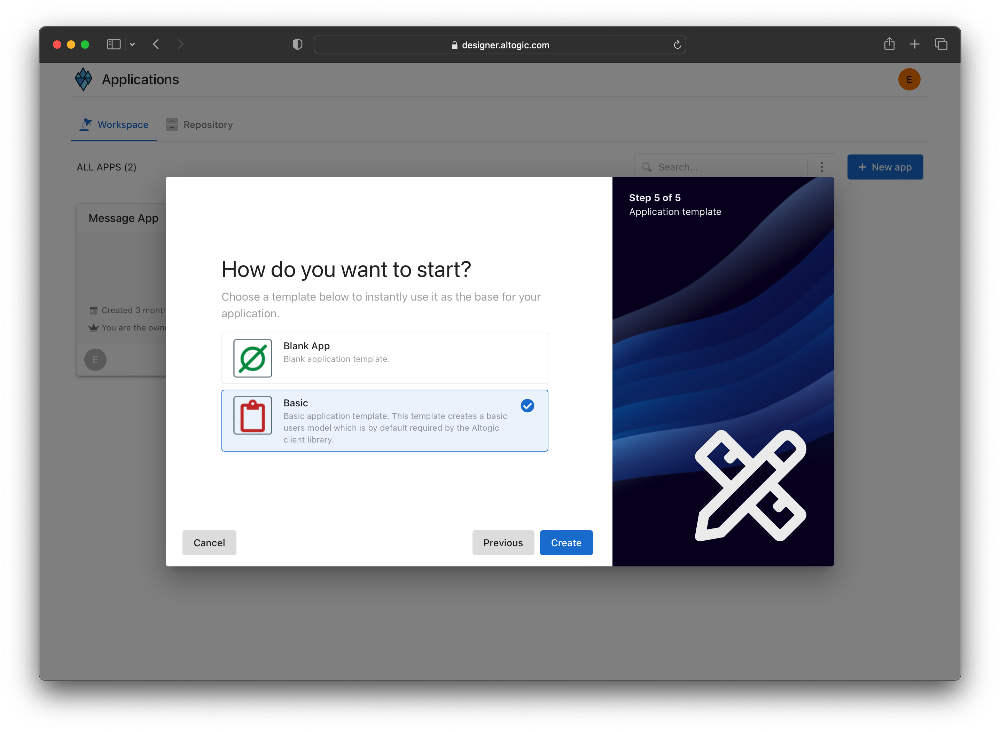
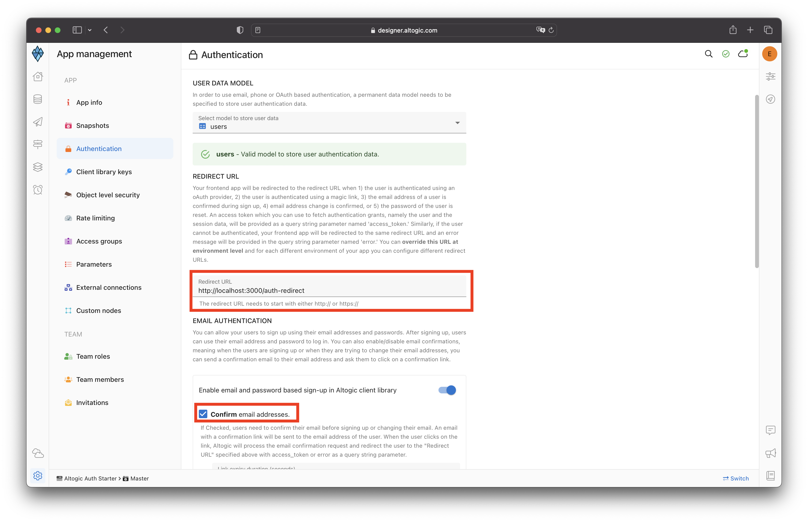

# Email & Password Based Authentication Using React Native & Altogic

## Introduction
**Altogic** is a Backend as a Service (BaaS) platform and provides a variety of services in modern web and mobile development. Most of the modern applications using React or other libraries/frameworks require to know the identity of a user. And this necessity allows an app to securely save user data and session in the cloud and provide more personalized functionalities and views to users.

Altogic has an Authentication service that integrates and implements well in JAMstack apps. It has a ready-to-use Javascript client library, and it supports many authentication providers such as email/password, phone number, magic link, and OAuth providers like Google, Facebook, Twitter, Github, Apple, etc.,

In this tutorial, we will implement email/password authentication with React Native and take a look how as a React Native developer we build applications and integrate with Altogic Authentication.

After completion of this tutorial, you will learn:

* How to create sample screens to display forms like login and signup.
* How to create a home screen and authorize only logged-in users.
* How to create different routes using the React Navigation.
* How to create an authentication flow by conditionally rendering between these pages whether a user is logged-in or not.
* How to authenticate users using magic link
* How to update user profile info and upload a profile picture
* And we will integrate Altogic authentication with the email/password method.

If you are new to React Native applications, this tutorial is definitely for you to understand the basics and even advanced concepts.

## How email-based sign-up works in Altogic
By default, when you create an app in Altogic, email-based authentication is enabled. In addition, during email-based authentication, the email address of the user is also verified. Below you can find the flow of email and password-based sign-up process.


If email verification is disabled, then after step 2, Altogic immediately returns a new session to the user, meaning that steps after step #2 in the above flow are not executed. You can easily configure email-based authentication settings from the App Settings > Authentication in Altogic Designer. One critical parameter you need to specify is the Redirect URL, you can also customize this parameter from App Settings > Authentication. Finally, you can also customize the email message template from the App Settings > Authentication > Message Templates.

> For frontend apps that use server-side rendering, the session token needs to be stored in an HTTP cookie so that the client browser and the frontend server can exchange session information. Otherwise, the session information can be lost, and the Altogic Client library methods that require a session token can fail.

## Prerequisites
To complete this tutorial, make sure you have installed the following tools and utilities on your local development environment.

- [VsCode](https://code.visualstudio.com/download)
- [NodeJS](https://nodejs.org/en/download/)
- [React Native Enviroments](https://reactnative.dev/docs/environment-setup)
- You also need an Altogic Account. If you do not have one, you can create an account by [signin up for Altogic](https://designer.altogic.com/).

## Creating an Altogic App
After creating an account, you will see the workspace where you can access your apps.


Click + New app and follow the instructions;

1. In the App name field, enter a name for the app.
2. Enter your subdomain.
3. Choose the deployment location.
4. And select your free execution environment pricing plan.
   


Then click Next and select Basic template. **This template creates a default user data model for your app which is required by [Altogic Client Library](https://www.npmjs.com/package/altogic) to store user data and manage authentication.** You can add additional user fields to this data model (e.g., name, surname, gender, birthdate) and when calling the `signUpWithEmail` method of the client library you can pass these additional data.



> **Tip:** If you do not select the basic template, instead selected the blank app template the user data model will not be created for your app. In order to use the Altogic Client Library's authentication methods you need a user data model to store the user data. You can easily create a new data model manually and from the **App Settings > Authentication** mark this new data model as your user data model. 

Then click Next to confirm and create an app.

Awesome! We have created our application; now click/tap on the <strong>newly created app to launch the Designer.</strong> In order to access the app and use the Altogic client library, we should get `envUrl` and `clientKey` of this app. You can use any one of the API base URLs specified for your app environment as your envUrl.

Click the <strong>Home</strong> icon at the left sidebar to copy the `envUrl` and `clientKey`.


Once the user is created successfully, our React app will route the user to the Verification page, and a verification email will be sent to the user's email address. When the user clicks the link in the mail, the user will navigate to the redirect page to grant authentication rights. After successfully creating a session on the Redirect page, users will be redirected to the Home page.

> If you want, you can deactivate or customize the mail verification from **App Settings -> Authentication** in Logic Designer.



We have changed the redirect URL to `myapp://auth-redirect`

## Create a React Native project
```bash
npx react-native init AwesomeProject
```

## Integrating with Altogic
Our backend and frontend are now ready and running on the server. ✨

Now, we can install the Altogic client library to our React app to connect our frontend with the backend.

```bash
# using npm
npm install altogic
# OR is using yarn
yarn add altogic
```

Let’s create a configs/ folder inside of the src/ directory to add `altogic.js` file.

Open `altogic.js` and paste below code block to export the altogic client instance.

`/src/configs/altogic.js`

```javascript
// /src/configs/altogic.js
import { createClient } from 'altogic';

// This `envUrl` and `clientKey` is sample you need to create your own.
let envUrl = 'https://auth.c1-na.altogic.com';
let clientKey = 'e574fee1fb2b443...a8598ca68b7d8';

const altogic = createClient(envUrl, clientKey);

export default { altogic };
```

> Replace envUrl and clientKey which is shown in the <strong>Home</strong> view of [Altogic Designer](https://designer.altogic.com/).

## Storing Session
Now, we can install the [react-native-async-storage](https://react-native-async-storage.github.io/async-storage/docs/install/) library to keep session information in app's storage.

```bash
# using npm
npm install @react-native-async-storage/async-storage
# OR is using yarn
yarn add @react-native-async-storage/async-storage
```

On iOS, use CocoaPods to add the native RNAsyncStorage to your project:

```bash
npx pod-install
```

Let's create a `storage.js` inside of the configs/ directory.

Open `storage.js` and paste below code block.
```javascript
// src/configs/storage.js
import AsyncStorage from '@react-native-async-storage/async-storage';

class Storage {
  constructor() {
    this.KEY_AUTH = '@auth';
    this.KEY_SESSION = '@session';
  }

  set = async (key, value) => {
    const jsonValue = JSON.stringify(value);
    await AsyncStorage.setItem(key, jsonValue);
  };

  get = async (key) => {
    const jsonValue = await AsyncStorage.getItem(key);
    return jsonValue != null ? JSON.parse(jsonValue) : null;
  };

  remove = async (key) => {
    await AsyncStorage.removeItem(key);
  };
}

export default new Storage();
```
We have created a Storage class that wrapped AsyncStorage to keep the keys together and prevent JSON parse operations every time.

## Create an Authentication Context
We need to share data across our components. We can use this hook throughout our application by creating an authentication context. Passing down the authentication status to each component is redundant. It leads to prop drilling, so using context is a good option. If you are not familiar with Context API in React, check out their docs [here](https://reactjs.org/docs/context.html).

> The React Context API is a state management tool used for sharing data across React components.

Let’s create contexts/ folder inside of the src/ directory to add `Auth.context.js` file inside it.

Open `Auth.context.js` and copy following code.

```javascript
// /src/contexts/Auth.context.js
import React, { useContext, useEffect, useState } from 'react';
import storage from '../configs/storage';

const Context = React.createContext(null);

const useFetchAuth = () => {
  const [fetchedAuth, setFetchedAuth] = useState(undefined);
  const [fetchedSession, setFetchedSession] = useState(undefined);

  useEffect(() => {
    // Check if session and user information is exist in storage
    storage
      .get(storage.KEY_AUTH)
      .then((authFromStorage) => {
        setFetchedAuth(authFromStorage || null);
      })
      .catch(() => setFetchedAuth(null));

    storage
      .get(storage.KEY_SESSION)
      .then((sessionFromStorage) => {
        setFetchedSession(sessionFromStorage || null);
      })
      .catch(() => setFetchedSession(null));
  }, []);

  return { fetchedAuth, fetchedSession };
};

const Provider = ({ children }) => {
  const { fetchedAuth, fetchedSession } = useFetchAuth();

  const [auth, setAuth] = useState(fetchedAuth);
  const [session, setSession] = useState(fetchedSession);

  useEffect(() => {
    // Set user information to auth state if it's exist in storage
    setAuth(fetchedAuth);
  }, [fetchedAuth]);
  useEffect(() => {
    // Set user information to storage when auth state's changed
    if (auth) storage.set(storage.KEY_AUTH, auth);
    else if (auth === null) storage.remove(storage.KEY_AUTH);
  }, [auth]);

  useEffect(() => {
    // Set session information to auth state if it's exist in storage
    setSession(fetchedSession);
  }, [fetchedSession]);
  useEffect(() => {
    // Set session information to storage when auth state's changed
    if (session) storage.set(storage.KEY_SESSION, session);
    else if (auth === null) storage.remove(storage.KEY_SESSION);
  }, [session]);

  return (
    <Context.Provider
      value={{
        auth,
        setAuth,
        session,
        setSession
      }}
    >
      {children}
    </Context.Provider>
  );
};

export const useAuthContext = () => {
  const context = useContext(Context);
  return context;
};

export default Provider;
```
## Create Routes

### Private Route Component

To secure the application and authorize users to access specified routes let’s create components/ folder inside of the src/ directory to add `PrivateRoute.js` and paste the code below.

```javascript
import React, { useEffect } from 'react';
import { View, Text } from 'react-native';
import { useAuthContext } from '../contexts/Auth.context';

function PrivateRoute({ children, navigation }) {
  const { auth, session } = useAuthContext();

  useEffect(() => {
    if (auth === null || session === null) {
      // Navigate to sign in, if the user has not session or don't come from magic link
      navigation.navigate('Index');
    }
  }, [auth]);

  return (
    <View>
      {auth === undefined || session === undefined ? (
        <Text>Loading...</Text>
      ) : auth ? (
        children
      ) : (
        <Text>You are redirecting to the login...</Text>
      )}
    </View>
  );
}

export default PrivateRoute;
```

> Previously we have created our authentication context to use user information. And, here, we are controlling session to route users, whether the Login page or the children.

Now we can wrap necessary routes with the PrivateRoute component to specify access in the `App.js`. Let’s open it and wrap our Home page with the PrivateRoute as the screen below.

> Firstly, you need to install [React Navigation](https://reactnavigation.org/). It's a routing library for react native applications.

Here also you can copy the code;

```javascript
// src/App.js
import React from 'react';
import { Text } from 'react-native';
import AuthProvider from './src/contexts/Auth.context';
import { NavigationContainer } from '@react-navigation/native';
import { createNativeStackNavigator } from '@react-navigation/native-stack';
import PrivateRoute from './src/components/PrivateRoute';

import AuthRedirectView from './src/views/auth-redirect';
import IndexView from './src/views/index';
import MagicLinkView from './src/views/magic-link';
import ProfileView from './src/views/profile';
import SignInView from './src/views/sign-in';
import SignUpView from './src/views/sign-up';

const Stack = createNativeStackNavigator();

const config = {
  screens: {
    // Public Routes
    Index: '/',
    AuthRedirect: '/auth-redirect/:access_token?',
    MagicLink: '/magic-link',
    SignIn: '/sign-in',
    SignUp: '/sign-up',
    // Private Routes
    Profile: '/profile'
  }
};

const linking = {
  prefixes: ['myapp://'],
  config
};

function App() {
  return (
    <AuthProvider>
      <NavigationContainer linking={linking} fallback={<Text>Loading...</Text>}>
        <Stack.Navigator>
          {/* Private Routes */}
          <Stack.Screen
            name="Profile"
            options={{
              headerLeft: () => null,
              headerBackVisible: false
            }}
          >
            {(props) => (
              <PrivateRoute {...props}>
                <ProfileView {...props} />
              </PrivateRoute>
            )}
          </Stack.Screen>
          {/* Public Routes */}
          <Stack.Screen
            name="Index"
            options={{
              headerLeft: () => null,
              headerBackVisible: false
            }}
            component={IndexView}
          />
          <Stack.Screen name="MagicLink" component={MagicLinkView} />
          <Stack.Screen name="SignUp" component={SignUpView} />
          <Stack.Screen name="SignIn" component={SignInView} />
          <Stack.Screen name="AuthRedirect" component={AuthRedirectView} />
        </Stack.Navigator>
      </NavigationContainer>
    </AuthProvider>
  );
}

export default App;
```
> Deep linking settings should be set up to handling token. [Deep Link](https://reactnative.dev/docs/linking) 

Let's create some views in **src/views/** folder as below:
* index.js
* sign-in.js
* sign-up.js
* auth-redirect.js
* magic-link.js
* profile.js

### Index Page
On this page, we will show the Login, Login With Magic Link, and Register buttons.

Replacing `views/index.js` with the following code:

```javascript
// src/views/index.js
import { Link } from '@react-navigation/native';
import { View, StyleSheet } from 'react-native';

function IndexView() {
  return (
    <View style={styles.container}>
      <Link style={styles.link} to="/magic-link">
        Login With Magic Link
      </Link>
      <Link style={styles.link} to="/sign-in">
        Sign In
      </Link>
      <Link style={styles.link} to="/sign-up">
        Sign Up
      </Link>
    </View>
  );
}

const styles = StyleSheet.create({
  container: {
    flex: 1,
    justifyContent: 'center',
    alignItems: 'center',
    padding: 20,
    fontSize: 45
  },
  link: {
    fontSize: 25,
    padding: 12
  }
});
export default IndexView;
```

### Login Page
On this page, we will show a form to log in with your email and password. We will use Altogic's `altogic.auth.signInWithEmail()` function to log in. We will save the session and user info to state and storage if the `signInWithEmail` function return success. The user will be redirected to the profile page.

Replacing `views/sign-in.js` with the following code:
```javascript
// src/views/sign-in.js
import { Link } from '@react-navigation/native';
import React, { useState } from 'react';
import { View, Button, TextInput, StyleSheet, Text } from 'react-native';
import altogic from '../configs/altogic';
import { useAuthContext } from '../contexts/Auth.context';

function SignInView({ navigation }) {
  const { setAuth, setSession } = useAuthContext();

  const [email, setEmail] = useState('');
  const [password, setPassword] = useState('');

  const [error, setError] = useState(null);

  const handleSignIn = async () => {
    try {
      const { user, session, errors } = await altogic.auth.signInWithEmail(email, password);

      if (errors) {
        throw errors;
      }

      setSession(session);
      setAuth(user);
      navigation.navigate('Profile');
    } catch (err) {
      setError(err);
    }
  };

  return (
    <View style={styles.container}>
      <TextInput
        style={styles.input}
        placeholder="Email"
        autoCapitalize="none"
        placeholderTextColor="white"
        onChangeText={(val) => setEmail(val)}
        value={email}
      />
      <TextInput
        style={styles.input}
        placeholder="Password"
        secureTextEntry={true}
        autoCapitalize="none"
        placeholderTextColor="white"
        onChangeText={(val) => setPassword(val)}
        value={password}
      />
      <Button title="Login" onPress={handleSignIn} />
      <Text style={styles.alreadyLabel}>Don't have an account yet?</Text>
      <Link style={styles.linkLabel} to="/sign-up">
        Create an account
      </Link>
      <Text>{error && JSON.stringify(error, null, 3)}</Text>
    </View>
  );
}

const styles = StyleSheet.create({
  input: {
    width: 350,
    height: 55,
    backgroundColor: '#42A5F5',
    margin: 10,
    padding: 8,
    color: 'white',
    borderRadius: 14,
    fontSize: 18,
    fontWeight: '500'
  },
  container: {
    flex: 1,
    justifyContent: 'center',
    alignItems: 'center'
  },
  successLabel: {
    color: 'green'
  },
  alreadyLabel: {
    marginTop: 20
  },
  linkLabel: {
    color: 'blue'
  }
});

export default SignInView;
```

### Register Page
On this page, we will show a form to sign up with email and password. We will use Altogic's `altogic.auth.signUpWithEmail()` function to log in.

We will save the session and user info to state and storage if the `signUpWithEmail` function returns the user. The user will be redirected to the profile page.

If `signUpWithEmail` does not return the user, it means the user must confirm the email so we will show the success message.

> `signUpWithEmail` function can accept optional  third parameter data to save the user's profile. We will save the user's name to the database in this example.

Replacing `views/sign-up.js` with the following code:
```javascript
// src/views/sign-up.js
import { Link } from '@react-navigation/native';
import { useState } from 'react';
import { Button, StyleSheet, Text, TextInput, View } from 'react-native';
import altogic from '../configs/altogic';
import { useAuthContext } from '../contexts/Auth.context';

function SignUpView({ navigation }) {
  const { setAuth, setSession } = useAuthContext();

  const [name, setName] = useState('');
  const [email, setEmail] = useState('');
  const [password, setPassword] = useState('');

  const [success, setSuccess] = useState('');
  const [error, setError] = useState(null);

  const handleSignUp = async () => {
    try {
      const { user, session, errors } = await altogic.auth.signUpWithEmail(email, password, name);

      if (errors) {
        throw errors;
      }

      if (session) {
        setAuth(user);
        setSession(session);
        navigation.navigate('Profile');
      } else {
        setSuccess(`We sent a verification link to ${email}`);
        setError(null);
      }
    } catch (err) {
      setError(err);
    }
  };

  return (
    <View style={styles.container}>
      <TextInput
        style={styles.input}
        placeholder="Name"
        autoCapitalize="none"
        placeholderTextColor="white"
        onChangeText={(val) => setName(val)}
        value={name}
      />
      <TextInput
        style={styles.input}
        placeholder="Email"
        autoCapitalize="none"
        placeholderTextColor="white"
        onChangeText={(val) => setEmail(val)}
        value={email}
      />
      <TextInput
        style={styles.input}
        placeholder="Password"
        secureTextEntry={true}
        autoCapitalize="none"
        placeholderTextColor="white"
        onChangeText={(val) => setPassword(val)}
        value={password}
      />
      <Button title="Sign Up" onPress={handleSignUp} />
      <Text style={styles.alreadyLabel}>
        Already have an account?{' '}
        <Link style={styles.linkLabel} to="/sign-in">
          Login
        </Link>
      </Text>
      <Text style={styles.successLabel}>{success && success}</Text>
      <Text>{error && JSON.stringify(error, null, 3)}</Text>
    </View>
  );
}

const styles = StyleSheet.create({
  input: {
    width: 350,
    height: 55,
    backgroundColor: '#42A5F5',
    margin: 10,
    padding: 8,
    color: 'white',
    borderRadius: 14,
    fontSize: 18,
    fontWeight: '500'
  },
  container: {
    flex: 1,
    justifyContent: 'center',
    alignItems: 'center'
  },
  successLabel: {
    color: 'green'
  },
  alreadyLabel: {
    marginTop: 20
  },
  linkLabel: {
    color: 'blue'
  }
});

export default SignUpView;
```

### Profile Page
On this page, we will show the user's profile and use Altogic's `altogic.auth.signOut()` function to log out.

We will remove session and user info from state and storage if the `signOut` function return success. Then the user will be redirected to the login page.

Replacing `views/profile.js` with the following code:
```js
// src/views/profile.js
import { Button, ScrollView } from 'react-native';
import Avatar from '../components/Avatar';
import Sessions from '../components/Sessions';
import UserInfo from '../components/UserInfo';
import altogic from '../configs/altogic';
import { useAuthContext } from '../contexts/Auth.context';

function ProfileView({ navigation }) {
  const { setSession, setAuth } = useAuthContext();

  const handleSignOut = async () => {
    await altogic.auth.signOut();
    setAuth(null);
    setSession(null);
    navigation.navigate('Index');
  };

  return (
    <ScrollView>
      <Avatar />
      <UserInfo />
      <Sessions />
      <Button title="Sign Out" onPress={handleSignOut} />
    </ScrollView>
  );
}

export default ProfileView;
```
### Auth Redirect Page
We use this page to verify the user's email address and process magic link. This is the page where the user is redirected when clicked on the sign-up email confirmation link or the magic link.

We will use Altogic's `altogic.auth.getAuthGrant()` function to log in with the handled access_token from the URL and use this access_token to create a new user session and associated `sessionToken`.

Replacing `views/auth-redirect.js` with the following code:
```js
// src/views/auth-redirect.js
import { useEffect } from 'react';
import { Text, View } from 'react-native';
import altogic from '../configs/altogic';
import { useAuthContext } from '../contexts/Auth.context';

function AuthRedirectView({ route, navigation }) {
  const { setAuth, setSession } = useAuthContext();
  const access_token = route.params?.access_token;

  const handleToken = async () => {
    try {
      const { user, session, errors } = await altogic.auth.getAuthGrant(access_token);

      if (errors) throw errors;

      setAuth(user);
      setSession(session);
      navigation.navigate('Profile');
    } catch (error) {
      navigation.navigate('Index');
    }
  };

  useEffect(() => {
    handleToken();
  }, []);

  return (
    <View>
      <Text>Redirecting...</Text>
    </View>
  );
}

export default AuthRedirectView;
```

### Magic Link Page
On this page, we will show a form to log in with Magic Link with only email. We will use Altogic's `altogic.auth.sendMagicLinkEmail()` function to log in.

When the user clicks on the magic link in the email, Altogic verifies the validity of the magic link and, if successful, redirects the user to the redirect URL specified in your app authentication settings with an access token in a query string parameter named `access_token.` The magic link flows in a similar way to the sign-up process. We use the `getAuthGrant` method explained above to create a new session and associated `sessionToken`.

```js
// src/views/magic-link.js
import { Link } from '@react-navigation/native';
import { useState } from 'react';
import { View, StyleSheet, TextInput, Button, Text } from 'react-native';
import altogic from '../configs/altogic';

function MagicLinkView() {
  const [email, setEmail] = useState('');

  const [error, setError] = useState(null);
  const [success, setSuccess] = useState('');
  const [loading, setLoading] = useState(false);

  async function loginHandler() {
    try {
      setLoading(true);
      setError(null);

      const { errors: apiErrors } = await altogic.auth.sendMagicLinkEmail(email);
      setLoading(false);

      if (apiErrors) throw apiErrors;

      setEmail('');
      setSuccess('Email sent! Check your inbox.');
    } catch (error) {
      setError(error.items);
    }
  }

  return (
    <View style={styles.container}>
      <TextInput
        style={styles.input}
        placeholder="Email"
        autoCapitalize="none"
        placeholderTextColor="white"
        onChangeText={(val) => setEmail(val)}
        value={email}
      />
      <Button title="Send Magic Link" disabled={loading} onPress={loginHandler} />
      <Text style={styles.alreadyLabel}>Don't have an account yet?</Text>
      <Link style={styles.linkLabel} to="/sign-up">
        Create an account
      </Link>
      <Text style={styles.successLabel}>{success && success}</Text>
      <Text>{error && JSON.stringify(error, null, 3)}</Text>
    </View>
  );
}

const styles = StyleSheet.create({
  input: {
    width: 350,
    height: 55,
    backgroundColor: '#42A5F5',
    margin: 10,
    padding: 8,
    color: 'white',
    borderRadius: 14,
    fontSize: 18,
    fontWeight: '500'
  },
  container: {
    flex: 1,
    justifyContent: 'center',
    alignItems: 'center'
  },
  successLabel: {
    color: 'green'
  },
  alreadyLabel: {
    marginTop: 20
  },
  linkLabel: {
    color: 'blue'
  }
});

export default MagicLinkView;
```

## Updating User Info
In this component, we will use Altogic's database operations to update the user fields and managing sessions.


Let's create some components in **src/components/** folder as below:
* UserInfo.js
* Sessions.js

Replacing `components/UserInfo.js` with the following code:
```js
// src/components/UserInfo.js
import { useState } from 'react';
import { Button, StyleSheet, Text, TextInput, View } from 'react-native';
import altogic from '../configs/altogic';
import { useAuthContext } from '../contexts/Auth.context';

function UserInfo() {
  const { auth, setAuth } = useAuthContext();
  const [changeMode, setChangeMode] = useState(true);
  const [errors, setErrors] = useState(null);

  const [name, setName] = useState(auth.name);

  const handleNameChange = () => {
    if (!changeMode && auth.name !== name) {
      changeName();
    }
    setChangeMode(!changeMode);
  };

  const changeName = async () => {
    setErrors(null);
    const { data: updatedUser, errors: apiErrors } = await altogic.db
      .model('users')
      .object(auth._id)
      .update({ name });
    if (apiErrors) setErrors(apiErrors.items[0].message);
    else setAuth(updatedUser);
  };

  return (
    <View style={styles.container}>
      <View style={styles.inputContainer}>
        {changeMode ? (
          <Text style={styles.text}>Hello, {auth?.name}</Text>
        ) : (
          <TextInput type="text" style={styles.input} onChangeText={setName} value={name} />
        )}
        <Button title={changeMode ? 'Change name' : 'Update name'} onPress={handleNameChange} />
      </View>
      {errors && <Text>{errors}</Text>}
    </View>
  );
}

const styles = StyleSheet.create({
  container: {
    borderWidth: 1,
    padding: 1,
    marginTop: 12,
    height: 100
  },
  inputContainer: {
    flex: 1,
    padding: 1,
    alignItems: 'center',
    justifyContent: 'center'
  },
  text: {
    width: '100%',
    textAlign: 'center',
    fontSize: 25
  },
  input: {
    borderWidth: 1,
    borderColor: 'blue',
    width: '100%',
    textAlign: 'center',
    fontSize: 25
  }
});

export default UserInfo;
```

Replacing `components/Sessions.js` with the following code:
```js
// src/components/Sessions.js
import { useEffect, useState } from 'react';
import { Button, Text, View, StyleSheet } from 'react-native';
import altogic from '../configs/altogic';
import { useAuthContext } from '../contexts/Auth.context';

function Sessions() {
  const { session } = useAuthContext();
  const [sessions, setSessions] = useState([]);

  const getAllSessions = async () => {
    const { sessions: sessionList } = await altogic.auth.getAllSessions();
    const formattedSessions = sessionList?.map((s) =>
      s.token === session?.token ? { ...s, isCurrent: true } : s
    );
    setSessions(formattedSessions || []);
  };

  const logoutSession = async (selectedSession) => {
    const { errors } = await altogic.auth.signOut(selectedSession.token);
    if (!errors) {
      setSessions(sessions.filter((s) => s.token !== selectedSession.token));
    }
  };

  useEffect(() => {
    getAllSessions();
  }, []);

  return (
    <View style={styles.container}>
      <Text style={styles.text}>All Sessions</Text>
      <View>
        {sessions?.map((sessionItem) => (
          <View key={sessionItem.token} style={styles.itemContainer}>
            <View style={styles.flex}>
              {sessionItem.isCurrent && <Text> Current Session </Text>}
              <Text>
                {' '}
                <Text>Device name: </Text>
                {sessionItem?.userAgent.device.family}
              </Text>
            </View>
            <View style={styles.itemDate}>
              <Text>{new Date(sessionItem.creationDtm).toLocaleDateString('en-US')}</Text>
              {!sessionItem.isCurrent && (
                <Button onPress={() => logoutSession(sessionItem)} title="X" />
              )}
            </View>
          </View>
        ))}
      </View>
    </View>
  );
}

const styles = StyleSheet.create({
  container: {
    borderWidth: 1,
    padding: 12,
    marginTop: 12
  },
  text: {
    width: '100%',
    textAlign: 'center',
    fontSize: 25
  },
  itemContainer: {
    flex: 1,
    flexDirection: 'row',
    justifyContent: 'space-between'
  },
  flex: {
    flex: 1,
    flexDirection: 'row',
    alignItems: 'center'
  },
  itemDate: {
    flex: 1,
    flexDirection: 'row',
    alignItems: 'center',
    justifyContent: 'flex-end'
  }
});

export default Sessions;
```
## Bonus: Upload Profile Photo
Let's create a Avatar component for user can upload a profile photo. 

> You will need a file picker that works on the environment you build the project for, we will use [react-native-image-picker]('https://github.com/react-native-image-picker/react-native-image-picker') in this example.

Open `Avatar.js` and paste the below code to create an avatar for the user. For convenience, we will be using the user's `_id` as the uploaded file's name and uploading the profile picture to the root directory of our app storage. If needed, you can create different buckets for each user or a generic bucket to store all provided photos of users. The Altogic Client Library has all the methods to manage buckets and files.

```javascript
// src/components/Avatar.js
import { useState } from 'react';
import { ActivityIndicator, Image, StyleSheet, Text, TouchableOpacity, View } from 'react-native';
import { launchImageLibrary } from 'react-native-image-picker';
import altogic from '../configs/altogic';
import { useAuthContext } from '../contexts/Auth.context';

function Avatar() {
  const { auth, setAuth } = useAuthContext();

  const [loading, setLoading] = useState(false);

  const handleUploadPhoto = async () => {
    try {
      let asset = null;
      const res = await launchImageLibrary({
        mediaType: 'photo',
        quality: 1,
        includeBase64: true
      });
      if (!res.didCancel && res.errorCode !== 'permission') {
        asset = res.assets[0];
      }
      if (!asset) {
        throw new Error('No valid file');
      }

      const formData = new FormData();
      formData.append('file', {
        uri: asset.uri,
        type: asset.type,
        name: asset.fileName
      });

      setLoading(true);

      const { publicPath } = await uploadPhoto(formData, `user_${auth._id}`);
      await updateUserInfo({ profilePicture: publicPath });
      setLoading(false);
    } catch (error) {
      console.log(error);
    }
  };

  const uploadPhoto = async (file, filename) => {
    const { data, errors } = await altogic.storage.bucket('root').upload(filename, file);

    if (errors) {
      throw errors;
    }
    return data;
  };

  const updateUserInfo = async (data) => {
    const { data: userFromDB, errors } = await altogic.db
      .model('users')
      .object(auth._id)
      .update(data);

    if (errors) {
      throw errors;
    }
    setAuth(userFromDB);
  };

  return (
    <View>
      <View style={styles.container}>
        {loading ? (
          <ActivityIndicator />
        ) : (
          <Image
            style={styles.tinyLogo}
            source={{
              uri:
                auth.profilePicture ||
                `https://ui-avatars.com/api/?name=${auth.email}&background=0D8ABC&color=fff`
            }}
          />
        )}
      </View>
      <TouchableOpacity style={styles.buttonStyle} activeOpacity={0.5} onPress={handleUploadPhoto}>
        <Text style={styles.buttonTextStyle}>Change Avatar</Text>
      </TouchableOpacity>
    </View>
  );
}

const styles = StyleSheet.create({
  container: {
    flex: 1,
    justifyContent: 'center',
    alignItems: 'center',
    padding: 20
  },
  buttonStyle: {
    backgroundColor: '#307ecc',
    borderWidth: 0,
    color: '#FFFFFF',
    borderColor: '#307ecc',
    height: 40,
    alignItems: 'center',
    borderRadius: 30,
    marginLeft: 35,
    marginRight: 35,
    marginTop: 5
  },
  buttonTextStyle: {
    color: '#FFFFFF',
    paddingVertical: 10,
    fontSize: 16
  },
  tinyLogo: {
    width: 150,
    height: 150
  }
});

export default Avatar;
```

## Conclusion
Congratulations!✨

You had completed the most critical part of the Authentication flow, which includes private routes, sign-up, sign-in, and sign-out operations.

If you have any questions about Altogic or want to share what you have built, please post a message in our [community forum](https://community.altogic.com/home) or [discord channel](https://discord.gg/ERK2ssumh8).


