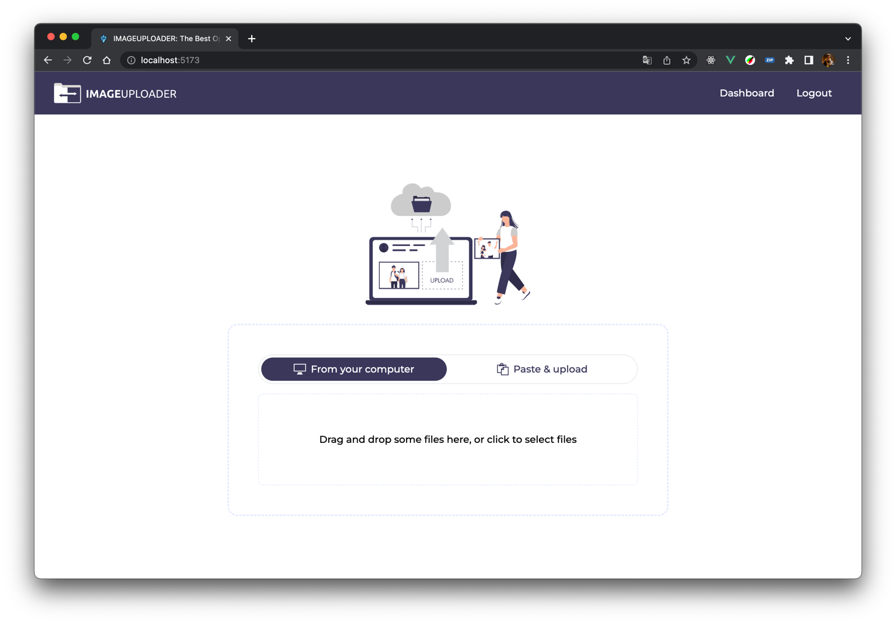
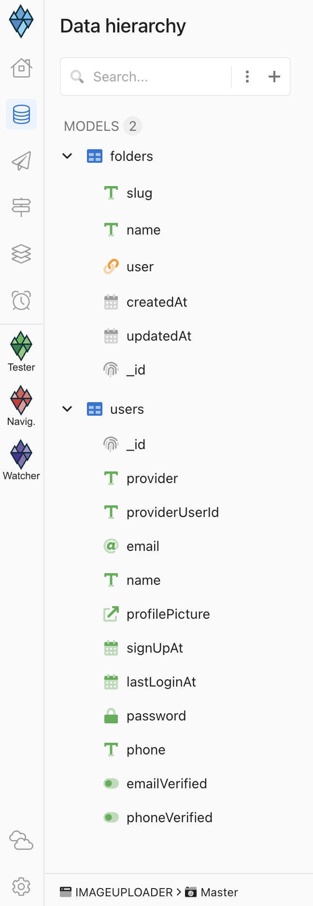

## Image Uploader

This repository contains an example of an image uploader built using the Altogic framework.



## Getting Started

1. Clone the repository by running the following command:

```shell
git clone https://github.com/altogic/altogic.git
```

2. Navigate to the `examples/image-uploader` directory.
3. Install the required dependencies by running `npm install`
4. Start the development server by running `npm run dev`
5. Open your browser and navigate to `http://localhost:5173`

## Features

- [x] User authentication
- [x] Image upload and storage
- [x] Image listing and display
- [ ] Image processing and manipulation

## Dependencies

- Altogic
- React

## Database Schema

The Altogic framework uses MongoDB and NoSQL as its database. The following screenshot shows the database schema used in this example.



## Contributing

We welcome contributions to the codebase. If you would like to contribute, please fork the repository, make your changes and submit a pull request.

## License

The code in this repository is licensed under the MIT License.

## Support

If you need help, join our [Discord server](https://discord.gg/ERK2ssumh8) and contact us.