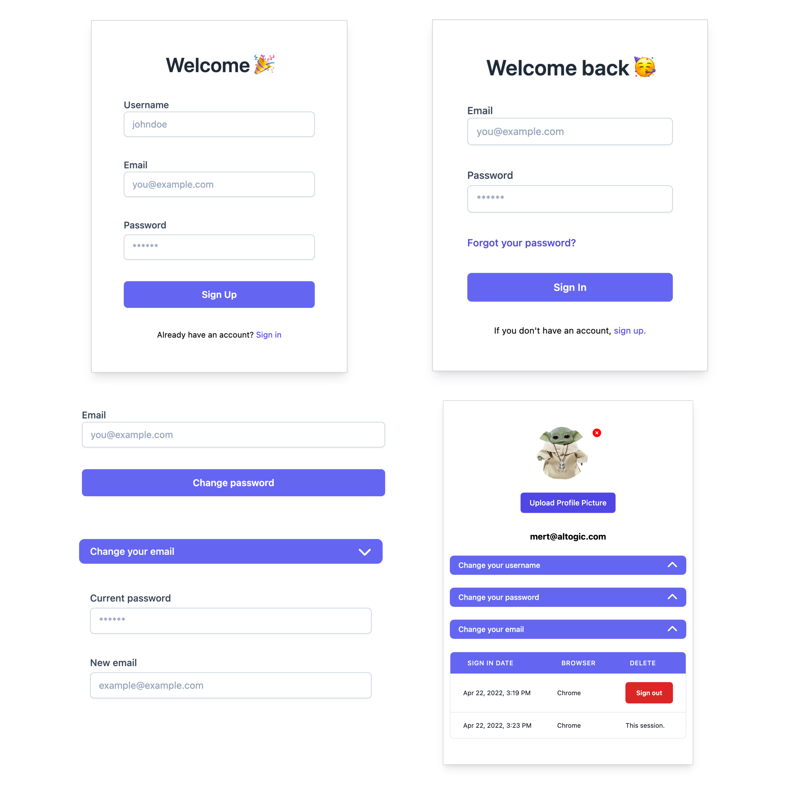

You can reach the demo [here.](https://altogic-nextjs-email-auth.vercel.app)

## Preview



## Introduction

This is a [Next.js](https://nextjs.org/) email-based authentication application using [Altogic](https://www.altogic.com), backend-as-a-service platform as the backend using its client library.

This authentication method requires users to specify their email and passwords. After signing up, users can log in to the application using their email and password.

By default email verification is enabled in your App settings → Authentication view of Designer. If you would like to change this, you can disable "Confirm email addresses" in the Authentication view of Designer.

You can find the written tutorial of this demo app on [our Medium blog.](https://medium.com/altogic/altogic-email-authentication-with-next-js-and-altogic-4c036c36ea8f)

### What is the email authentication flow in Altogic?

1. Users sign up with their email and password.
2. A verification email is sent to the specified email address by Altogic.
3. Users confirm their email by clicking on the link in the sent email.
4. Altogic checks the token in clicked link and if valid changes the user's email address to verified and returns an access token in the query string parameter of the redirect URL.
5. This access token is used to get a session token and users are directed to their profile page.

## Features

1. Sign up users
2. Send the email confirmation mail
3. Resend the email confirmation mail
4. Upload the profile photo
5. Change/Remove the profile photo
6. Password recovery
7. Email change
8. Password change
9. Active session management

## Installation

### Creating App in Altogic

We can create an app with the Altogic Designer really fast. To create an app via the Designer:

1. Log in to Altogic with your credentials.
2. Select New app.
3. In the App name field, enter a name for the app.
4. And click create.


---

We need `envUrl` and `clientKey` to access our environment via Altogic Client Library. `envUrl` is specific to each environment, and Altogic initially creates one environment for you when you create your app. To get the `envUrl` via the Designer:

1. Launch the Designer.
2. Click/tap on Environments at the left-bottom of the designer.
3. Click/tap name of the Environment
4. Scroll down to API BASE URL section.
5. Copy subdomain or environment url.


---

We can get the `clientKey` by clicking on the App Settings button in the left-bottom corner of the Designer and clicking on the Client library keys section.


---

Now you have got both `clientKey`and `envUrl`. Now you have to create a `.env.local` file in your root directory of the project to complete the Altogic configuration with your app:

```bash
touch .env.local
```

Copy and paste the below code to your `.env.local` file, don't forget to change <YOUR-APPLICATION-ENV-URL> and <YOUR-APPLICATION-CLIENT-KEY> values with your `envUrl` and `clientKey`.

```javascript
NEXT_PUBLIC_ALTOGIC_ENV_URL = <YOUR-APPLICATION-ENV-URL>;
NEXT_PUBLIC_ALTOGIC_CLIENT_KEY = <YOUR-APPLICATION-CLIENT-KEY>;
```

### Install the packages

Before you start to use the npx command, make sure you have NodeJS installed in your development environment. Also, installing VSCode and some extensions might be better for faster development.

💡 You can visit https://nodejs.org/en/download/ to download.

To get started, clone this project and proceed to the installation.

Install the packages:

```bash
npm install
```

Run the development server:

```bash
npm run dev
```

Open [http://localhost:3000](http://localhost:3000) with your browser to see the result.

## Learn More

To learn more about Altogic and Next.js, you can take a look at the following resources:

- [Altogic Client API Reference](https://clientapi.altogic.com/v1.2.2/modules.html) - learn about Altogic Client Library features
- [Altogic Docs](https://docs.altogic.com/) - learn about how to design your backend in Altogic
- [Next.js Documentation](https://nextjs.org/docs) - learn about Next.js features and API.

## Contribution

Your feedback and contributions are welcome! Please open a pull request for contributions.

## Youtube Video

[](https://www.youtube.com/watch?v=rlOTW_NuJzc)
