# Introduction to Altogic and Next.js

This article will cover how to code simple CRUD operations in a to-do app using Next.js, and [Altogic](https://altogic.com/), a Backend-as-a-Service platform using its client library.

// @TODO: link değiştirilecek

You can check out the [demo.](https://altogic-react-todo-app-quickstart.vercel.app/)

## What is Altogic?

Altogic backend as a service platform allows you to create and start running your backend apps in minutes. With your backend apps, you can **manage your application data** in a database, **cache your data in memory, execute database transactions to ensure data integrity**, **run complex business logic** through synchronous and asynchronous services, **manage user sessions**, **schedule jobs** to be executed at a specific time or interval, **send and receive real-time messages** through WebSockets and more.

## What is Next.js?

Next.js is a JavaScript framework for building server-rendered React applications. It allows developers to easily create and deploy high-performance web apps with features such as automatic code splitting, server-side rendering, and static site generation. Next.js also includes a built-in development server and a powerful set of APIs for handling routing, configuration, and more.

## Setting up your Altogic and Next.js environment

To complete this tutorial, ensure you have installed the following tools and utilities on your local development environment.

- [VsCode](https://code.visualstudio.com/download)
- [NodeJS](https://nodejs.org/en/download/)
- [Next.js](https://nextjs.org/docs/getting-started)
- You also need an Altogic Account. If you do not have one, you can create an account by [signin up for Altogic](https://designer.altogic.com/).

### Creating an Altogic Account

After creating an account, you will see the workspace where you can access your apps.

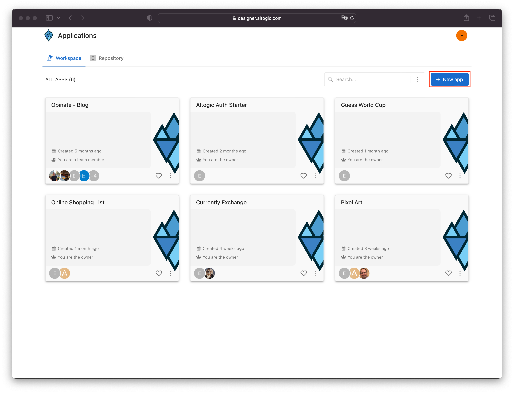

Click + New app and follow the instructions;

1. In the App name field, enter a name for the app.
2. Enter your subdomain.
3. Choose the deployment location.
4. And select your free execution environment pricing plan.

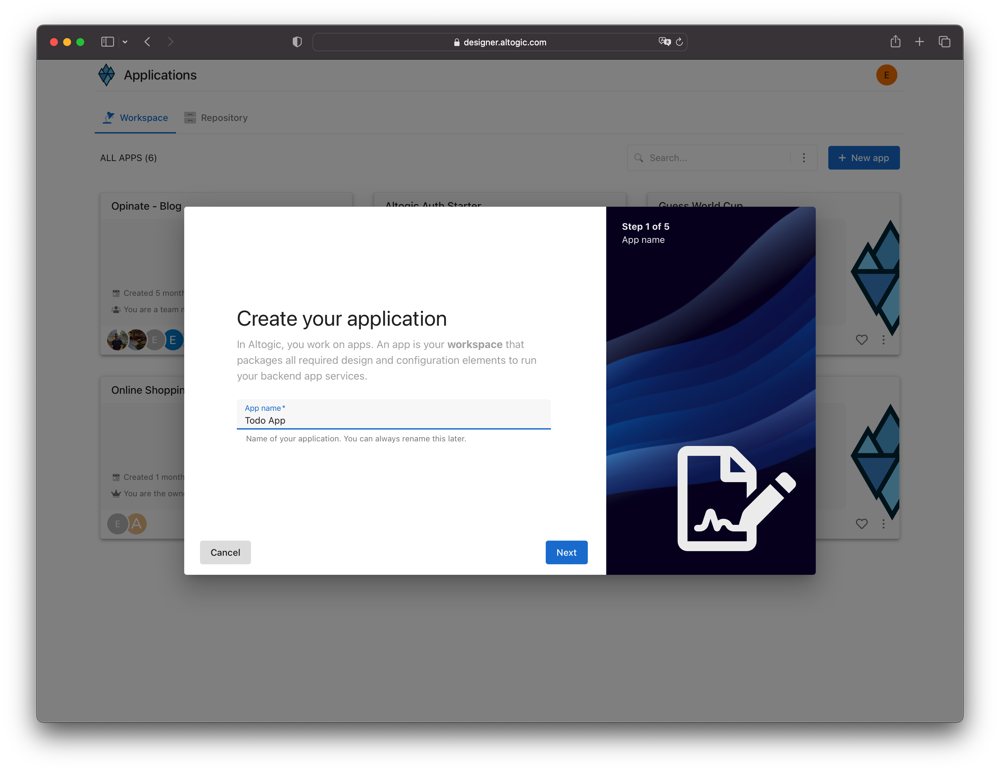

**Basic template creates a default user data model for your app, which is required by [Altogic Client Library](https://www.npmjs.com/package/altogic) to store user data and manage authentication.** 

We don't need user model for this example but later if you want, you can easily create a new data model manually and from the **App Settings > Authentication**
mark this new data model as your user data model.

Then click Next and select Blank template. 


Awesome! We have created our application; now click/tap on the **newly created app to launch the Designer.** In order to access the app and use the Altogic client library, we should get `envUrl` and `clientKey` of this app. You can use any one of the API base URLs specified for your app environment as your envUrl.

Click the **Home** icon at the left sidebar to copy the `envUrl` and `clientKey`.

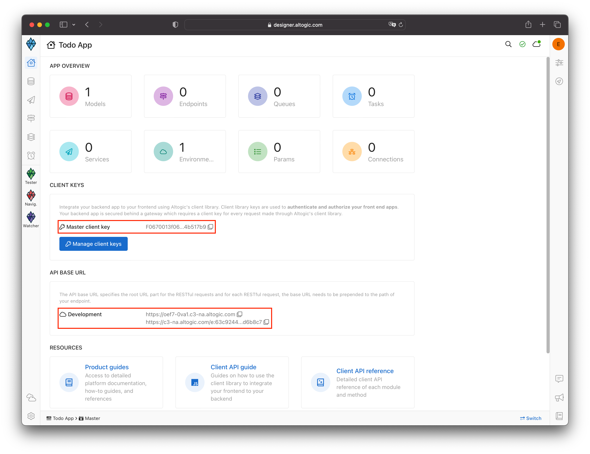

We will not use authentication in this example, we should remove the session requirement in the client library.

We  **App Settings -> Client library keys -> Master client key** in Altogic Designer.

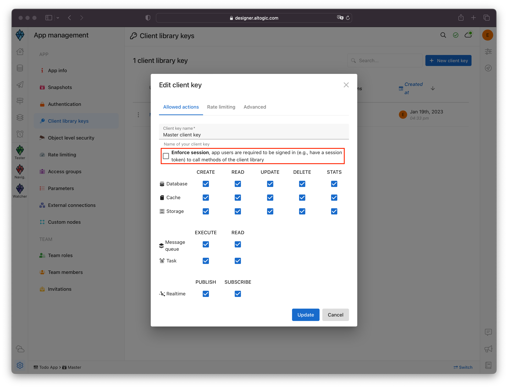

We have changed “Enforce session” unchecked.

### Creating a Next.js project

```bash
npx create-next-app@latest
# or
yarn create next-app
# or
pnpm create next-app
```

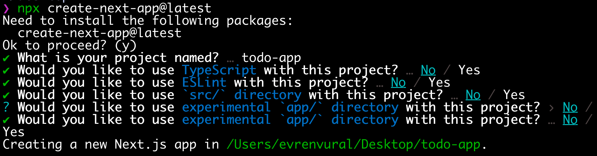

## Designing the User Interface for Todo App

## **Installing Tailwind**

```bash
npm install -D tailwindcss postcss autoprefixer

npx tailwindcss init -p
```

Add the paths to all of your template files in your tailwind.config.js file.

```jsx
/** @type {import('tailwindcss').Config} */
module.exports = {
  content: [
    "./src/**/*.{js,jsx,ts,tsx}",
  ],
  theme: {
    extend: {},
  },
  plugins: [],
}
```

Replace `styles/global.css` with the following code:

```jsx
@tailwind base;
@tailwind components;
@tailwind utilities;

* {
  box-sizing: border-box;
  padding: 0;
  margin: 0;
}

html,
body {
  max-width: 100vw;
  overflow-x: hidden;
}

a {
  color: inherit;
  text-decoration: none;
}
```

Replace `pages/index.js` with the following code:

```jsx
export default function Home() {
  return (
    <div className="max-w-2xl mx-auto py-8 px-4 sm:py-12 sm:px-6 lg:max-w-7xl lg:px-8">
      <form>
        <div className="relative">
          <input
            placeholder="Add Todo"
            className="w-full rounded-md border-gray-200 py-2.5 pr-10 pl-2 shadow-sm sm:text-sm border-2 border-dashed"
          />

          <span className="absolute inset-y-0 right-0 grid w-10 place-content-center">
            <button type="submit">
              <span className="sr-only">Submit</span>
              <svg
                xmlns="http://www.w3.org/2000/svg"
                fill="none"
                viewBox="0 0 24 24"
                strokeWidth="2"
                stroke="currentColor"
                aria-hidden="true"
                id="send-icon"
                className="w-7 h-7 text-gray-500"
              >
                <path
                  strokeLinecap="round"
                  stroke-strokelinejoin="round"
                  d="M13 9l3 3m0 0l-3 3m3-3H8m13 0a9 9 0 11-18 0 9 9 0 0118 0z"
                />
              </svg>
            </button>
          </span>
        </div>
      </form>

      <div className="flex items-center justify-between mt-2">
        <div className="relative flex items-center">
          <div className="flex items-center h-5">
            <input
              type="checkbox"
              className="focus:ring-indigo-500 h-6 w-6 text-indigo-600 border-gray-300 rounded cursor-pointer"
            />
          </div>
          <div className="ml-3 text-sm w-full p-2 cursor-pointer">
            <label className="font-medium text-gray-700 cursor-pointer"></label>
          </div>
        </div>
        <div className="flex items-center px-2 py-2 text-sm font-medium rounded-md">
          <button>
            <svg
              xmlns="http://www.w3.org/2000/svg"
              fill="none"
              viewBox="0 0 24 24"
              strokeWidth="2"
              stroke="currentColor"
              aria-hidden="true"
              className="lex-shrink-0 h-5 w-5"
            >
              <path
                strokeLinecap="round"
                strokeLinejoin="round"
                d="M19 7l-.867 12.142A2 2 0 0116.138 21H7.862a2 2 0 01-1.995-1.858L5 7m5 4v6m4-6v6m1-10V4a1 1 0 00-1-1h-4a1 1 0 00-1 1v3M4 7h16"
              />
            </svg>
          </button>
        </div>
      </div>
    </div>
  );
}
```

## Creating the Backend for Your Todo App with Altogic

### Creating todo model

1. Click on **Models** on the left sidebar.
2. Click **New** on the right of the screen and select **model.**
3. Set model name as **todo.**
4. Ensure that the **Enable timestamps** is selected.
5. Click **Next.**
    
    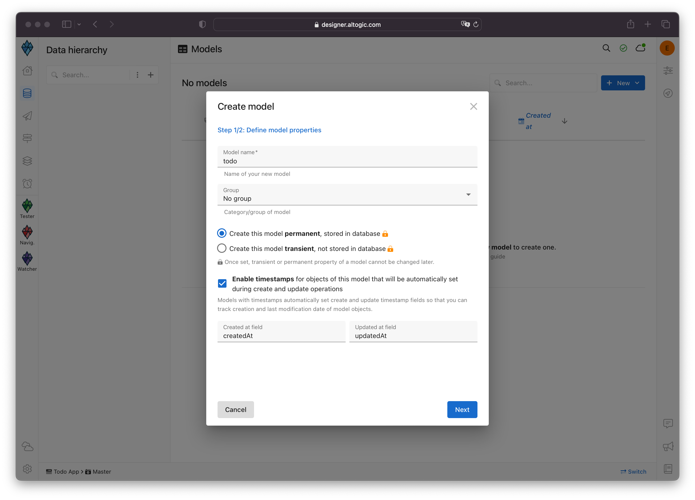
    

**Altogic** provides basic **CRUD** endpoints and services with the related model by default when you create a new model. Since we use **Altogic Client Library,** we won’t use these endpoints.

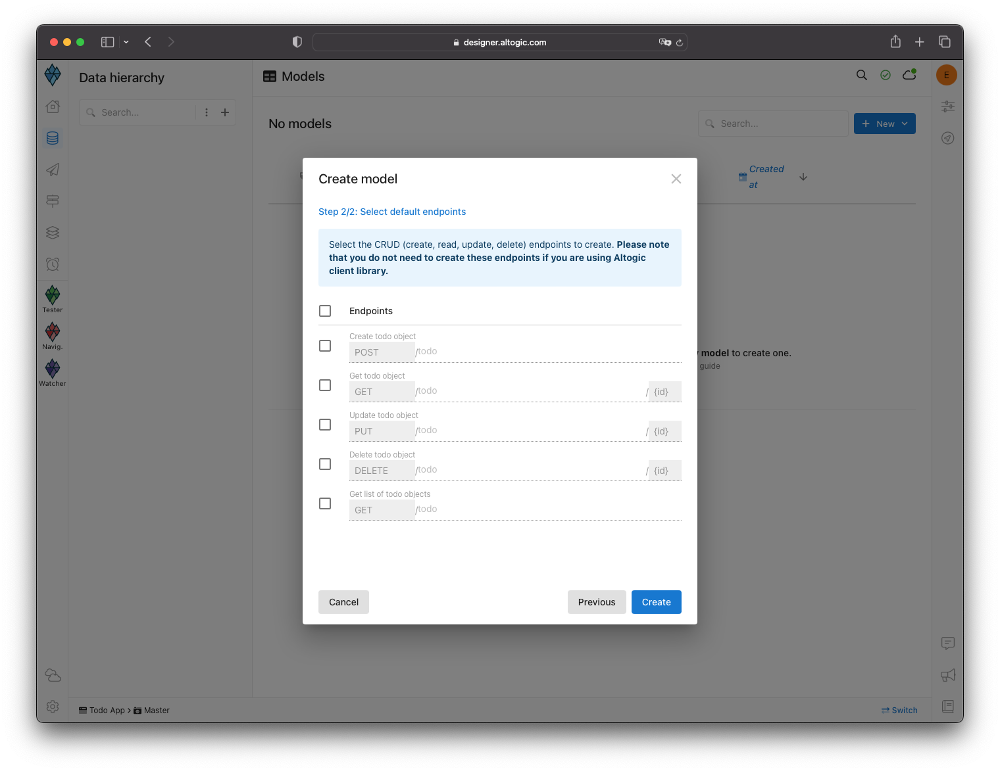

We created our model, ”todo.” We have to define the model properties' name and status and define the name property as Text and the status as Boolean.

**Creating “name” field**

1. Click on the **todo** model on the *Models* page.
2. Click on **New Field** on the right-top of the page.
3. Select **Text Field→ Text.**
4. Set model name as **name.**
5. Ensure that the **Required** is selected.
6. Click **Create.**
    
    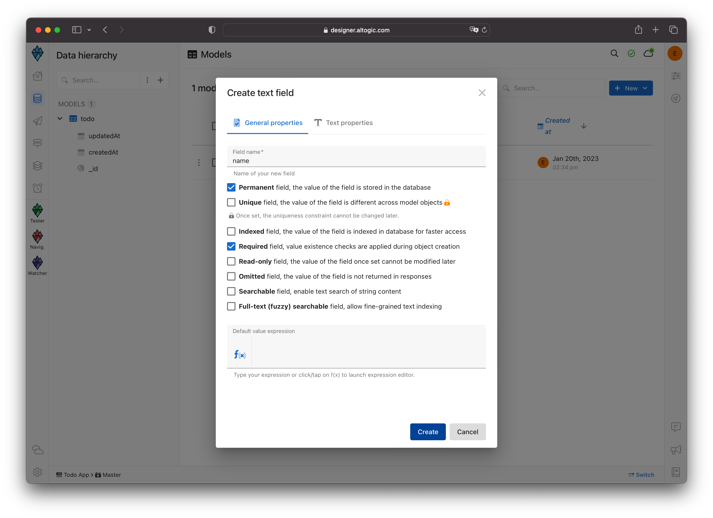
    
    **Creating “isCompleted” field**
    
    1. Click on **New Field** on the right-top of the page.
    2. Select **Boolean.**
    3. Set model name as **isCompleted.**
    4. Ensure that the **Required** is selected.
    5. Set default value expression **false.**
        
        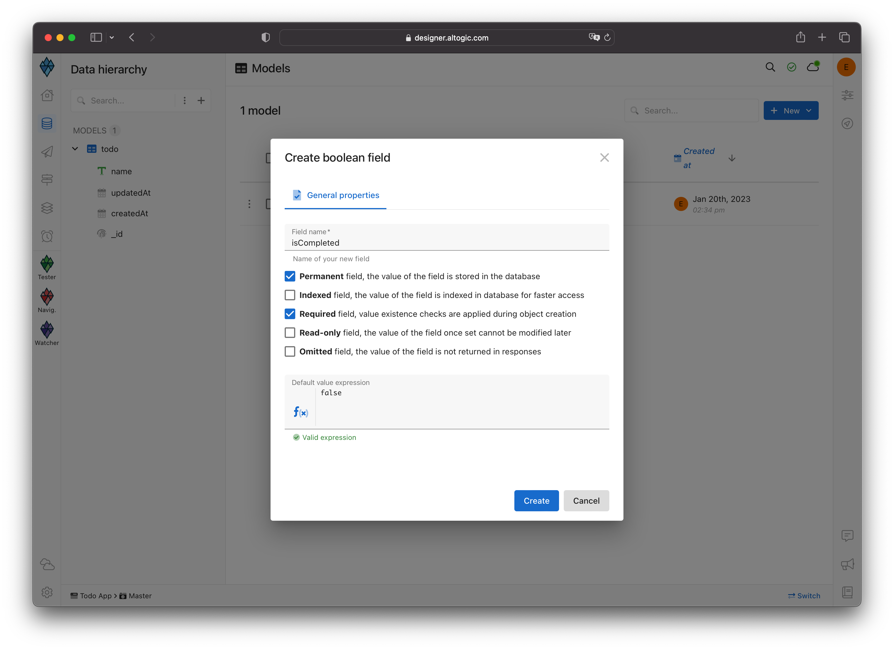
        
        We completed the database design and the model definition on **Altogic** without any coding and complex configuration. Let’s move on to the front-end development.
        
        ## Integrating your Todo App’s frontend and backend
        
        Now, we can install the Altogic client library to our Next.js app to connect our frontend with the backend.
        
        ```bash
        # using npm
        npm install altogic
        # OR is using yarn
        yarn add altogic
        ```
        
        Let’s create a configs/ folder directory to add altogic.js file.
        
        Open altogic.js and paste below code block to export the altogic client instance.
        
        ```jsx
        // configs/altogic.js
        import { createClient } from 'altogic';
        
        // This `envUrl` and `clientKey` is sample you need to create your own.
        let envUrl = 'https://auth.c1-na.altogic.com';
        let clientKey = 'e574fee1fb2b443...a8598ca68b7d8';
        
        const altogic = createClient(envUrl, clientKey);
        
        export default altogic;
        ```
        
        > Replace envUrl and clientKey which are shown in the **Home** view of [Altogic Designer](https://designer.altogic.com/).
        > 
        
        ## Adding states
        
        We have added our states to show the todo list and enter a new todo.
        
        ```jsx
        const [todos, setTodos] = useState([]);
        const [todoInput, setTodoInput] = useState("");
        ```
        
        ## Fetching todo list
        
        We have fetched 100 data in our todo model with the Altogic client library.
        
        We have added the below function above our component, and we entered the props we sent as the default value of our state.
        
        ```jsx
        export async function getServerSideProps() {
          try {
            const { data: todosFromDb, errors } = await altogic.db
              .model("todo")
              .page(1)
              .limit(100)
              .get();
        
            if (errors) throw errors;
        
            return { props: { todosFromDb } };
          } catch (errorList) {
            return { errorCode: errorList?.status || 404 };
          }
        }
        ```
        
        ```jsx
        export default function Home({ todosFromDb }) {
          const [todos, setTodos] = useState(todosFromDb);
        ```
        
        ```jsx
        {todos?.map((todo) => (
                <div key={todo._id} className="flex items-center justify-between mt-2">
                  <div className="relative flex items-center">
                    <div className="flex items-center h-5">
                      <input
                        type="checkbox"
                        className="focus:ring-indigo-500 h-6 w-6 text-indigo-600 border-gray-300 rounded cursor-pointer"
                      />
                    </div>
                    <div className="ml-3 text-sm w-full p-2 cursor-pointer">
                      <label className="font-medium text-gray-700 cursor-pointer">
                        {todo.name}
                      </label>
                    </div>
                  </div>
                  <div className="flex items-center px-2 py-2 text-sm font-medium rounded-md">
                    <button>
                      <svg
                        xmlns="http://www.w3.org/2000/svg"
                        fill="none"
                        viewBox="0 0 24 24"
                        strokeWidth="2"
                        stroke="currentColor"
                        aria-hidden="true"
                        className="lex-shrink-0 h-5 w-5"
                      >
                        <path
                          strokeLinecap="round"
                          strokeLinejoin="round"
                          d="M19 7l-.867 12.142A2 2 0 0116.138 21H7.862a2 2 0 01-1.995-1.858L5 7m5 4v6m4-6v6m1-10V4a1 1 0 00-1-1h-4a1 1 0 00-1 1v3M4 7h16"
                        />
                      </svg>
                    </button>
                  </div>
                </div>
              ))}
        ```
        
        ## Creating  a todo
        
        We have updated the state after adding todo to our database using altogic client library.
        
        Add `handleAddTodo` function with the following code:
        
        ```
        const handleAddTodo = async (e) => {
            e.preventDefault();
        
            try {
              const { data, errors } = await altogic.db.model("todo").create({
                name: todoInput,
              });
        
              if (errors) throw errors;
        
              setTodoInput("");
              setTodos([data, ...todos]);
            } catch (errorList) {
              alert(errorList?.items[0].message);
            }
          };
        ```
        
        ```jsx
        <form onSubmit={handleAddTodo}>
           <div className="relative">
             <input
                placeholder="Add Todo"
                className="w-full rounded-md border-gray-200 py-2.5 pr-10 pl-2 shadow-sm sm:text-sm border-2 border-dashed"
                onChange={(e) => setTodoInput(e.target.value)}
                value={todoInput}
             />
        
             <span className="absolute inset-y-0 right-0 grid w-10 place-content-center">
               <button type="submit">
        	       <span className="sr-only">Submit</span>
        	       <svg
        	         xmlns="http://www.w3.org/2000/svg"
        	         fill="none"
        	         viewBox="0 0 24 24"
        	         strokeWidth="2"
        	         stroke="currentColor"
        	         aria-hidden="true"
        	         id="send-icon"
        	         className="w-7 h-7 text-gray-500"
        	        >
        		        <path
        		         strokeLinecap="round"
        		         stroke-strokelinejoin="round"
        		         d="M13 9l3 3m0 0l-3 3m3-3H8m13 0a9 9 0 11-18 0 9 9 0 0118 0z"
        		         />
        	         </svg>
                </button>
             </span>
             </div>
         </form>
        ```
        
        ## Changing todo status
        
        We have updated the state after updating todo status using altogic client library.
        
        Add `handleChangeStatus` function with the following code:
        
        ```jsx
        const handleChangeStatus = async (todoId, newStatus) => {
            try {
              const { data: updatedTodo, errors } = await altogic.db
                .model("todo")
                .object(todoId)
                .update({
                  isCompleted: newStatus,
                });
        
              if (errors) throw errors;
        
              setTodos(todos.map((todo) => (todo._id === todoId ? updatedTodo : todo)));
            } catch (errorList) {
              alert(errorList?.items[0].message);
            }
          };
        ```
        
        ```jsx
        <div className="flex items-center h-5">
            <input
               type="checkbox"
               className="focus:ring-indigo-500 h-6 w-6 text-indigo-600 border-gray-300 rounded cursor-pointer"
               onChange={() => handleChangeStatus(todo._id, !todo.isCompleted)}
               checked={todo.isCompleted}
             />
        </div>
        <div
          className="ml-3 text-sm w-full p-2 cursor-pointer"
          onClick={() => handleChangeStatus(todo._id, !todo.isCompleted)}
          >
            <label className="font-medium text-gray-700 cursor-pointer">
              {todo.name}
            </label>
        </div>
        ```
        
        ## Deleting the todo
        
        We have updated the state after deleting the todo using altogic client library.
        
        Add `handleDeleteTodo` function with the following code:
        
        ```jsx
        const handleDeleteTodo = async (todoId) => {
            try {
              const { errors } = await altogic.db.model("todo").object(todoId).delete();
        
              if (errors) throw errors;
        
              setTodos(todos.filter((todo) => todo._id !== todoId));
            } catch (errorList) {
              alert(errorList?.items[0].message);
            }
          };
        ```
        
        ```jsx
        <button onClick={() => handleDeleteTodo(todo._id)}>
           <svg
             xmlns="http://www.w3.org/2000/svg"
             fill="none"
             viewBox="0 0 24 24"
             strokeWidth="2"
             stroke="currentColor"
             aria-hidden="true"
             className="lex-shrink-0 h-5 w-5"
            >
        	    <path
        	     strokeLinecap="round"
        	     strokeLinejoin="round"
        	     d="M19 7l-.867 12.142A2 2 0 0116.138 21H7.862a2 2 0 01-1.995-1.858L5 7m5 4v6m4-6v6m1-10V4a1 1 0 00-1-1h-4a1 1 0 00-1 1v3M4 7h16"
        	    />
            </svg>
        </button>
        ```
        
        Congratulations!✨
        
        We have successfully completed the example. 
        
        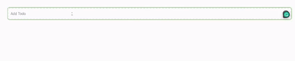
        
        ## Adding Advanced Features to Your Todo App with Altogic and Next.js
        
        ### Enhancing Your Todo App’s User Experience
        
        We can show the completed todos below the list and strike out to improve the user experience.
        
        Let's add the sort function in altogic client library to sorting.
        
        ```jsx
        const { data: todosFromDb, errors } = await altogic.db
              .model("todo")
              .sort("isCompleted", "asc")
              .page(1)
              .limit(100)
              .get();
        ```
        
        We have changed our variable by using the sort function in javascript so that the sorting is not broken when the state changes. 
        
        We have added the line-through class to cross out completed todos.
        
        ```jsx
        const sortedTodos = todos.sort(({ isCompleted }) => (isCompleted ? 1 : -1));
        ```
        
        ```jsx
        {sortedTodos?.map((todo) => (
                <div key={todo._id} className="flex items-center justify-between mt-2">
                  <div className="relative flex items-center">
                    <div className="flex items-center h-5">
                      <input
                        type="checkbox"
                        className="focus:ring-indigo-500 h-6 w-6 text-indigo-600 border-gray-300 rounded cursor-pointer"
                        onChange={() => handleChangeStatus(todo._id, !todo.isCompleted)}
                        checked={todo.isCompleted}
                      />
                    </div>
                    <div
                      className="ml-3 text-sm w-full p-2 cursor-pointer"
                      onClick={() => handleChangeStatus(todo._id, !todo.isCompleted)}
                    >
                      <label
                        className={`font-medium text-gray-700 cursor-pointer ${
                          todo.isCompleted && "line-through"
                        }`}
                      >
                        {todo.name}
                      </label>
                    </div>
                  </div>
                  <div className="flex items-center px-2 py-2 text-sm font-medium rounded-md">
                    <button onClick={() => handleDeleteTodo(todo._id)}>
                      <svg
                        xmlns="http://www.w3.org/2000/svg"
                        fill="none"
                        viewBox="0 0 24 24"
                        strokeWidth="2"
                        stroke="currentColor"
                        aria-hidden="true"
                        className="lex-shrink-0 h-5 w-5"
                      >
                        <path
                          strokeLinecap="round"
                          strokeLinejoin="round"
                          d="M19 7l-.867 12.142A2 2 0 0116.138 21H7.862a2 2 0 01-1.995-1.858L5 7m5 4v6m4-6v6m1-10V4a1 1 0 00-1-1h-4a1 1 0 00-1 1v3M4 7h16"
                        />
                      </svg>
                    </button>
                  </div>
                </div>
              ))}
        ```
        
        ## Strategies for Optimizing Your Todo App’s Performance
        
        If you want to add a search feature to your to-do application, you can add an index to the searched field with Altogic.
        
        Let's open the Altogic designer and click on the name field under our model. We have selected Indexed and Searchable properties and saved them.
        
        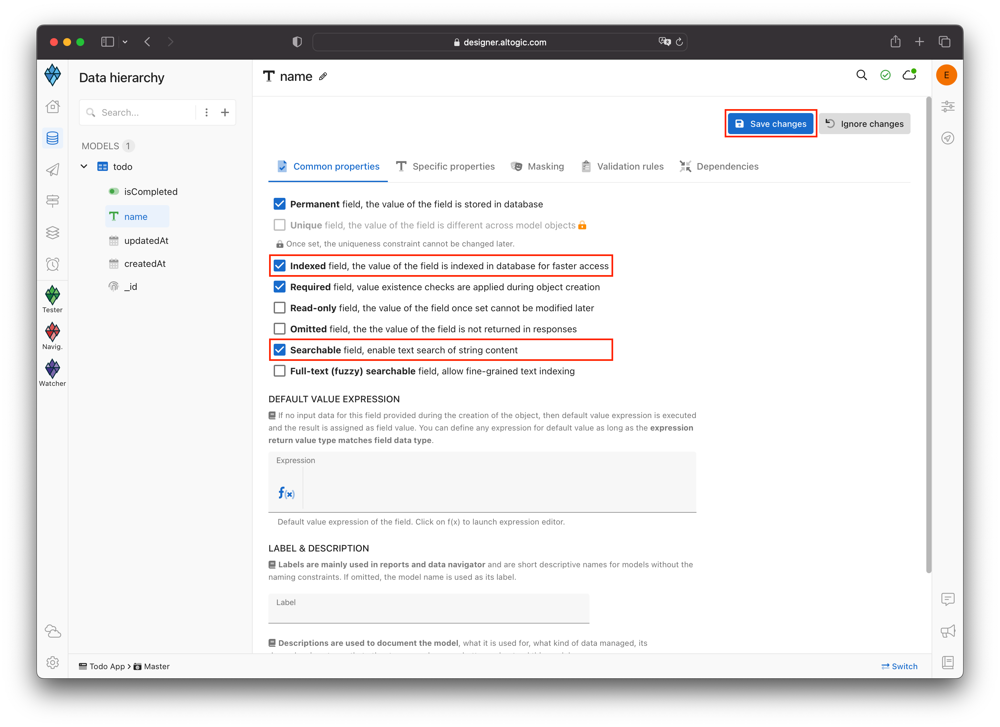
        
        ## **Conclusion**
        
        If you want to show a more comprehensive example with features such as private todo creation, searching todo, inviting users, authentication, and real-time. You can check out [Online Todo App](https://github.com/altogic/altogic/tree/main/examples/online-todo). or if you want to see more examples with Altogic, you can check out the [showcase](https://www.altogic.com/showcase/).