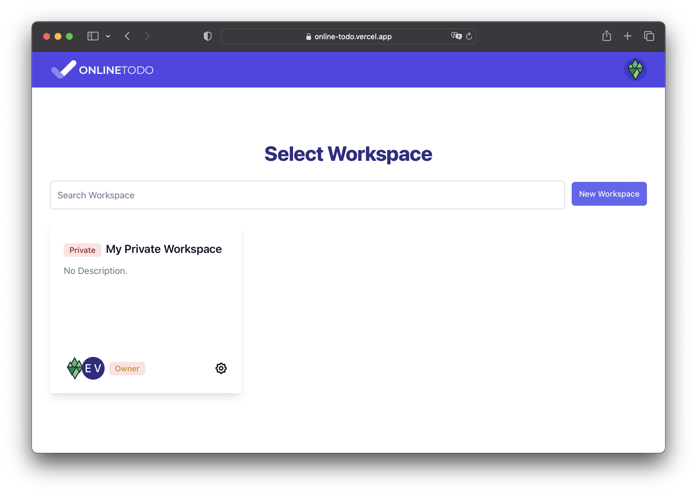
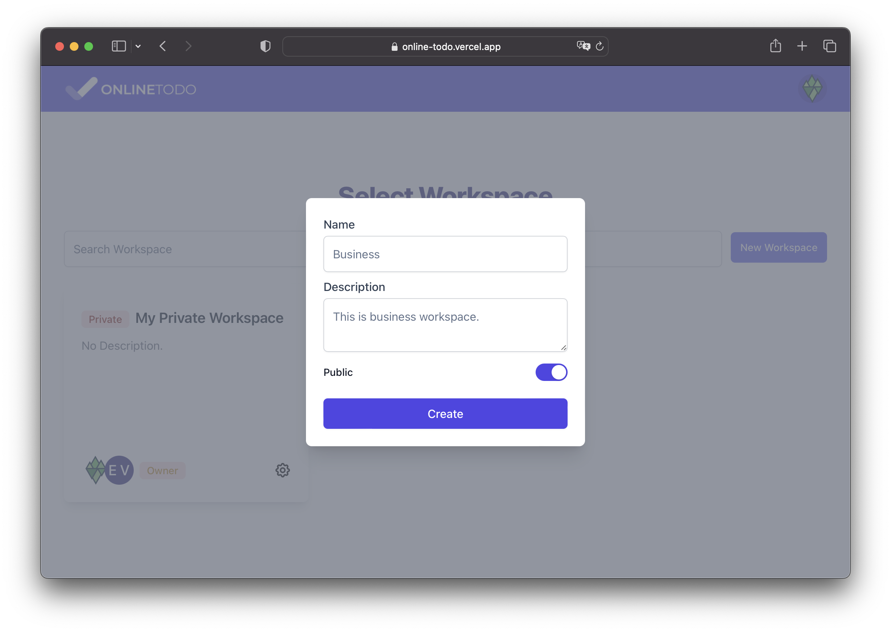
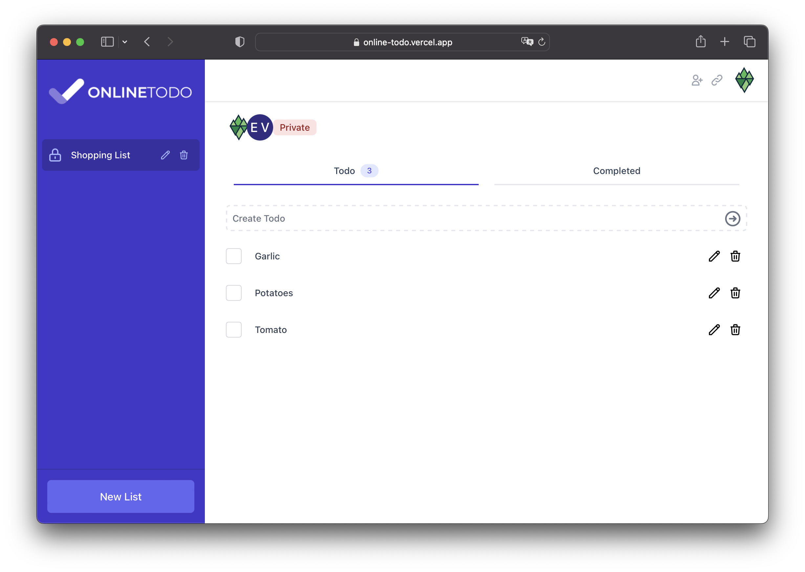
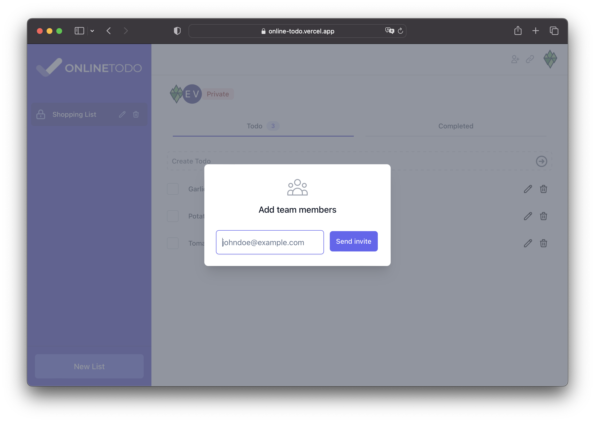
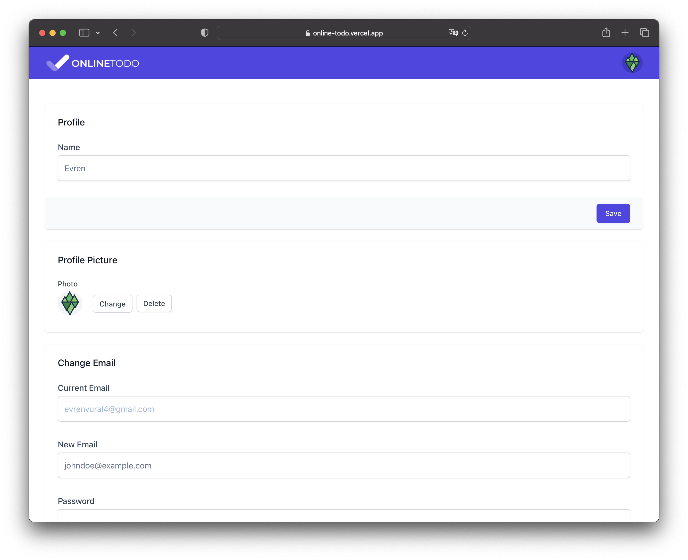
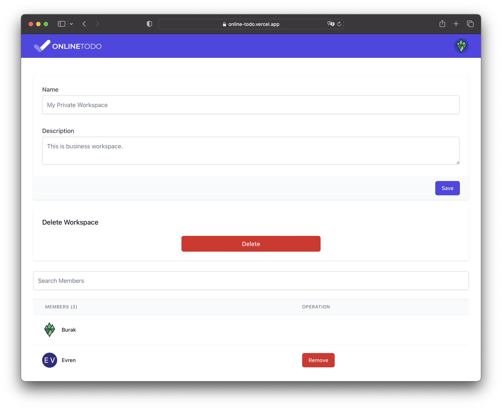

# Altogic Online Todo - Realtime App

## Previews

You can see the preview of the app here: [https://online-todo.vercel.app/](https://online-todo.vercel.app/)

### Home

### Todo List

### Invite People

### Settings

## Introduction

This is a realtime todo app that builds [React.js](https://reactjs.org/) & [Altogic](https://www.altogic.com), backend-as-a-service platform as the backend using its client library.

## Features

1. Authentication
2. [Altogic Realtime](https://www.altogic.com/client/category/realtime)
3. Create workspace
4. Create list
5. Private & Public Lists
6. Create todo
7. Invite users
8. Upload images
9. User settings
10. Workspace settings

## Getting Started

You can run this example rename `.env.example` to `.env` and enter your Client API Key and Environment URL in the `.env` file.

## Learn More

To learn more about Altogic and React.js, you can take a look at the following resources:

- [Altogic Client API Reference](https://clientapi.altogic.com/latest/modules.html) - learn about Altogic Client Library features
- [Altogic Docs](https://www.altogic.com/docs/) - learn about how to design your backend in Altogic
- [Altogic Client Library](https://www.altogic.com/client/) - learn about how to design your backend in Altogic
- [React.js Documentation](https://reactjs.org/docs/getting-started.html) - learn about React.js features and API.

## Contribution

Your feedback and contributions are welcome! Please open a pull request for contributions. If you need the backend for this app, you can contact us at [Discord Server](https://discord.gg/ERK2ssumh8).
