# How to build Pixel App

## What is Pixel Art?

Pixel art is a form of digital art where images are created and edited at the pixel level. It typically features low resolution and a limited color palette and is often used to create retro-style graphics in video games and other digital media. The style is characterized by its blocky, pixelated appearance and is created using software tools designed explicitly for pixel art.

## What is Altogic?

Altogic backend as a service platform allows you to create and start running your backend apps in minutes. With your backend apps, you can **manage your application data** in a database, **cache your data in memory, execute database transactions to ensure data integrity**, **run complex business logic** through synchronous and asynchronous services, **manage user sessions**, **schedule jobs** to be executed at a specific time or interval, **send and receive real-time messages** through WebSockets and more.

### Creating an Altogic Application

As you are aware, Altogic will be used in this project, so if you do not already have an account, you must create one from the [Altogic Designer.](https://designer.altogic.com/) 

> I advise you to review the [documentation](https://www.altogic.com/client/installation/) for more in-depth details.
> 

## Setting up your development environment with Altogic and Next.js 13

```bash
npx create-next-app@latest
# or
yarn create next-app
```

### **Installing Altogic Client Library[](https://www.altogic.com/client/quick-start-authentication/with-nuxtjs-3/#integrating-with-altogic)**

The Altogic client library is required for our front-end application because the backend will use Altogic. To set up, use the "cd” command to navigate the project folder, then type the code below to install Altogic.

```bash
npm install altogic
# or
yarn add altogic
```

### Creating Altogic instance

Let’s create a `configs/` folder to add the **altogic.js** file. Open **altogic.js** and paste below code block to export the altogic client instance.

```bash
import { createClient } from "altogic";

let envUrl = ''; // replace with your envUrl
let clientKey = ''; // replace with your clientKey

const altogic = createClient(envUrl, clientKey, {
  signInRedirect: "/sign-in",
});

export const { db, auth, storage, endpoint, queue, realtime, cache } = altogic;
```

Replace `ENV_URL` and `CLIENT_KEY` which are shown in the **Home** view of [Altogic Designer](https://designer.altogic.com/).

## **App preview and s**creens

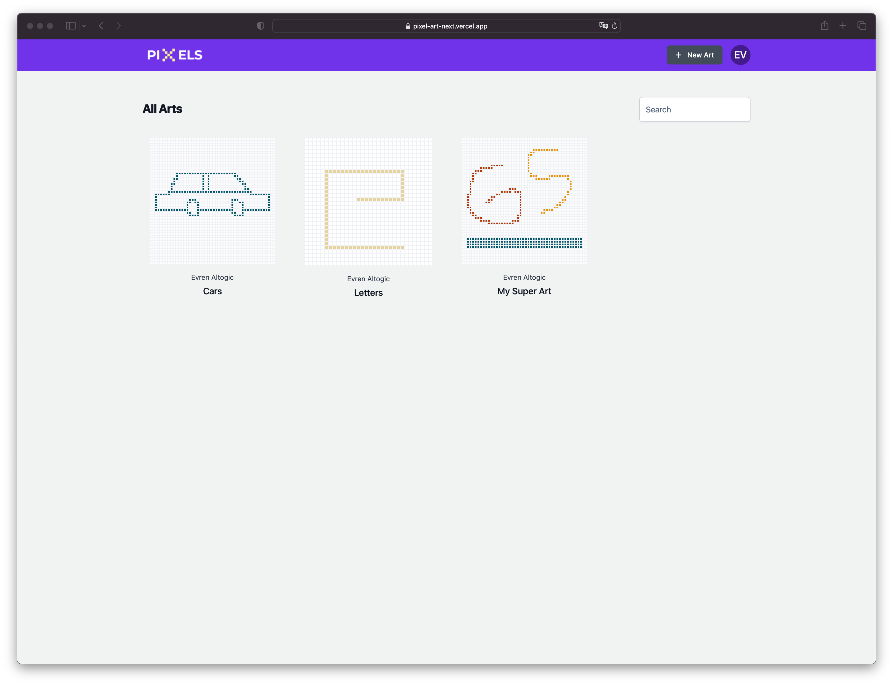

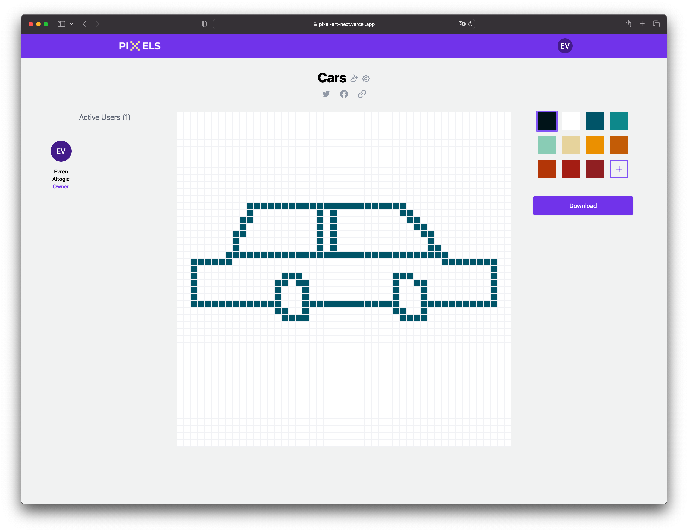

## Creating a backend for your Pixel Art App with Altogic

Firstly, Let's create our models. We have four models. There is a many-to-many connection between the pixel_arts model and the user model. We created the pixel_user_connections model to provide this connection. Lookup is an expensive operation. We have added some fields to this model to minimize the lookup in GET queries.

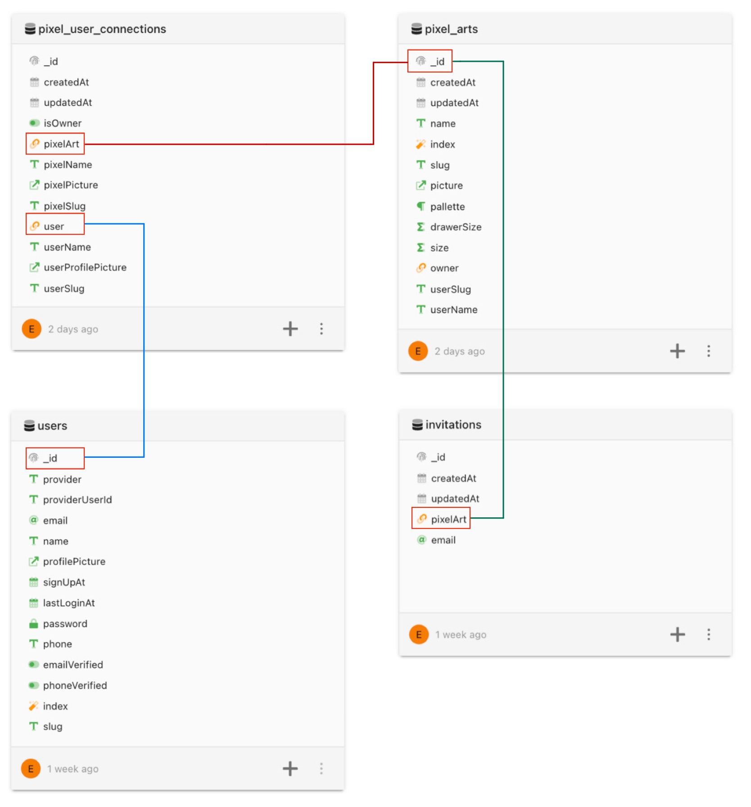

## Services

With the client library in Altogic, we can perform a wide range of tasks. Still, occasionally we may need to handle multiple tasks at once, or there may be circumstances where additional security is necessary. In these situations, we can write a service using drag and drop in Altogic.

All my services are below.

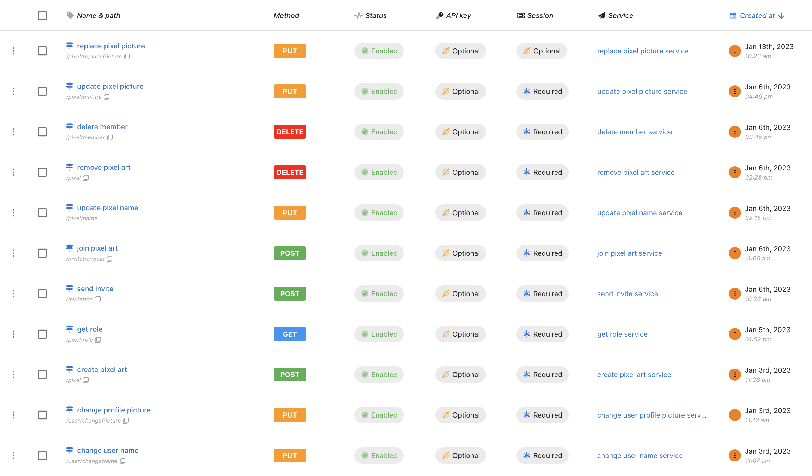

**Create Pixel Art Service**

It’s used to create pixel art. Data are inserted into pixel_arts and pixel_user_connections.

Logic

A "pixel_arts" object is created and saved in the database. Then a “pixel_user_connections” object is created, and The “pixel_arts” object is returned as a response.

.png)

**Update Pixel Name Service**

It’s used to update the pixel’s name. Data in pixel_arts and pixel_user_connections are updated.

Logic

The “name” field in “pixel_art” is updated with the query according to “pixelSlug.” Then the pixelName in “pixel_user_connections” is updated.

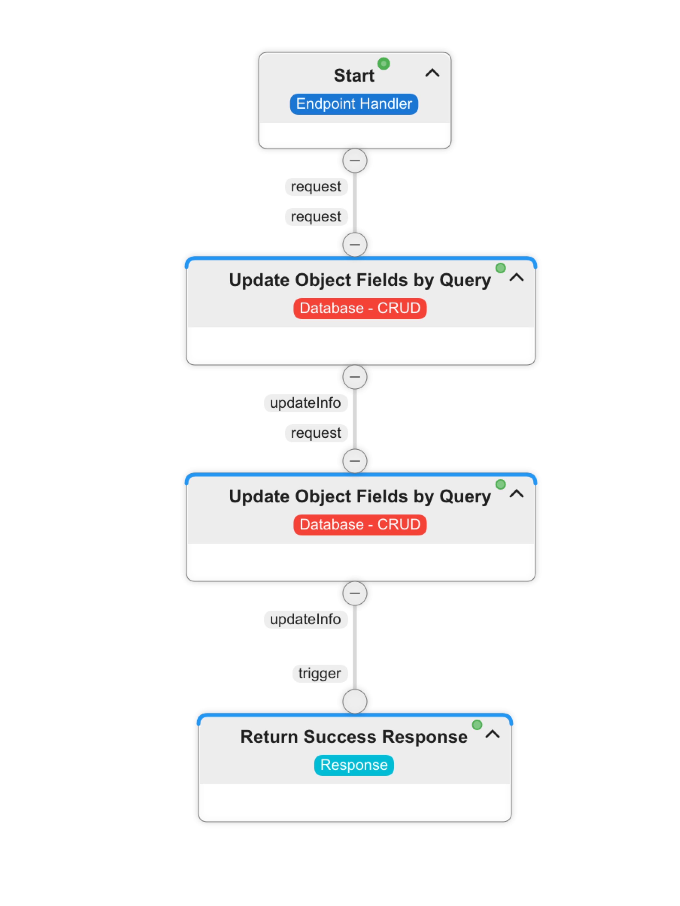

**Remove Pixel Art Service**

It’s used to remove pixel art. All connection and pixel art records are removed.

Logic

All “pixel_user_connections” objects are removed with the query according to “pixelSlug.” Then the “pixel_art” object is removed.

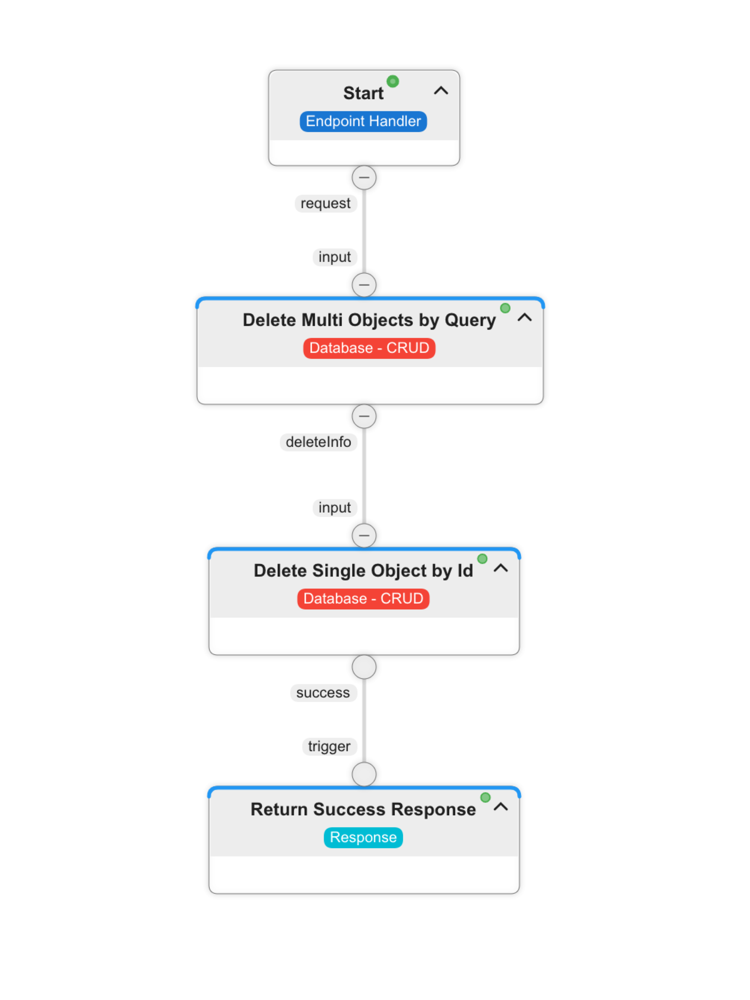

**Replace Pixel Picture Service**

It's used to update pixel pictures. We need pixel art pictures to show in the OG image. This required photo is recorded for storage with this service before sharing.

Logic

The png file of the drawn pixel art is replaced with the one in the storage.

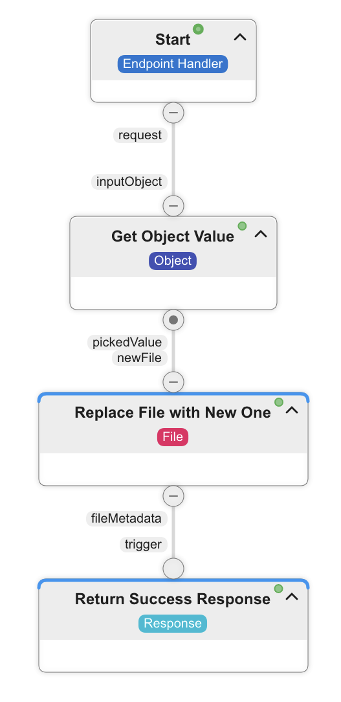

**Update Pixel Picture Service**

It’s used to update pixel pictures’ paths in pixel_arts and pixel_user_connections models. 

Logic

After saving the pixel picture to storage, this service is called. The "publicPath" in the body is saved in the picture field in the “pixel_arts” model. Then the “pixelPicture” in the “pixel_user_connections” model is updated. 


**Send Invite Service**

It's used to send invite people. Service first checks if the invited user is a member of pixel art. If the user is a member, it throws an error. Then it is checked whether the invited user has been invited before. If invited, the error is thrown. After passing all these checks, the invitations model is recorded, and an e-mail is sent to the invited user.

Logic


**Join Pixel Art Service**

Invited users join the team through this service. First, it is checked whether there is such an invitation and whether it has been a member. After the checks are made, the connection model is recorded and deleted from the invitation table.

Logic


**Delete Member Service**

It’s used to remove members from pixel art. 

Logic

The “pixel_user_connections” objects is removed with the query according to “pixelSlug” and “userId”. Then the “drawerSize” field of the pixel art model is decreased by one.


**Get Role Service**

It is the service that gives the member's role in pixel art. Create variable object creates role variable. The pixel_user_connections table checks to find the connection of the user who requested the pixel art.

Logic


**Change Profile Picture Service**

It is the service where the user changes his profile photo.

Logic

After saving the user picture to storage, this service is called. The "publicPath" in the body is saved in the profilePicture field in the “users” model. Then the “userProfilePicture” in the “pixel_user_connections” model is updated. 


**Change User Name Service**

It is the service that the user renames.

Logic

The “name” field in “users” is updated with the query according to “userId.” Then the userName in “pixel_user_connections” is updated.


## **Integrating your app’s frontend with the backend**

### Displaying a list of canvas

Data is kept in matrix form according to the specified size. An element of the matrix; stores the information of its location with its x and y coordinates and the data of its color with its color field.

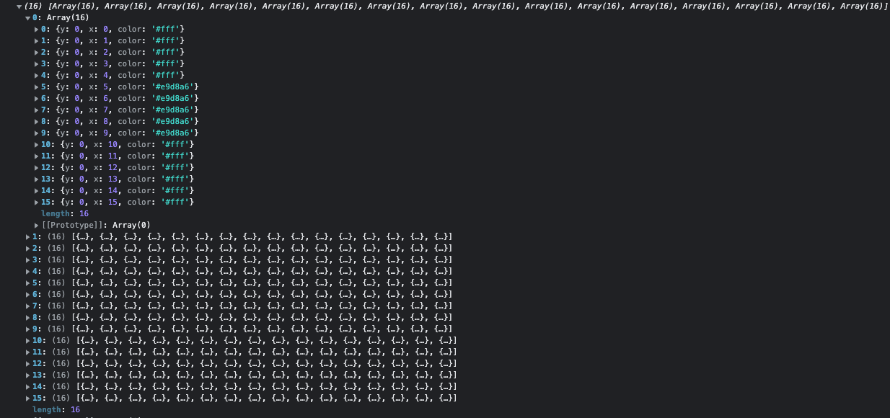

It is drawn to the screen with two loops.

```jsx
import cs from "classnames";
import _ from "lodash";
import { useRouter } from "next/router";
import { useEffect, useRef, useState } from "react";
import { useDispatch, useSelector } from "react-redux";
import { pixelActions } from "../redux/pixel/pixelSlice";
import { realtimeActions } from "../redux/realtime/realtimeSlice";
import Cell from "./cell";

export default function PixelTable({ drawColor, canDraw, size }) {
  const router = useRouter();
  const { pixelSlug } = router.query;
  const pixelRef = useRef(null);

  const dispatch = useDispatch();
  const data = useSelector((state) => state.pixel.pixel);

  const [holdDown, setHoldDown] = useState(false);

  const handleFocus = (e) => {
    if (!document.getElementById("pixel-table")?.contains(e.target)) {
      // Clicked outside the box
      setHoldDown(false);
    }
  };

  useEffect(() => {
    dispatch(
      realtimeActions.joinRequest({
        pixelSlug,
      })
    );

    return () => {
      dispatch(
        realtimeActions.leaveRequest({
          pixelSlug,
        })
      );
    };
  }, [pixelSlug]);

  useEffect(() => {
    if (pixelRef?.current) {
      pixelRef.current.addEventListener("mouseup", holdUpMouse);
      pixelRef.current.addEventListener("mousedown", holdDownMouse);
      window.addEventListener("click", handleFocus, false);
    }

    return () => {
      if (pixelRef?.current) {
        window.removeEventListener("click", handleFocus, false);
        pixelRef.current.removeEventListener("mouseup", holdUpMouse);
        pixelRef.current.removeEventListener("mousedown", holdDownMouse);
      }
    };
  }, [pixelRef]);

  const holdDownMouse = () => {
    setHoldDown(true);
  };
  const holdUpMouse = () => {
    setHoldDown(false);
  };

  const draw = (x, y) => {
    if (!canDraw || !data[y] || !data[y][x] || data[y][x].color === drawColor) {
      return;
    }

    dispatch(pixelActions.drawPixel({ x, y, drawColor }));
    dispatch(
      realtimeActions.drawRequest({
        pixelSlug,
        x,
        y,
        drawColor,
      })
    );
    dispatch(
      pixelActions.savePixelRequest({
        slug: pixelSlug,
      })
    );
  };

  const onMouseDown = ({ x, y }) => {
    draw(Number(x), Number(y));
  };

  const onMouseOver = ({ x, y }) => {
    if (holdDown) {
      draw(x, y);
    }
  };

  return (
    <div
      ref={pixelRef}
      id="pixel-table"
      className={cs([
        "my-3 2xl:my-6",
        canDraw
          ? "touch-none touch-pinch-zoom cursor-cell"
          : "cursor-not-allowed",
      ])}
    >
      {_.map(data, (row, rowIndex) => (
        <div key={rowIndex} className="flex w-full">
          {_.map(row, (column, columnIndex) => (
            <div key={`${rowIndex},${columnIndex}`}>
              <Cell
                size={size}
                indexKey={`${rowIndex},${columnIndex}`}
                data={column}
                onMouseDown={onMouseDown}
                onMouseOver={onMouseOver}
              />
            </div>
          ))}
        </div>
      ))}
    </div>
  );
}
```

```jsx
import cs from "classnames";

export default function Cell(props) {
  const { indexKey, data, onMouseDown, onMouseOver, size } = props;

  const handleTouchMove = (ev) => {
    const touchX = ev.touches[0].pageX - window.pageXOffset;
    const touchY = ev.touches[0].pageY - window.pageYOffset;

    const element = document.elementFromPoint(touchX, touchY);

    if (element) {
      const [y, x] = element.id.split(",");
      onMouseDown({ x, y }, ev);
    }
  };
  return (
    <div
      id={indexKey}
      style={{
        backgroundColor: data?.color,
      }}
      className={cs([
        "border border-gray-100",
        size === 16 &&
          "w-5 h-5 sm:w-10 sm:h-10 md:w-12 md:h-12 lg:w-14 lg:h-14",
        size === 32 && "w-2.5 h-2.5 sm:w-5 sm:h-5 md:w-6 md:h-6 lg:w-7 lg:h-7",
        size === 48 &&
          "w-[0.42rem] h-[0.42rem] sm:w-[0.83rem] sm:h-[0.83rem] md:w-4 md:h-4 lg:w-[1.16rem] lg:h-[1.16rem]",
      ])}
      onMouseDown={(ev) => onMouseDown(data, ev)}
      onMouseOver={(ev) => onMouseOver(data, ev)}
      onFocus={(ev) => onMouseOver(data, ev)}
      onTouchMove={handleTouchMove}
    />
  );
}
```

## Adding realtime functionality

A request for real-time connection is thrown when the page is loaded

```jsx
useEffect(() => {
    dispatch(
      realtimeActions.joinRequest({
        pixelSlug,
      })
    );

    return () => {
      dispatch(
        realtimeActions.leaveRequest({
          pixelSlug,
        })
      );
    };
  }, [pixelSlug]);
```

We wrap the realtime services we will use with the realtimeService object.

```jsx
import { realtime } from "../../configs/altogic";

const realtimeService = {
  join: (channel) => realtime.join(channel),
  leave: (channel) => realtime.leave(channel),
  removeListen: (eventType) => realtime.off(eventType),
  listen: (eventType, callback) => realtime.on(eventType, callback),
  sendMessage: (channel, event, message) =>
    realtime.send(channel, event, message),

  updateProfile: (user) => realtime.updateProfile(user),
  getMembers: (channel) => realtime.getMembers(channel),
};

export default realtimeService;
```

While the states are being updated, if a request comes in, this request is canceled. The channels of the redux-saga are used to prevent pixel loss in this situation.

```jsx
import _ from "lodash";
import { eventChannel } from "redux-saga";
import {
  all,
  apply,
  call,
  fork,
  put,
  select,
  take,
  takeEvery,
  takeLatest,
} from "redux-saga/effects";
import { ArtEventType } from "../../functions/constants";
import pixelService from "../pixel/pixelService";
import { pixelActions } from "../pixel/pixelSlice";
import realtimeService from "./realtimeService";
import { realtimeActions } from "./realtimeSlice";

function* drawSaga({ payload: { pixelSlug, x, y, drawColor } }) {
  const sent = yield select((state) => state.realtime.realtimeKey);
  yield apply(realtimeService, realtimeService.sendMessage, [
    pixelSlug,
    ArtEventType.DRAW,
    { data: { x, y, drawColor }, sent },
  ]);
}

function* listenSocket(socketChannel) {
  while (true) {
    try {
      const { data, sent, type } = yield take(socketChannel);

      switch (type) {
        case "join":
          const { id, data: member } = data;
          yield put(
            pixelActions.updateMembers({
              key: id,
              value: { id, ...member },
            })
          );
          break;
        case "leave":
          yield put(
            pixelActions.removeMembers({
              key: data.id,
            })
          );
          break;
        case ArtEventType.DELETED:
          window.location.href = "/";
          break;
        case ArtEventType.UPDATED_NAME:
          const pixelConn = yield select((state) =>
            _.get(state.pixel.pixelConnections, data.data.pixelSlug)
          );
          const pixel = yield select((state) =>
            _.get(state.pixel.pixels, data.data.pixelSlug)
          );
          yield put(
            pixelActions.updatePixelConnections({
              key: data.data.pixelSlug,
              value: {
                ...pixelConn,
                pixelName: data.data.name,
                pixel: {
                  ...pixel,
                  name: data.data.name,
                },
              },
            })
          );
          yield put(
            pixelActions.updatePixels({
              key: data.data.pixelSlug,
              value: {
                ...pixel,
                name: data.data.name,
              },
            })
          );
          break;
        case ArtEventType.REMOVE_MEMBER:
          const user = yield select((state) => state.auth.user);
          if (data.data === user?._id) {
            realtimeService.updateProfile({
              userId: user._id,
              name: user.name,
              profilePicture: user.profilePicture,
              slug: user.slug,
              role: "viewer",
            });
          }
          break;

        default:
          const realtimeKey = yield select(
            (state) => state.realtime.realtimeKey
          );
          if (sent !== realtimeKey) {
            yield put(pixelActions.drawPixel(data));
          }
          break;
      }
    } catch (err) {
      console.error("socket error:", err);
    }
  }
}

function* joinSaga({ payload: { pixelSlug } }) {
  realtimeService.join(pixelSlug);
  yield put(realtimeActions.setPixelSlug(pixelSlug));

  const socketChannel = yield call(createSocketChannel);
  yield fork(listenSocket, socketChannel);
  yield fork(leaveSaga, socketChannel);
  yield fork(joinMemberSaga, pixelSlug);
}

function* joinMemberSaga(pixelSlug) {
  try {
    const user = yield select((state) => state.auth.user);
    if (user) {
      const {
        data: { role },
        errors,
      } = yield call(pixelService.getRole, pixelSlug);
      if (errors) {
        throw errors;
      }

      realtimeService.updateProfile({
        userId: user._id,
        name: user.name,
        profilePicture: user.profilePicture,
        slug: user.slug,
        role,
      });
    }
  } catch (e) {
    console.error(e);
  }
}

function* leaveSaga(socketChannel) {
  while (true) {
    const {
      payload: { pixelSlug },
    } = yield take(realtimeActions.leaveRequest.type);
    realtimeService.leave(pixelSlug);
    yield put(realtimeActions.setPixelSlug(null));
    socketChannel.close();
  }
}

function createSocketChannel() {
  return eventChannel((emit) => {
    const drawHandler = (event) => {
      emit(event.message);
    };
    const joinHandler = (event) => {
      emit({ type: "join", data: event.message });
    };
    const leaveHandler = (event) => {
      emit({ type: "leave", data: event.message });
    };
    const deleteHandler = (event) => {
      emit({ type: ArtEventType.DELETED, data: event.message });
    };
    const updatedNameHandler = (event) => {
      emit({ type: ArtEventType.UPDATED_NAME, data: event.message });
    };
    const removeMemberHandler = (event) => {
      emit({ type: ArtEventType.REMOVE_MEMBER, data: event.message });
    };

    // setup the subscription
    realtimeService.listen(ArtEventType.DRAW, drawHandler);
    realtimeService.listen("channel:join", joinHandler);
    realtimeService.listen("channel:update", joinHandler);
    realtimeService.listen("channel:leave", leaveHandler);
    realtimeService.listen(ArtEventType.DELETED, deleteHandler);
    realtimeService.listen(ArtEventType.UPDATED_NAME, updatedNameHandler);
    realtimeService.listen(ArtEventType.REMOVE_MEMBER, removeMemberHandler);

    const unsubscribe = () => {
      realtimeService.removeListen(ArtEventType.DRAW);
      realtimeService.removeListen("channel:join");
      realtimeService.removeListen("channel:update");
      realtimeService.removeListen("channel:leave");
      realtimeService.removeListen(ArtEventType.DELETED);
      realtimeService.removeListen(ArtEventType.UPDATED_NAME);
      realtimeService.removeListen(ArtEventType.REMOVE_MEMBER);
    };

    return unsubscribe;
  });
}

function* getMembersSaga({ payload: { pixelSlug } }) {
  try {
    const { data, errors } = yield call(realtimeService.getMembers, pixelSlug);
    if (errors) {
      throw errors;
    }
    let newMembers = {};

    if (!_.isEmpty(data)) {
      for (const { id, data: member } of data) {
        newMembers[id] = { id, ...member };
      }
      yield put(pixelActions.setMembers(newMembers));
    }
  } catch (e) {
    console.error(e);
  }
}

export default function* realtimeSaga() {
  yield all([
    takeEvery(realtimeActions.joinRequest.type, joinSaga),
    takeEvery(realtimeActions.drawRequest.type, drawSaga),
    takeLatest(realtimeActions.getMembersRequest.type, getMembersSaga),
  ]);
}
```

## Saving canvas to SVG

With the help of the html2canvas library, the selected element is converted to blob type and downloaded.

```jsx
const download = () => {
    html2canvas(document.querySelector("#pixel-table")).then((canvas) => {
      canvas.toBlob(function (blob) {
        saveCanvasToDisk(blob, "png");
      });
    });
  };

  const saveCanvasToDisk = (blob, fileExtension) => {
    saveAs(blob, `${pixel?.name}.${fileExtension}`);
  };
```

## Adding Additional Functionality for Developing Pixel Art with Altogic and Next.js

## Securing your app with Object Level Security

With Altogic Object Level Security, you can add restrictions to crud operations on models. In this way, outside interference with the application is prevented.

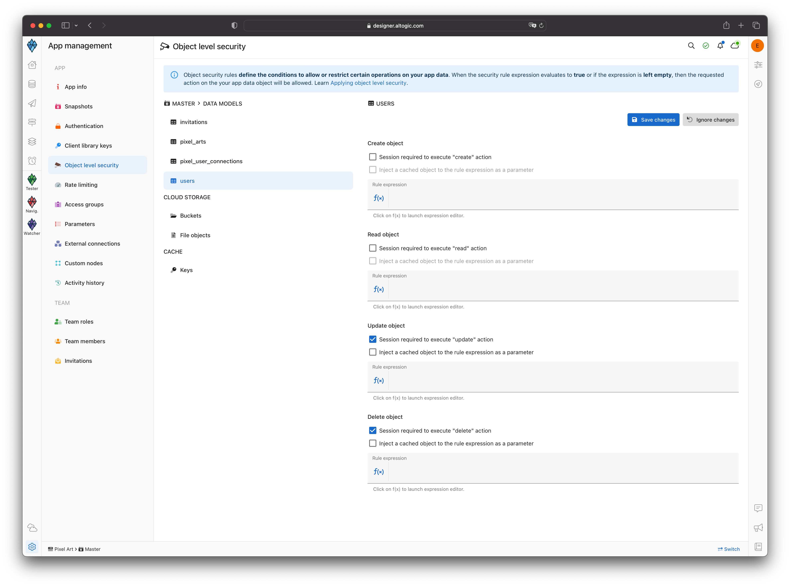

## Securing your app with Rate Limiter

With Rate Limiter, you can prevent possible DDOS attacks on your website. This project can receive 250 requests within 15 seconds. If it gets more requests, it will return an error.

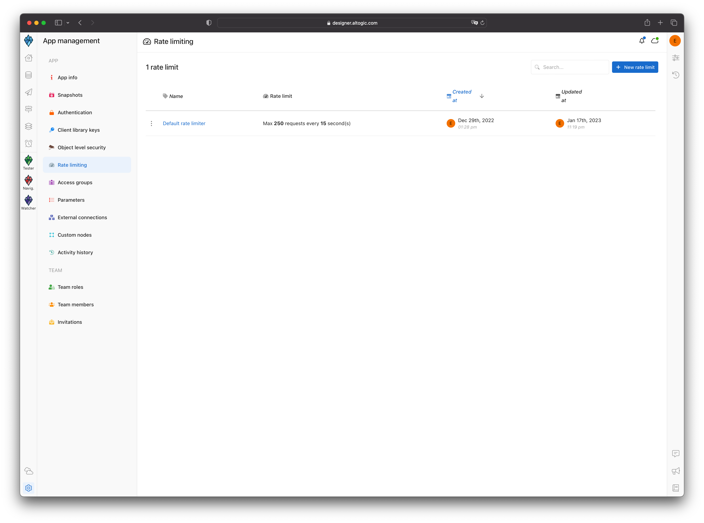

## OG Image

OG are the images that appear when you share the application. For the painting to appear, you need to add it to the meta tag in the HTML. I wanted each pixel art to have its image in this application. I used the SSR technology of next.js to achieve this.

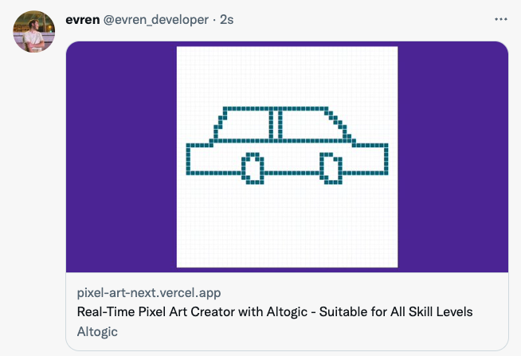

I used Next.Js @vercel/og package to provide this image and created **og-images.js** in `pages/api` folder.

```jsx
import { ImageResponse } from "@vercel/og";

export const config = {
  runtime: "experimental-edge",
};

export default async function handler(req) {
  const { searchParams } = new URL(req.url || "");
  const link = searchParams.get("link");

  if (!link) {
    return new Response("Missing link", { status: 400 });
  }

  return new ImageResponse(
    (
      <section
        style={{ backgroundColor: "#4c1d95" }}
        tw="flex flex-col items-center justify-center w-full h-full"
      >
        <div tw="flex my-2">
          
        </div>
      </section>
    ),
    {
      width: 1200,
      height: 627,
      headers: {
        "Cache-Control": "no-cache",
      },
    }
  );
}
```

After pressing the share button, we send a request to our replace picture service before sharing. After saving the final version of Pixel Art, we send it as a link to the API we created.

```jsx
const beforeOnClick = () =>
    new Promise((resolve) => {
      setLoading(true);
      dispatch(
        pixelActions.replacePictureRequest({
          pixelSlug,
          onSuccess: () => {
            setLoading(false);
            resolve();
          },
          onFailure: () => {
            setLoading(false);
            resolve();
          },
        })
      );
    });
```

Let's give the api link we created to the meta tags.

```bash
				<meta
          property="twitter:image"
          content={`https://pixel-art-next.vercel.app/api/og-image?link=${
            pixel?.picture
          }&name=${pixel?.name}&time=${new Date().getTime()}`}
        />
        <meta
          property="og:image"
          content={`https://pixel-art-next.vercel.app/api/og-image?link=${
            pixel?.picture
          }&name=${pixel?.name}&time=${new Date().getTime()}`}
        />
```

## Optimizing your Pixel Art app’s performance

It is not the right approach to send a request after each frame is drawn. We should minimize network requests so I used debounce.

```jsx
const draw = (x, y) => {
    if (!canDraw || !data[y] || !data[y][x] || data[y][x].color === drawColor) {
      return;
    }

    dispatch(pixelActions.drawPixel({ x, y, drawColor }));
    dispatch(
      realtimeActions.drawRequest({
        pixelSlug,
        x,
        y,
        drawColor,
      })
    );
    dispatch(
      pixelActions.savePixelRequest({
        slug: pixelSlug,
      })
    );
  };
```

“savePixelRequest” is handled in redux-saga with debounce.

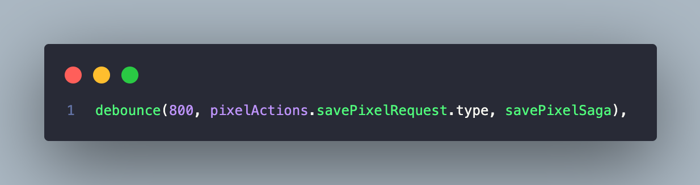

```jsx
function* savePixelSaga({ payload: { slug, onSuccess, onFailure } }) {
  try {
    const pixelPallette = yield select((state) => state.pixel.pixel);

    const { errors } = yield call(
      pixelService.draw,
      slug,
      JSON.stringify(pixelPallette)
    );
    if (errors) {
      throw errors;
    }

    if (_.isFunction(onSuccess)) onSuccess();
  } catch (e) {
    if (_.isFunction(onFailure)) onFailure(e);
  }
}
```

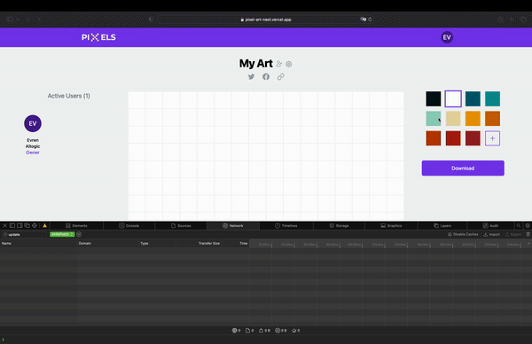

## Conclusion[](https://www.altogic.com/client/quick-start-authentication/with-flutter#conclusion)

If you have questions about Altogic or want to share what you have built, please post a message in our Community Forum or Discord Channel.

If you have any questions about Altogic or want to share what you have built, please post a message in our [community forum](https://community.altogic.com/home) or [discord channel](https://discord.gg/ERK2ssumh8).