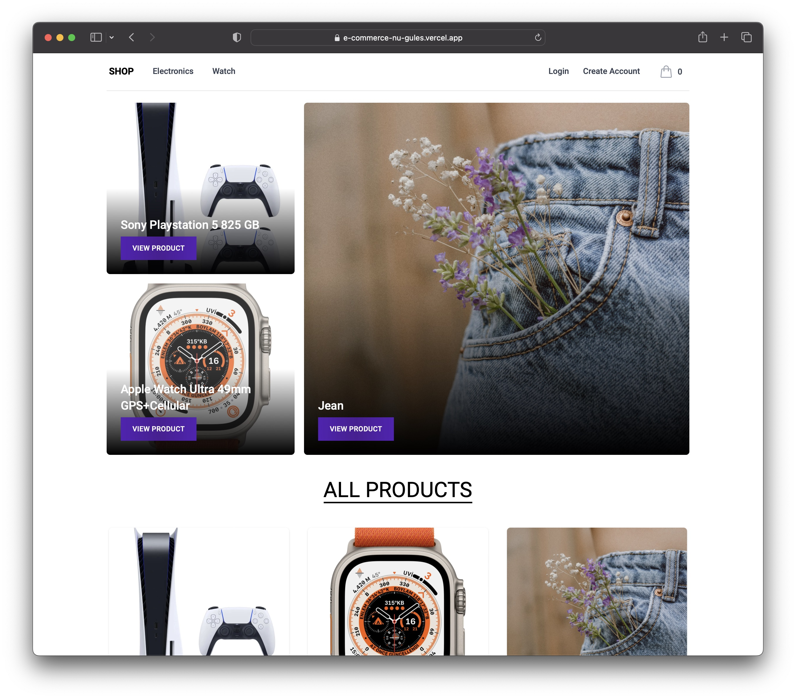

# Ecommerce Store With Altogic & React

## Previews

You can see the preview of the app here: [https://recommerce-chi.vercel.app/](https://recommerce-chi.vercel.app/)

## Introduction

This is an e-commerce app that builds [React.js](https://reactjs.org/) & [Altogic](https://www.altogic.com), backend-as-a-service platform as the backend using its client library.

## Features

1. Authentication
2. Add a Product
3. Add a Category
4. Profile Settings
5. Stock Control
6. Real Time Dashboard
7. Real Time Notification For Admin

## Learn More

To learn more about Altogic and React.js, you can take a look at the following resources:

-   [Altogic Client API Reference](https://clientapi.altogic.com/latest/modules.html) - learn about Altogic Client Library features
-   [Altogic Docs](https://www.altogic.com/docs/) - learn about how to design your backend in Altogic
-   [Altogic Client Library](https://www.altogic.com/client/) - learn about how to design your backend in Altogic
-   [React.js Documentation](https://reactjs.org/docs/getting-started.html) - learn about React.js features and API.

## Contribution

Your feedback and contributions are welcome! Please open a pull request for contributions. If you need the backend for this app, you can contact us at [Discord Server](https://discord.gg/ERK2ssumh8).
