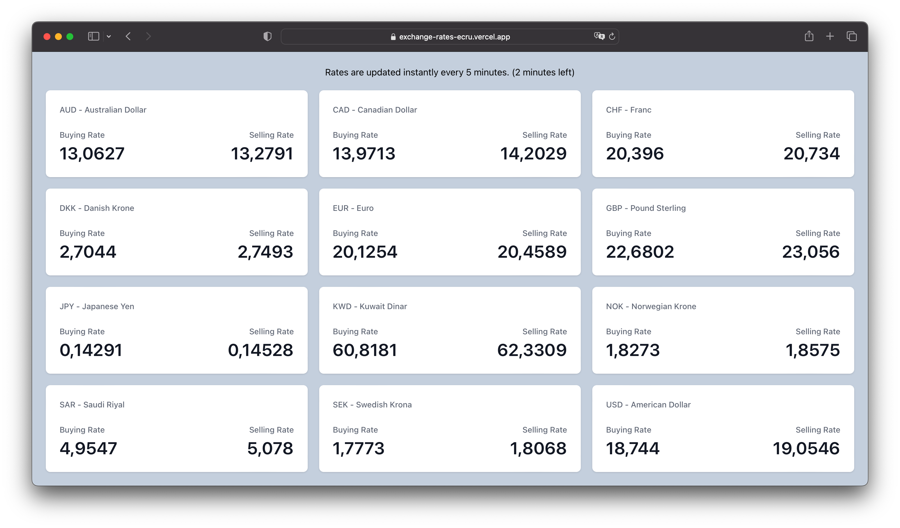
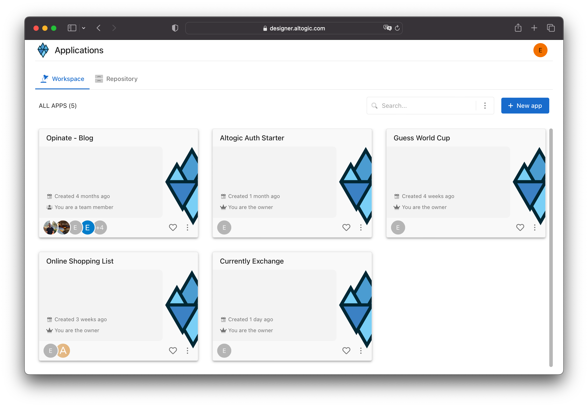
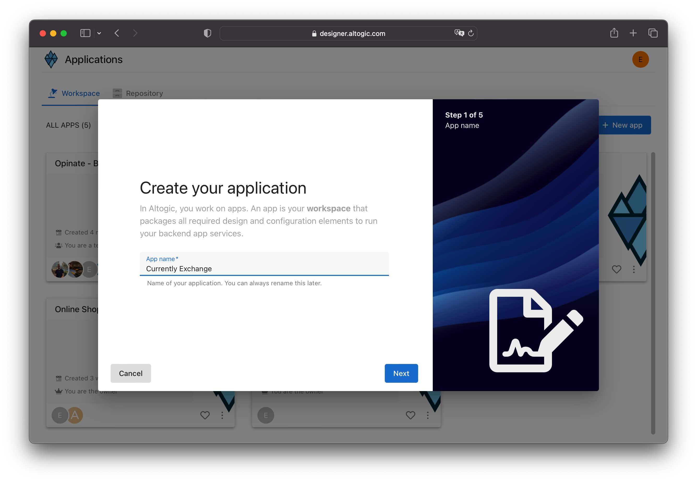
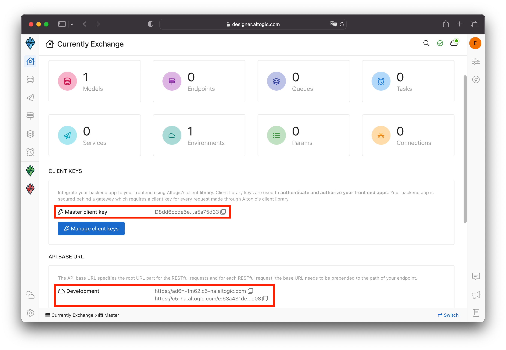
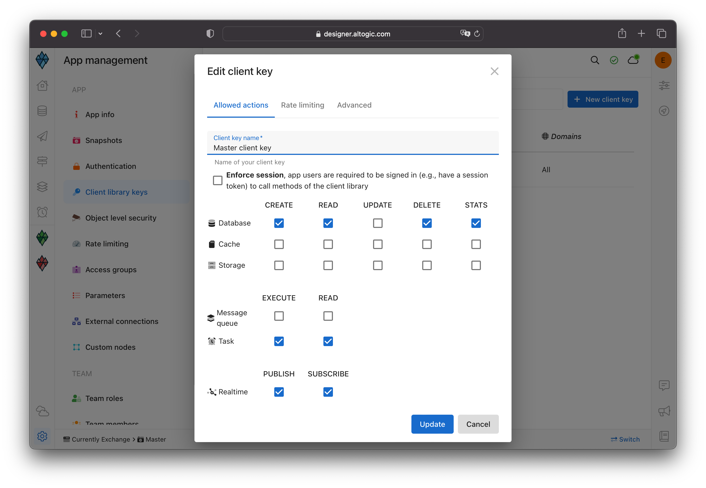
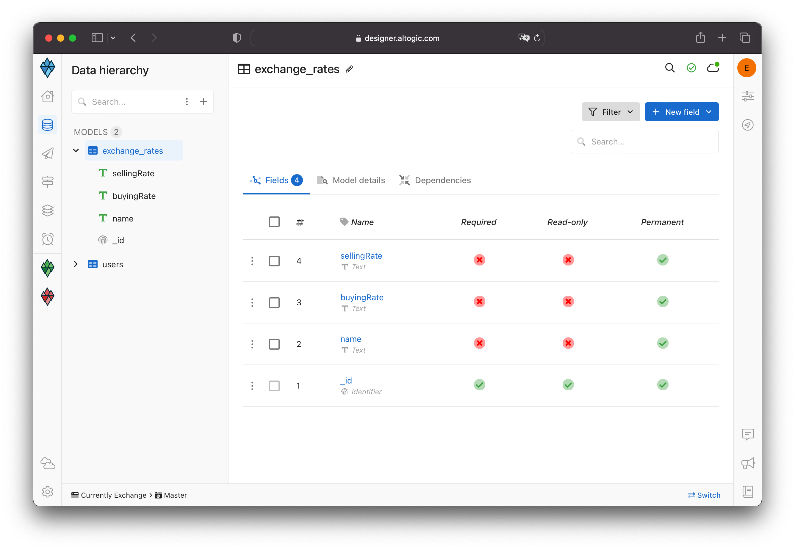
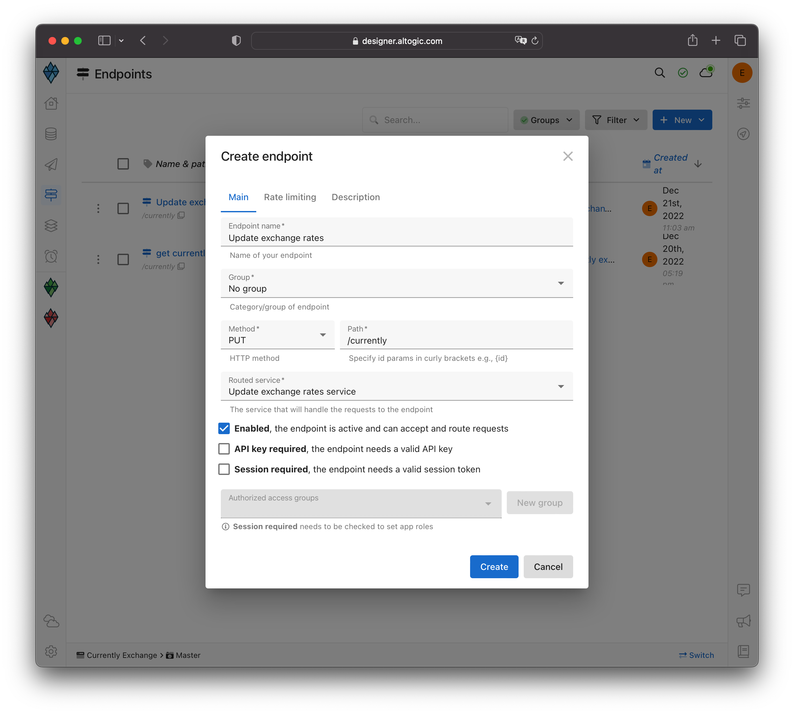
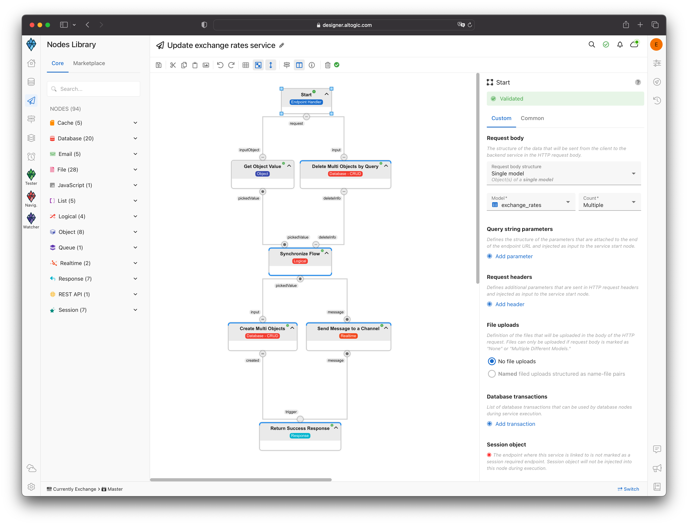
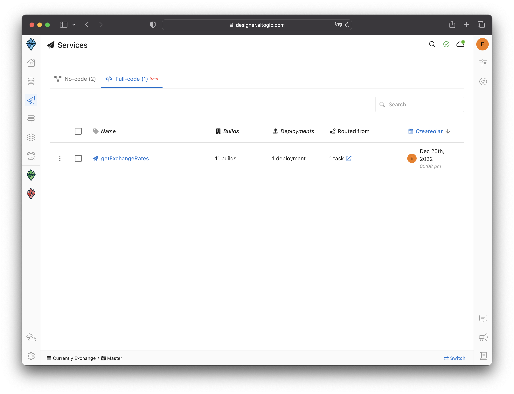
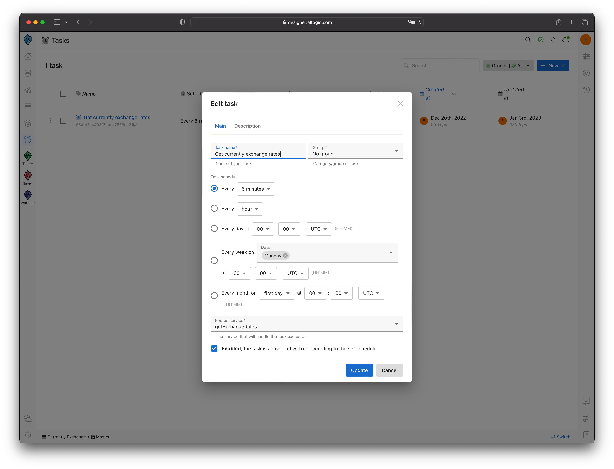

# Exchange Rates App using Cloud Function, Cron Job, and Realtime

You can access the full source code on our example repository.



## Introduction

Exchange Rates is an application that displays exchange rates instantly. 

In this example, we will create a cloud function to pull the data and scrape the HTML page. We will create a cron job for the scrape process to run every 5 minutes and use the Realtime service to instantly reflect the captured data to the user after saving it to the database.

## Creating an Altogic App
First, let's create an altogic app.



Click + New app and follow the instructions;

1. In the App name field, enter a name for the app.
2. Enter your subdomain.
3. Choose the deployment location.
4. And select your free execution environment pricing plan.



Then click Next and select Basic template. **This template creates a default user data model for your app which is required by [Altogic Client Library](https://www.npmjs.com/package/altogic) to store user data and manage authentication.** You can add additional user fields to this data model (e.g., name, surname, gender, birthdate) and when calling the `signUpWithEmail` method of the client library you can pass these additional data.


> **Tip:** If you do not select the basic template, instead selected the blank app template the user data model will not be created for your app. In order to use the Altogic Client Library's authentication methods you need a user data model to store the user data. You can easily create a new data model manually and from the **App Settings > Authentication** mark this new data model as your user data model. 

Then click Next to confirm and create an app.

Awesome! We have created our application; now click/tap on the <strong>newly created app to launch the Designer.</strong> In order to access the app and use the Altogic client library, we should get `envUrl` and `clientKey` of this app. You can use any one of the API base URLs specified for your app environment as your envUrl.

Click the <strong>Home</strong> icon at the left sidebar to copy the `envUrl` and `clientKey`.



### Configurations
Before starting the application, we need to make some configuration settings in Altogic Designer for security purposes.

<strong>App Settings -> Client library keys -> Master client keys</strong>

We have unchecked the services we do not use as in the screenshot below.



## Creating Model and Service

### Model
We have created our model as `exchange_rates` and added the necessary fields.



### Endpoint

Let's create our endpoint as in the below.

* <strong>`Endpoint Name:`</strong> "Update exchange rates"
* <strong>`Method:`</strong> PUT
* <strong>`Path:`</strong> "/currently"
* <strong>`Routed Service:`</strong> Add new no-code service as "Update exchange rates service"
* <strong>`Session Required:`</strong> We did not check the session required field because there will be no authentication in our application.



After creating the endpoint, let's click on the `Update exchange rates service` we created.

### Service

The service will save the scraped data to the database.

<strong>Nodes:</strong>

* <strong>`Start (Endpoint Handler):`</strong> We have selected "Single model" in the request body. Then set "exchange_rates" and "Multiple" counts.
* <strong>`Get Object Value:`</strong> We have entered the picked value as "inputObject.body".
* <strong>`Delete Multi Objects by Query:`</strong> We have selected "exchange_rates" in the Deleted object model and entered the select query as true.
* <strong>`Synchronize Flow:`</strong> We have selected "pickedValue" in the Triggered inputs.
* <strong>`Create Multi Objects:`</strong> We have selected "exchange_rates" in the Created objects model.* 
* <strong>`Send Message to a Channel:`</strong> We have entered channel name value as "rates" and event name value as "update".
* <strong>`Return Success Response:`</strong> We have connected it with the response.

>  The `Synchronize Flow` node waits for execution flow until the execution completion of selected nodes. 



## Creating Cloud Function and Cron Job

Let's create our cloud function to scrape our data. We need to download Altogic CLI. 

```bash 
$ npm install -g altogic-cli 
```

Once the installation is complete, you can verify the installation using

```bash 
$ altogic -v
```
### Dependencies
The following dependencies are required. By default, when you create a new full-code function using the CLI, Altogic CLI clones a starter project from the Git repository.

- Git

### Getting Started
Before using the CLI, you need to log in to your Altogic account.

```bash
$ altogic login
? Enter your email or username: test@myemail.com
? Enter your password: ********
```

> If you have signed up to your Account using your Google credentials, a 6-digit authorization code is sent to your email address. You need to type this code to complete your login.

Once logged in, you can create your full-code function. It will first ask you to select the application you want to create the function for. Following app selection, you need to provide a name to your function and select the runtime environment.

```bash
$ altogic create function

? To which application do you want to add the new function? Currently Exchange
(63a1ab31953cba15cdbc7a08)

? What is the name of your function? getCurrentlyRates

? What is the runtime of your function? node.js-18.0

✔ Success
```

After creating the function let's go inside

```bash
cd [your-function-name]
```

The `create function` command will create a folder in your current directory using the name of your function and it will also create an `altogic.json` file to keep the configuration parameters.

You can use your code editor to write the code for your function. By default, the entrypoint of your cloud function is src/index.js which exports the function code.

> If you change the entrypoint file of your function, you need to edit the entrypoint entry in `altogic.json` configuration file.

You can use any third party libraries you want in Altogic Cloud functions. We will use the `axios` and `cheerio` libraries for this example.

```bash
$ npm install axios cheerio
```

After downloading and installing the libraries, we can start writing the code.

Replacing `src/index.js` with the following code:

> Env and Client Key should be changed according to your own application.

```js
const { createClient } = require("altogic");
const cheerio = require("cheerio");
const axios = require("axios");

const ENV_URL = "https://exchange.c1-europe.altogic.com";
const CLIENT_KEY = "b205444ca3...ee1f99";

module.exports = async function (req, res) {
  let altogic;

  if (!ENV_URL || !CLIENT_KEY) {
    console.warn(
      "Client library environment URL and/or client key variables are not set. Unless these variables are set, the cloud function cannot use Altogic Client Library."
    );
  } else altogic = createClient(ENV_URL, CLIENT_KEY);

  const exchangeRates = [];
  let rowIndex = -1;

  // Fetches html page
  const targetUrl = "https://www.isbank.com.tr/en/foreign-exchange-rates";
  const pageResponse = await axios.get(targetUrl);
  const $ = cheerio.load(pageResponse.data);

  // Normalize data
  $("tr")
    .find("td")
    .each((idx, ref) => {
      if ([0, 1, 2].includes(idx)) return;
      const index = idx - 3;

      if (index % 3 === 0) {
        rowIndex++;
        exchangeRates.push({});
      }
      const columnIndex = index % 3;
      const elem = $(ref);

      switch (columnIndex) {
        case 0:
          const elemArray = elem.text().trim().split(" ");
          const shortName = elemArray[0].substring(0, 3);
          const firstName = elemArray[elemArray.length - 2];
          const lastName = elemArray[elemArray.length - 1];
          exchangeRates[rowIndex]["name"] = firstName
            ? `${shortName} - ${firstName} ${lastName}`
            : `${shortName} - ${lastName}`;
          break;
        case 1:
          exchangeRates[rowIndex]["buyingRate"] = elem.text().trim();
          break;
        case 2:
          exchangeRates[rowIndex]["sellingRate"] = elem.text().trim();
          break;
        default:
          break;
      }
    });

  // Sends database and realtime channel in service
  altogic.endpoint.put("/currently", exchangeRates);

  res.json(true);
};
```

After scraping the website and normalizing the data, we saved the data to the database with the help of the endpoint we created earlier. We also sent the data to the rates channel in real-time so that the user instantly reflected the data.

Now, we can deploy our function and connect with the task.

```bash
$ altogic deploy
```

You can see the function we wrote on the <strong>Services -> Full-code</strong> page.



Let's come to the task page and create a new task and connect the function we wrote. We set the time to 5 minutes.



## Create a React project

```bash
npx create-react-app exchange-rates

cd exchange-rates

npm run start
```

### Prerequisites

- [React](https://reactjs.org/)
- [Tailwind](https://tailwindcss.com/docs/guides/create-react-app)
- [React Toastify](https://www.npmjs.com/package/react-toastify)

### Installing Tailwind

```bash
npm install -D tailwindcss postcss autoprefixer

npx tailwindcss init -p
```

Add the paths to all of your template files in your tailwind.config.js file.
```js
/** @type {import('tailwindcss').Config} */
module.exports = {
  content: [
    "./src/**/*.{js,jsx,ts,tsx}",
  ],
  theme: {
    extend: {},
  },
  plugins: [],
}
```

Add the @tailwind directives for each of Tailwind’s layers to your ./src/index.css file.

```css
@tailwind base;
@tailwind components;
@tailwind utilities;
```

### Installing React Toastify

```bash
npm install --save react-toastify
```

### Integrating with Altogic

```bash
# using npm
npm install altogic
# OR is using yarn
yarn add altogic
```

Let’s create a configs/ folder inside of the src/ directory to add altogic.js file.

Open altogic.js and paste below code block to export the altogic client instance.

```js
// src/configs/altogic.js
import { createClient } from "altogic";

const altogic = createClient(
  "https://exchange.c1-europe.altogic.com",
  "b205444ca335...e4fee1f99"
);

export const { db, auth, storage, endpoint, queue, realtime, cache } = altogic;
```

> Replace envUrl and clientKey which is shown in the Home view of Altogic Designer.

> `signInRedirect` is the sign in page URL to redirect the user when user's session becomes invalid. Altogic client library observes the responses of the requests made to your app backend. If it detects a response with an error code of missing or invalid session token, it can redirect the users to this signin url.

## Stats Component
Let's create a components/ folder inside the src/ directory to add `stats.js` to show exchange rate information. When the page was loaded, we made a GET request to pull the data from the database. We also subscribed to the rates channel we created in the cloud function for instantaneous data reflection. 

Replacing `src/components/stats.js` with the following code:

```js
// src/components/stats.js
import { useEffect, useState } from "react";
import { toast } from "react-toastify";
import { db, realtime } from "../configs/altogic";
import { sortArray } from "../helper/functions";

export default function Stats() {
  const [exchangeRates, setExchangeRates] = useState([]);

  const updateRates = ({ message }) => {
    toast.success("Rates are updated.");
    setExchangeRates(message);
  };

  useEffect(() => {
    // Fetches data and subscribes realtime channel
    db.model("exchange_rates")
      .get()
      .then(({ data }) => setExchangeRates(data));

    realtime.join("rates");

    realtime.on("update", updateRates);

    // Unsubscribes realtime channel
    return () => {
      realtime.leave("rates");
      realtime.off("update");
    };
  }, []);

  return (
    <dl className="mt-5 grid grid-cols-1 gap-5 sm:grid-cols-3">
      {exchangeRates?.sort(sortArray).map((item) => (
        <div
          key={item.name}
          className="px-4 py-5 bg-white shadow rounded-lg overflow-hidden sm:p-6"
        >
          <dt className="text-sm font-medium text-gray-500 truncate mb-6">
            {item.name}
          </dt>
          <div className="flex justify-between">
            <dt className="text-sm font-medium text-gray-500 truncate">
              Buying Rate
            </dt>
            <dt className="text-sm font-medium text-gray-500 truncate">
              Selling Rate
            </dt>
          </div>
          <div className="flex justify-between">
            <dd className="mt-1 text-3xl font-semibold text-gray-900">
              {item.buyingRate}
            </dd>
            <dd className="mt-1 text-3xl font-semibold text-gray-900">
              {item.sellingRate}
            </dd>
          </div>
        </div>
      ))}
    </dl>
  );
}
```

> Let's create helper/ folder inside src/ directory to add `functions.js`. the `sortArray` function to sort the data by name.

> Replacing `src/helper/functions.js` with the following code:

```js
export function sortArray(a, b) {
  // ignore upper and lowercase
  const nameA = a.name.toUpperCase(); 
  const nameB = b.name.toUpperCase();

  if (nameA < nameB) {
    return -1;
  }
  if (nameA > nameB) {
    return 1;
  }

  // names must be equal
  return 0;
}
```
## Home Page
We have created a timer and called the stats component to show the user when the data will be updated.

Replacing `src/App.js` with the following code:

```js
// src/App.js
import { useEffect, useState } from "react";
import { ToastContainer } from "react-toastify";
import "react-toastify/dist/ReactToastify.css";
import Stats from "./components/stats";

const MINUTES = 5;

function App() {
  const [minutesLeft, setMinutesLeft] = useState(
    MINUTES - (new Date().getMinutes() % MINUTES)
  );

  useEffect(() => {
    setInterval(timer, 1000);

    return () => {
      clearInterval(timer);
    };
  }, []);

  const timer = () => {
    setMinutesLeft(MINUTES - (new Date().getMinutes() % MINUTES));
  };

  return (
    <div className="px-6 py-6 bg-slate-300 h-full">
      <h1 className="text-center">
        Rates are updated instantly every {MINUTES} minutes. ({minutesLeft}{" "}
        minutes left)
      </h1>

      <Stats />

      <ToastContainer
        position="top-center"
        autoClose={700}
        hideProgressBar={false}
        newestOnTop={false}
        closeOnClick
        rtl={false}
        pauseOnFocusLoss
        draggable
        pauseOnHover
        theme="dark"
      />
    </div>
  );
}

export default App;
```

## Conclusion
Congratulations!✨

We have completed the exchange rate application using `cloud function`, `task` and `realtime`.

If you have any questions about Altogic or want to share what you have built, please post a message in our [community forum](https://community.altogic.com/home) or [discord channel](https://discord.gg/ERK2ssumh8).