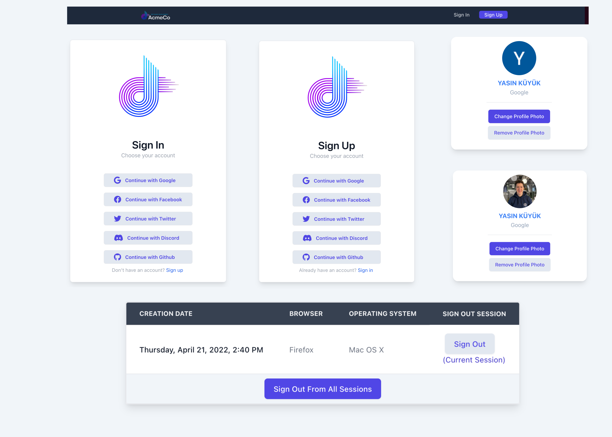
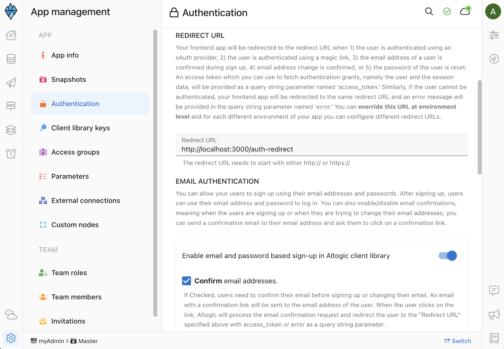

## Preview



## Introduction

This is an oAuth provider authentication app using [React](https://reactjs.org/) & [Tailwind CSS](https://tailwindcss.com/docs/guides/create-react-app) and [Altogic](https://www.altogic.com), backend-as-a-service platform as the backend using its client library.

The term OAuth stands for Open Authorization with 3rd party application such as social providers. Users can sign in to the application using their **Google**, **Facebook**, **Twitter**, **Discord**, **Github** accounts.

You can find the written tutorial of this demo app on our [Medium blog.](https://medium.com/altogic/how-to-build-oauth-provider-authentication-with-react-and-altogic-9282feed0c33)

## Features

Even though our application is a oAuth provider authentication app, it has powerful extra features and an excellent user interface, as you can see in the product review.

- Sign up with Google
- Sign up with Facebook
- Sign up with Github
- Sign up with Discord
- Sign up with Twitter
- Sign out from the current session
- Sign out from other sessions
- Sign out from all sessions
- Get all active sessions
- Upload profile photo to the cloud storage
- Remove profile photo from the cloud storage

## Installation

### Creating App in Altogic

To enable oAuth provider authentication, we need to create an app in **Altogic**.
We can create an app with the **Altogic Designer** really fast. To create an app via the Designer:

1. Log in to Altogic with your credentials.
2. Select New app.
3. In the App name field, enter a name for the app.
4. And click create.


After creating the app, we need `envUrl` and `clientKey` to access our app via Altogic Client Library to create a web application. You can customize your subdomain, but not necessarily to do. **Altogic** automatically creates one for you, which will be your `envUrl`.


In order to get the `clientKey`, we need to enter the app and;

1. Click on **App Settings** at the left-bottom of the **Altogic Designer**
2. Click on **Client library keys** section.


We can create new `clientKey` from that page, but **Altogic** automatically creates one for you. You can copy the existing `clientKey` from the list.

Now you have got both `clientKey` and `envUrl`. Now you have to create a `.env` file in your root directory of the project to complete the Altogic configuration with your app:

```powershell
touch .env
```

Copy and paste the below code to your `.env` file. Do not forget to change `YOUR_APPLICATION_ENV_URL` and `OUR_APPLICATION_CLIENT_KEY` values with your `envUrl` and `clientKey`.

```javascript
REACT_APP_ALTOGIC_ENV_URL = YOUR_APPLICATION_ENV_URL;
REACT_APP_ALTOGIC_CLIENT_KEY = YOUR_APPLICATION_CLIENT_KEY;
```

Our Altogic Client is ready to use now! We have last remaining configuration to complete now: _Twilio_

### oAuth Providers Configuration

Altogic currently supports 5 different **OAuth** providers:

- [Google](https://console.developers.google.com/)
- [Facebook](https://developers.facebook.com/)
- [Twitter](https://dev.twitter.com/)
- [Discord](https://discord.com/developers/docs/topics/oauth2)
- [Github](https://docs.github.com/en/developers/apps/building-oauth-apps/creating-an-oauth-app)

The **Redirect URL** is the link to which your front-end application is redirected after the user signs in with the provider. Firstly, we will configure our frontend application's **Redirect URL** with Altogic.

1. Click on **App Settings** at the left-bottom of the Designer.
2. And click on **Authentication** section.
3. Type your **Redirect URL** to the input field.



The remaining part is the configuration of the **oAuth** providers' client with our app We have to create an account with the providers we will use. Before moving on to the self-configuration of each provider, there are 4 core concepts to explain:

- **Client ID:** The ID of the application on the provider side
- **Client Secret:** The secret client key of the application on the provider side
- **Development-Callback URL:** The Redirect URL that we will pass to the application on the provider side
- **Client Sign In URL:** The URL of the providers sign in page linked with our app. Since we have been using the Altogic Client Library, we won't need this URL to redirect to the providers sign in page

You can find the video tutorials of each providers below:

- [Google](https://youtu.be/vfVKjtp7o8M)
- [Facebook](https://youtu.be/g84vwxsryZk)
- [Twitter](https://youtu.be/tk1cPCezgRw)
- [Discord](https://youtu.be/e1nFti5ATLs)
- [Github](https://youtu.be/qKfdaAur18g)

## Install the Packages

Before you start to use the npm command, make sure you have NodeJS installed in your development environment. Also, installing VSCode and some extensions might be better for faster development.

💡 You can visit [https://nodejs.org/en/download/](https://nodejs.org/en/download/) to download.

To get started, clone this project and proceed to the installation.

Install the packages:

```powershell
npm install
```

Required dependencies are installed to your local machine. Everything is ready to start and run the project:

```powershell
npm run start
```

## Learn More

Take a look at the following resources:

- [Altogic Client API Reference](https://clientapi.altogic.com/v1.2.2/modules.html) - learn about Altogic Client Library features
- [Altogic Docs](https://docs.altogic.com/) - learn about how to design your backend in Altogic
- [React Documentation](https://reactjs.org/docs/getting-started.html) - learn about React.js features and API.
- [Tailwind Documentation](https://tailwindcss.com/docs/installation) - learn about design your app with Tailwind CSS

## Contribution

Your feedback and contributions are welcome! Please open a pull request for contributions.

## Youtube Video

[](https://youtu.be/tQJoT8bybMU)
