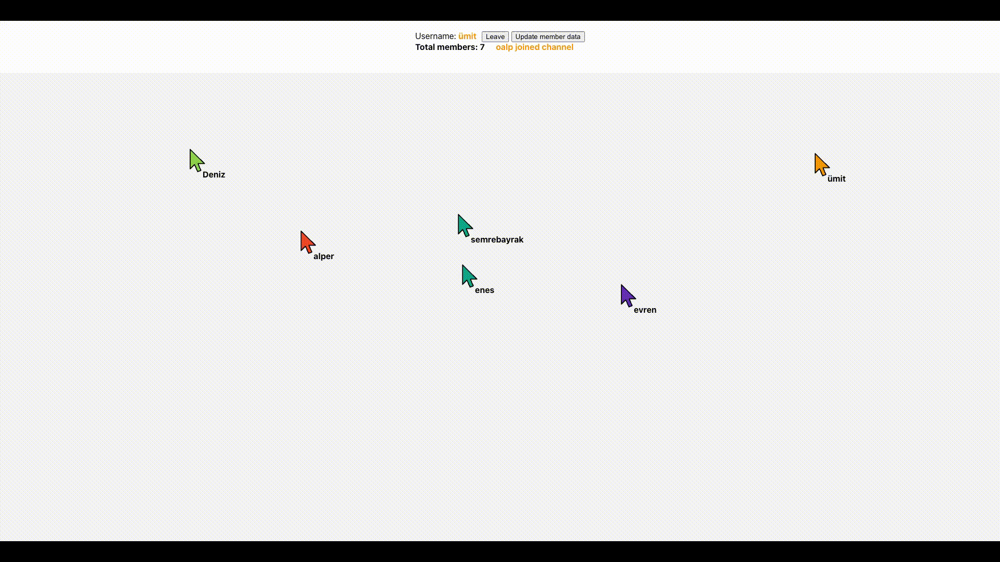
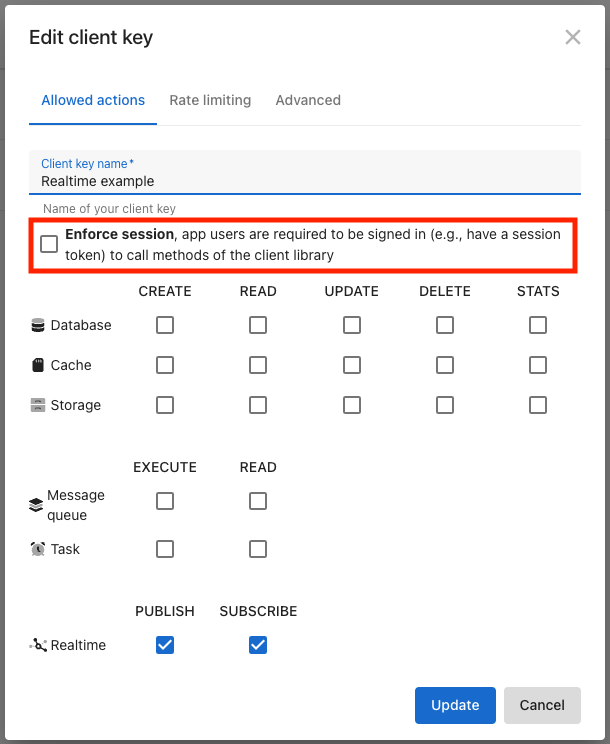

# Realtime presence sample app

Click [here](https://realtime-ten.vercel.app/) to access the live demo!

## Preview



## Introduction

The realtime presence app is a react application that is using Altogic's realtime features to emit mouse movements of users joined in a channel. Each user first joins to a channel called **presence** with a username and an automatically assigned mouse color. Following the channel join the mouse movements of the user is emitted to the **presence** channel and all users that are a member of this channel receive each other's mouse movements. 

When joined to the channel, the users can change their mouse color and leave the channel.

#### Joining the channel

```javascript
//Joining the presence channel
altogic.realtime.join('presence');
```

#### Leaving the channel

```javascript
//Leaving the presence channel
altogic.realtime.leave('presence');
```

#### Updating mouse color

```javascript
let newColor = colors[Math.floor(Math.random() * colors.length)];
//You can assign any custom data to a user profile, in this case we assign username, color and id
altogic.realtime.updateProfile({
  username: username,
  color: newColor,
  id: altogic.realtime.getSocketId(),
});
```

#### Sending the mouse coordinates

We emit an event called **track** to the **presence** channel which provides the current location of the user's mouse.

```javascript
//Socket id is a unique identifier and assigned automatically when a realtime connection is 
//established with the realtime server
altogic.realtime.send('presence', 'track', {
  username: username,
  color: color,
  x: x,
  y: y,
  id: altogic.realtime.getSocketId(),
});
```

#### Listening to users join, leave and update events

```javascript
//Triggered when a new user joins the channel, calls the joinMember method
altogic.realtime.onJoin(this.joinMember);
//Triggered when a user leaves the channel, calls the leaveMember method
altogic.realtime.onLeave(this.leaveMember);
//Triggered when one of the channel users update the profile info, calls the updateMember method
altogic.realtime.onUpdate(this.updateMember);
```

#### Listening to mouse movement events of users

```javascript
//Triggered when a move movement is received, calls the trackMember method
altogic.realtime.on('track', this.trackMember);
```

## Prerequisites

To run your own version of this app, after cloning this repository to your local development environment, you need to create a new app in [Altogic](https://www.altogic.com) and get your client key from the home view. **Please make sure that the client key does not enforce any sessions, meaning that your users will not be asked to sign up for an account to this simple realtime app.**




## Learn more

- [Altogic Client API Reference](https://clientapi.altogic.com/v2.0.0/modules.html) - learn about Altogic Client Library features
- [Altogic Docs](https://docs.altogic.com/) - learn about how to design your backend in Altogic
- [Discord community](https://discord.gg/ERK2ssumh8) - meet with fellow Altogic developers
- [Forum discussions](https://community.altogic.com) - ask questions and get answers from the community

## Contribution

Your feedback and contributions are welcome! Please open a pull request for contributions.

