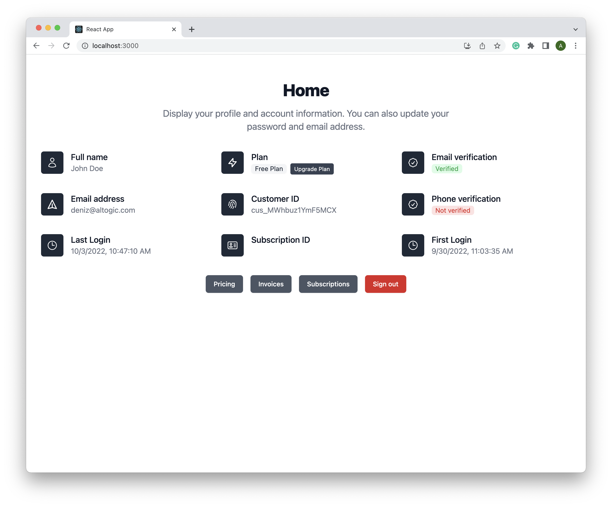
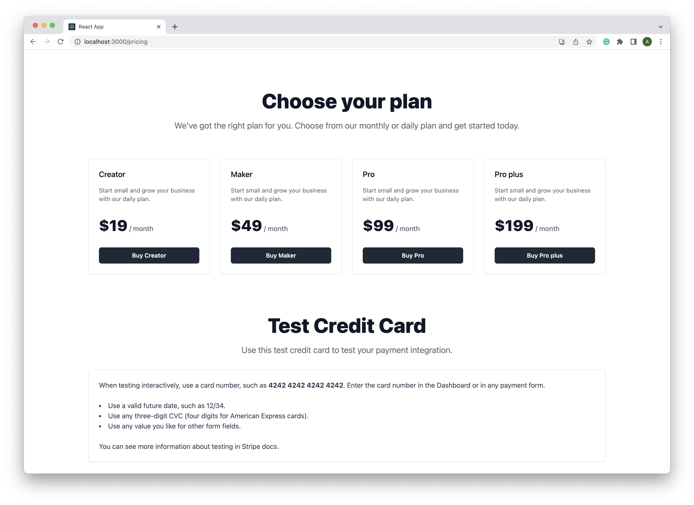

# React Saas starter with Altogic and Stripe

### Introduction

In this part of the tutorial, we will build the front end with React and develop the pricing, subscriptions, invoices, account, payment success, and cancel pages to ensure an easy, fast, and best way of payment processing.

### 🔥 Live

You can access the live demo of [React Saas starter app](https://altogic-stripe-payment.vercel.app).

### Getting started

You can run this example rename .env.example to .env and enter your Client Key, API Key and Environment URL to the .env file.

### Prerequisite

Before starting this tutorial, please ensure you have completed the [Altogic + React Authentication starter course](https://www.altogic.com/blog/how-to-integrate-altogic-authentication-with-react-app-part-1) to understand authentication, routing, session, etc.

### User interface development

In the current project, we used React with the Tailwindcss to create a project quickly. [Tailwindcss & React Installation Guide](https://tailwindcss.com/docs/guides/create-react-app).

We will also use the same project structure as in the **Altogic + React Authentication starter course** to ship a fast MVP.

### Features

- **Pricing page** to take payments from the user.
- **Subscriptions page** to display active subscriptions of the user.
- **Account page** to display the user role and basic information.
- **Invoices page** to display, download and view the invoices.
- **Home page** to display user details.
- **Navigating to** the Stripe portal to handle the payment.

### Preview

### Learn more

- [Written tutorial](http://www.altogic.com/blog/build-your-react-saas-starter-with-altogic-and-stripe) - learn more about Stripe integration and Altogic.
- [Altogic Client API Reference](https://clientapi.altogic.com/v2.0.0/modules.html) - learn about Altogic Client Library features
- [Altogic Docs](https://docs.altogic.com/) - learn about how to design your backend in Altogic
- [Discord community](https://discord.gg/ERK2ssumh8) - meet with fellow Altogic developers
- [Forum discussions](https://community.altogic.com) - ask questions and get answers from the community

### Contribution

All the feedback and contributions are welcome! Feel free to open a pull request to contribute.
